# MySQL卸载、安装

## 一、卸载

### （一）关闭MySQL服务

按`win+R`键，输入`services.msc`，回车。

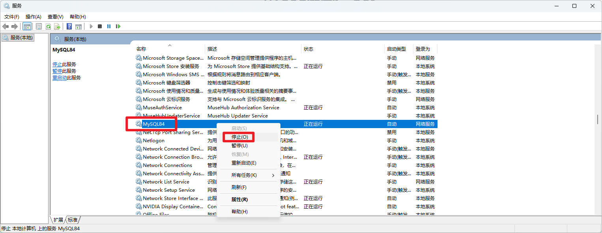

找到MySQL，将其停止，`状态`不显示`正在运行`即可。

### （二）卸载MySQL软件

打开控制面板，卸载软件。

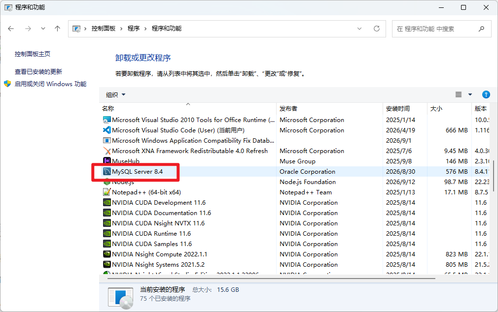

不同版本可能不太一样。比如有的版本在控制面板中可能不止这一个文件，总之把所有和`MySQL`相关的都卸载掉即可。

当前`8.4`版本卸载后会有一个弹窗，如下

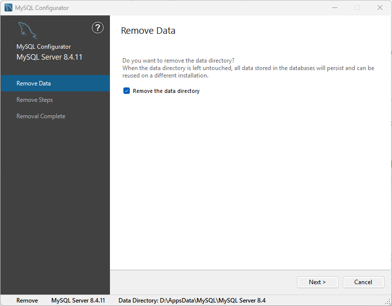

点击`Next`，再点击`Execute`，最后点击`Finish`即可。

### （三）清理相关文件

检查：

- `C:\ProgramData\MySQL`
- `C:\Program Files`
- `C:\Program Files (x86)`

如果有MySQL相关目录，删除即可。


## 二、安装

### （一）下载安装包

访问MySQL官网`https://www.mysql.com/cn/downloads/`。

下拉，找到`MySQL Community (GPL) Downloads »`

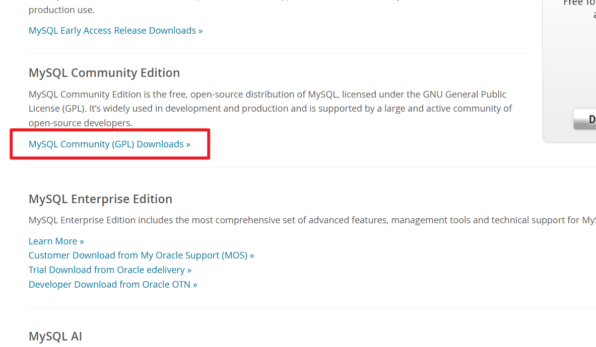

选择`MySQL Community Server`。

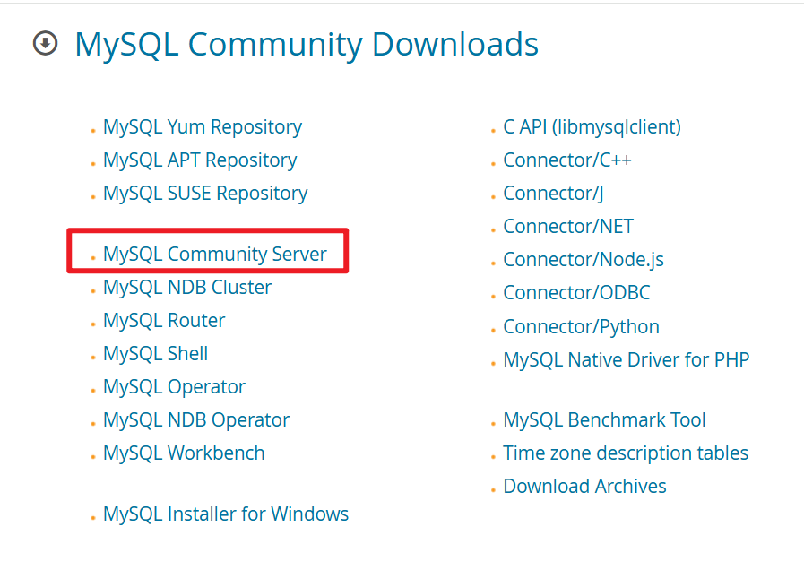

选择合适的版本和安装方式。

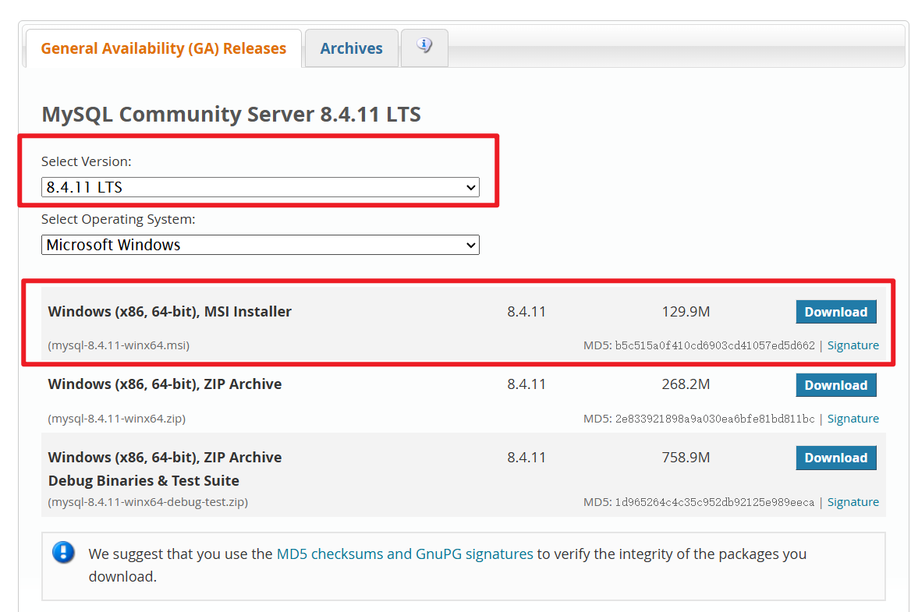

点击`No thanks, just start my download.`

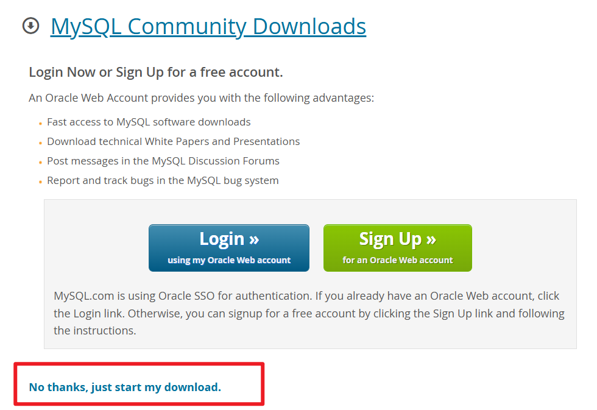

### （二）执行安装

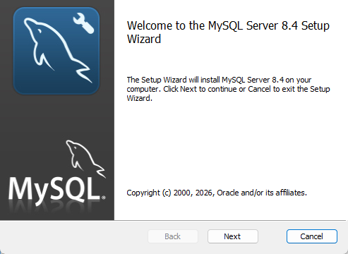

选`Custom`，自定义安装。

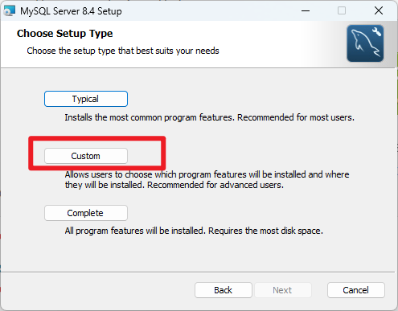

选择合适的安装目录。

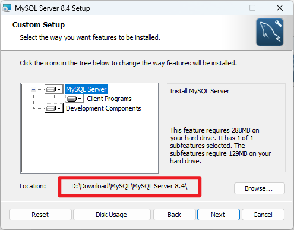

安装。

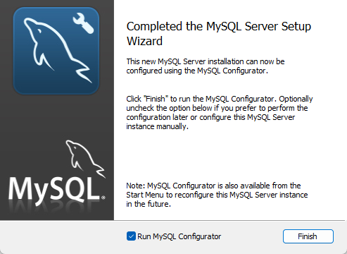

保持下方勾选状态，点`Finish`，之后进入配置阶段。


## 三、配置

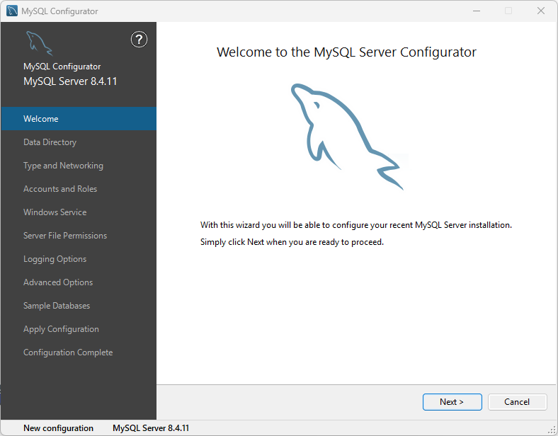

设置数据文件路径。

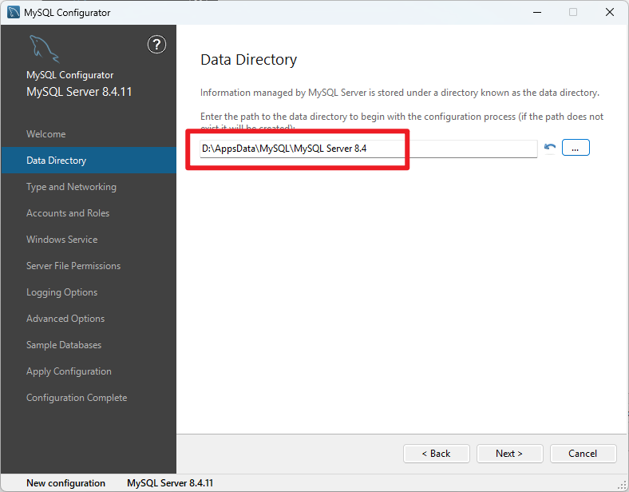

设置Named Pipe。

勾选Named Pipe，修改Pipe Name为`MYSQL84`，然后点击Next。

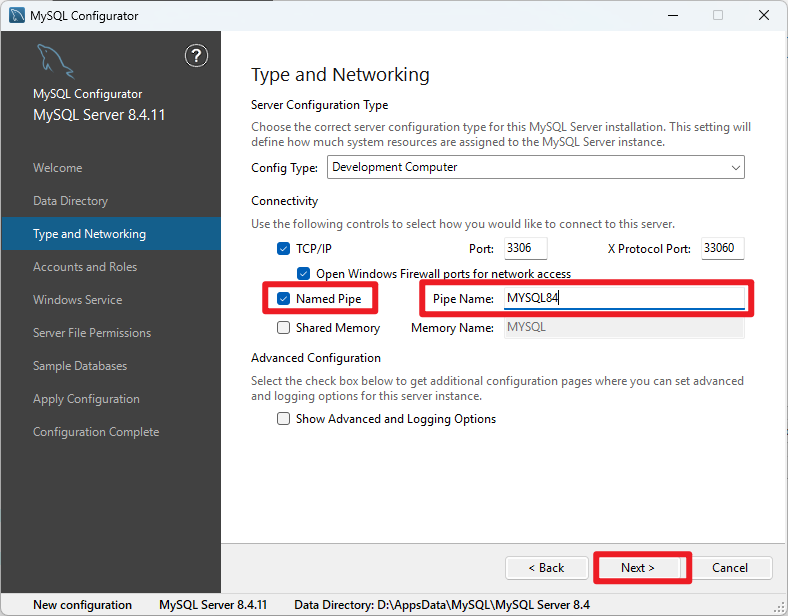

这一步保持默认，点Next。

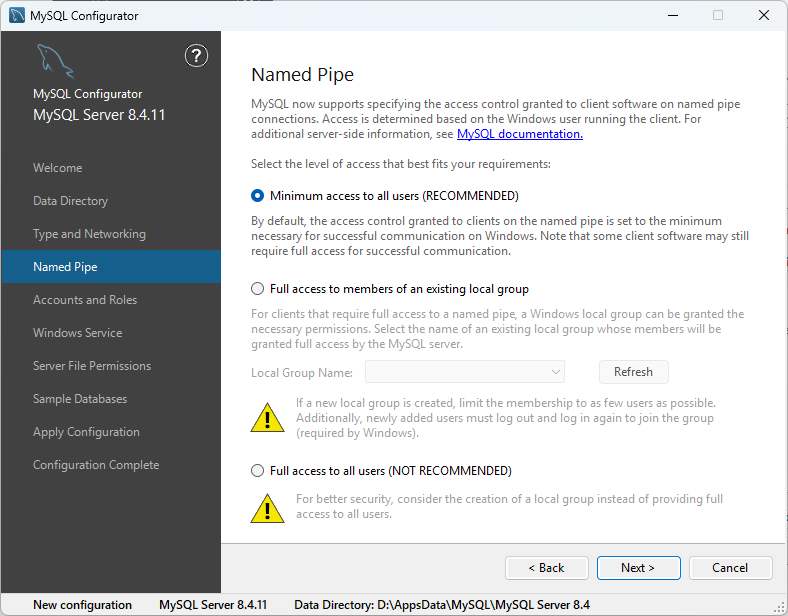

给root用户设置密码。不用管下面的User。

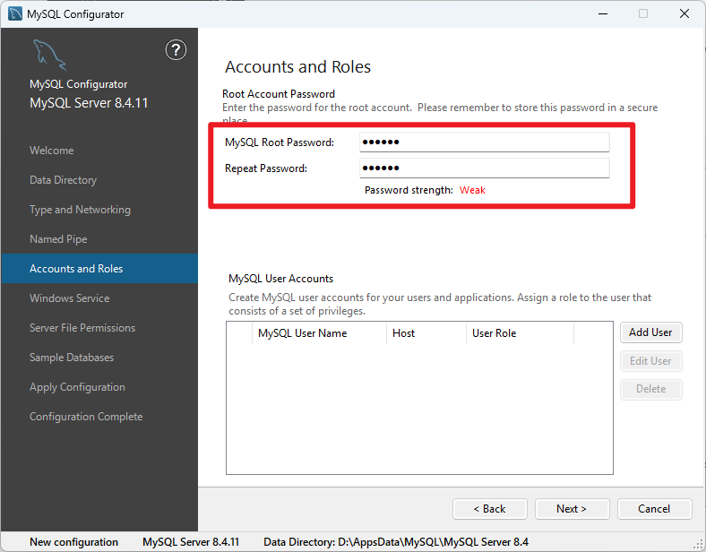

保持`Start the MySQL ...`勾选，则每次开机后MySQL会自动启动。

如果取消勾选，则想要使用MySQL，需要先去`services.msc`里面启动MySQL服务。

保持勾选即可。

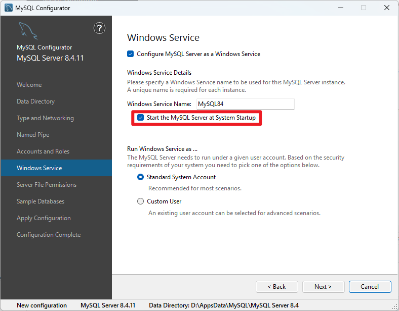

一路保持默认，点击Next即可。

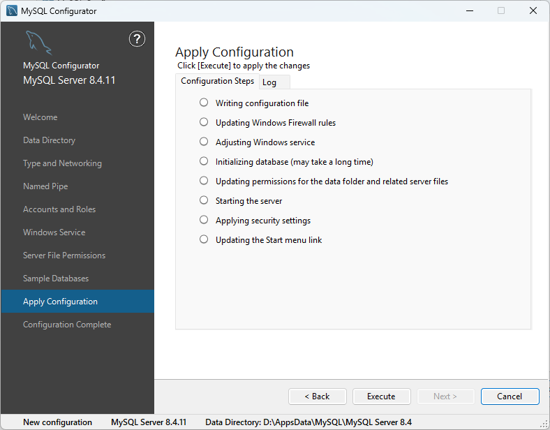

点击Execute。


## 四、环境变量配置

复制安装目录下的`bin`路径。

例如我的是：`D:\Download\MySQL\MySQL Server 8.4\bin`

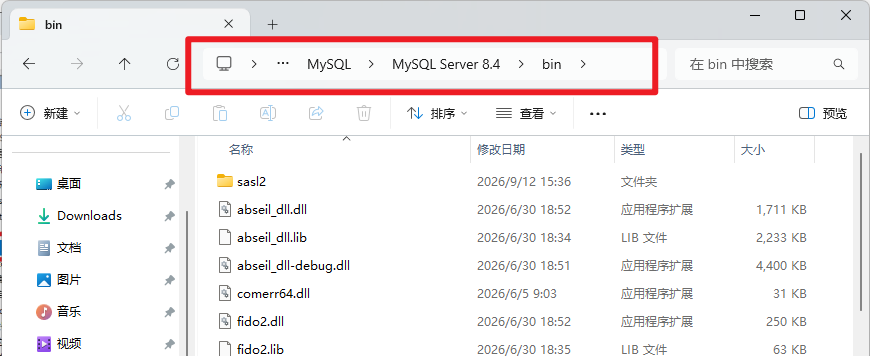

将其添加到系统环境变量中。

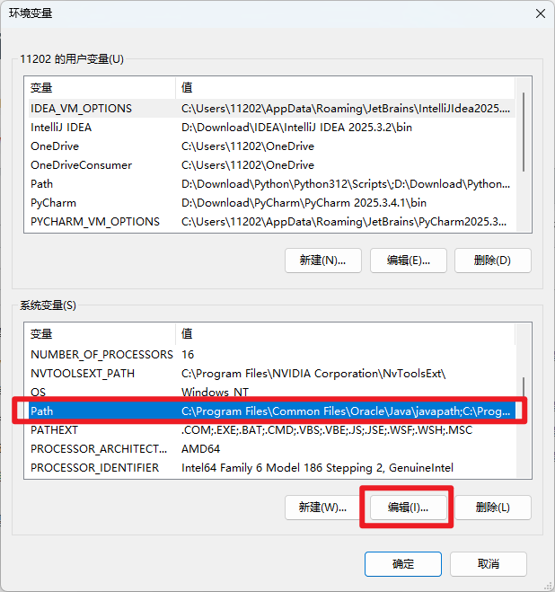

把刚才复制的bin路径粘贴进去。

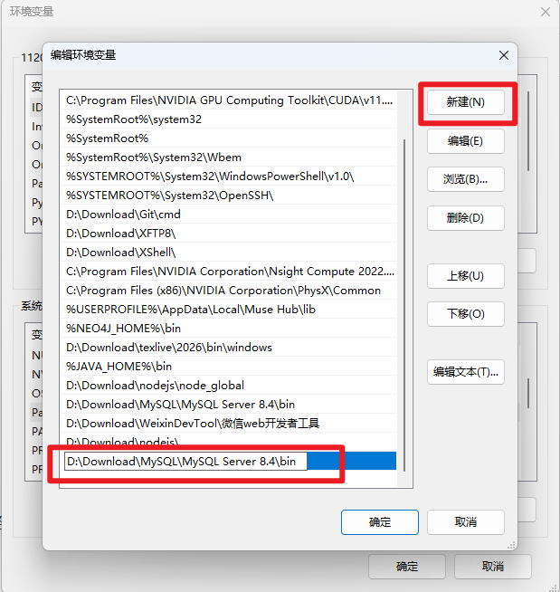


## 五、验证

按`win+R`，输入`services.msc`，打开服务管理器，查看里面是否存在MYSQL84。

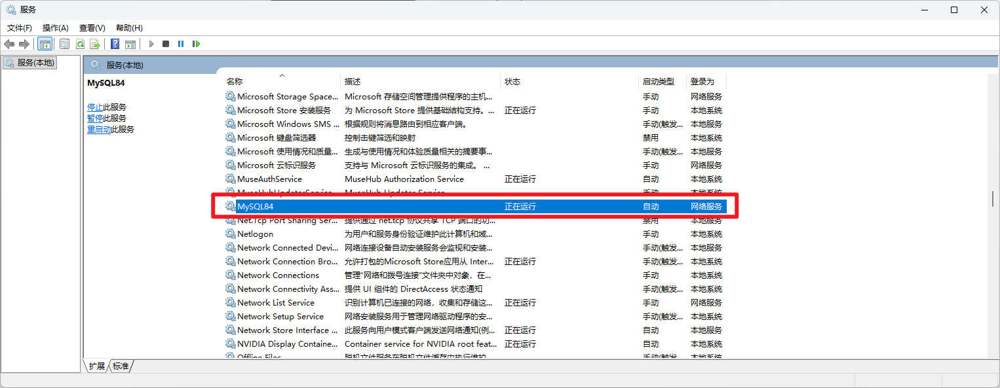

打开`cmd`，输入以下命令：

```cmd
mysql -u root -p
```

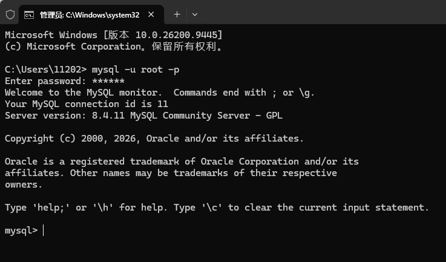

全部安装成功。