# Node.js卸载、安装及npm配置

## 一、卸载

### （一）卸载

进入控制面板，找到`Node.js`，卸载。

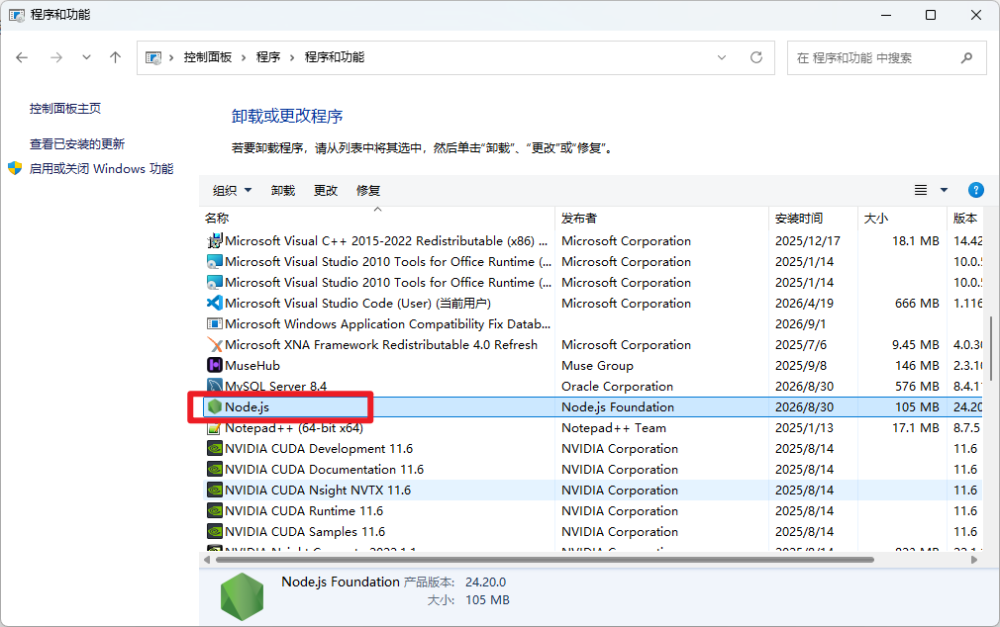

### （二）清理文件

删除之前的安装目录，我之前安装在了`D:\Download\nodejs`。


## 二、安装

### （一）下载安装包

到Node.js官方网站`https://nodejs.org/zh-cn`下载。

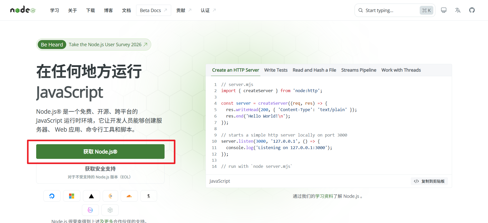

由于我要下载`Node 22`系列的版本，因此点击`之前的版本`。

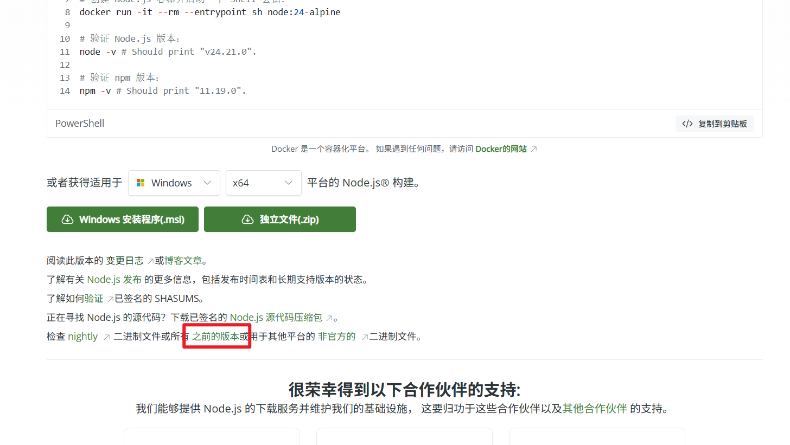

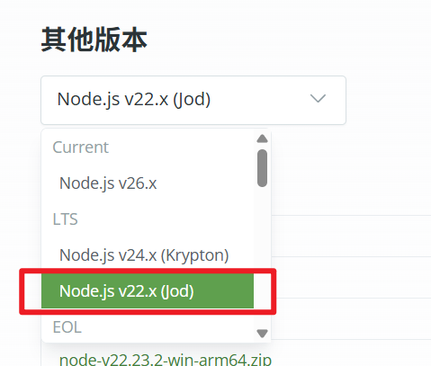

在`22`系列中选择最新的版本，即`22.23.2`，下载

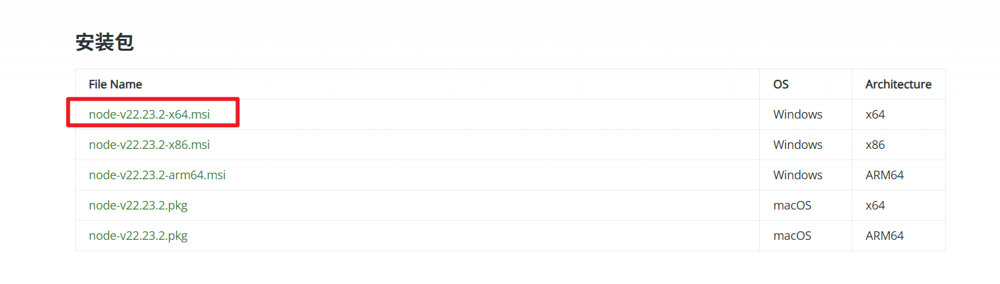

### （二）安装

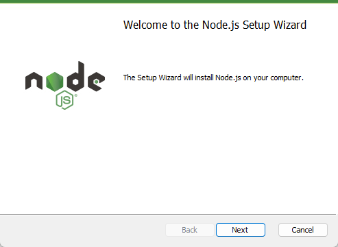

这一步把安装路径改成C盘以外的。此处我安装在`D:\Download\nodejs`。

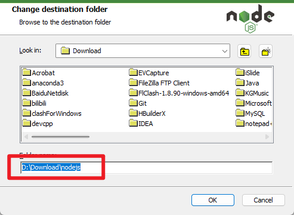

这一步不用动，点`Next`即可。

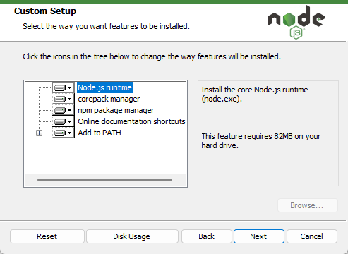

这一步不勾选，点`Next`。

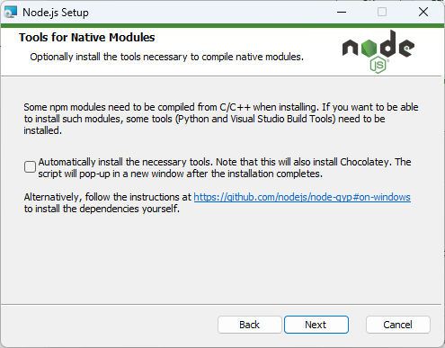

点`Install`，下载。

下载完成，点`Finish`。

### （三）检验是否安装成功

打开`cmd`，输入`node -v`，`npm -v`。

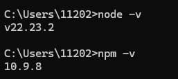

以上node的环境已经安装完成，并且npm包管理器也有了。


## 三、npm配置

### （一）镜像源配置

后续会经常使用npm来安装一些包，因此需要配置npm的下载镜像。

可以先查看当前npm所使用的镜像：

```cmd
npm config get registry
```

把npm镜像换成国内的，比如

- `https://registry.npmmirror.com`
- `https://registry.npm.taobao.org/`

打开`cmd`，输入下方内容即可：

```cmd
npm config set registry https://registry.npmmirror.com
```

### （二）包的安装路径

- 本地安装：默认情况下，当执行`npm install`命令时，软件包会被安装到当前项目的`node_modules`子文件夹下。
- 全局安装：执行`npm install -g`命令时，会安装到全局的位置。

我们不希望包安装到C盘，通过`npm config get prefix`查看当前设置的全局目录。

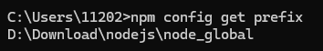

可见，全局目录是nodejs的安装路径。因此不用更改。

