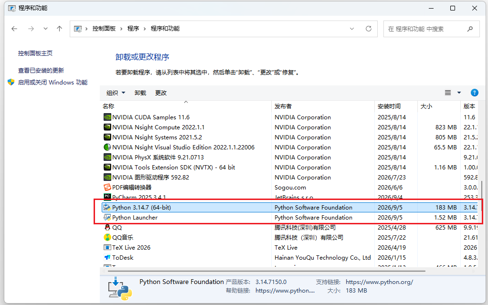
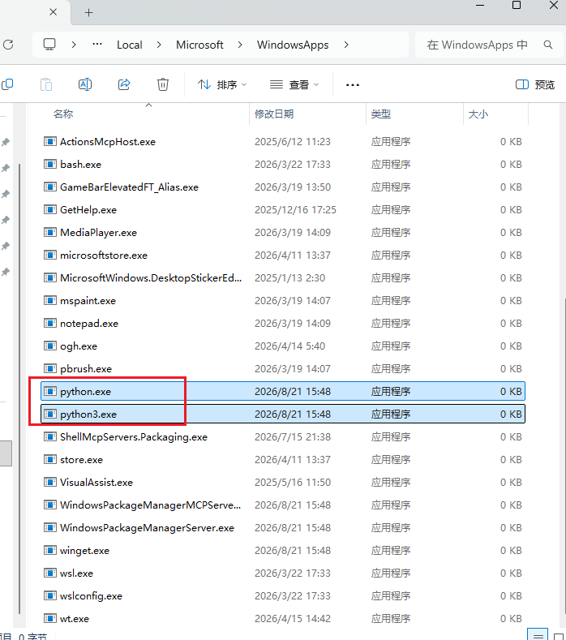
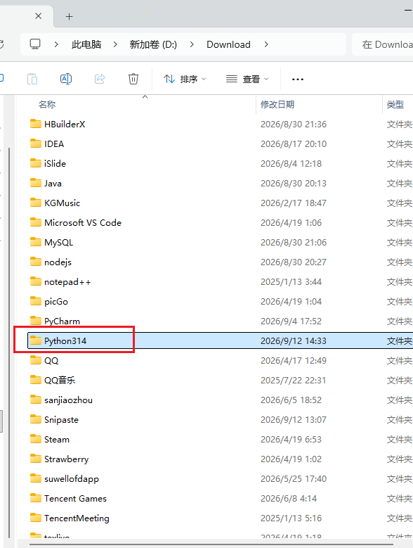
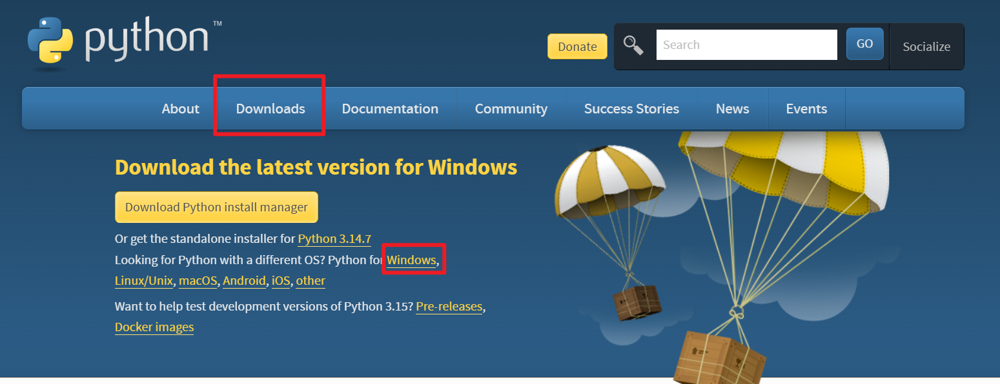
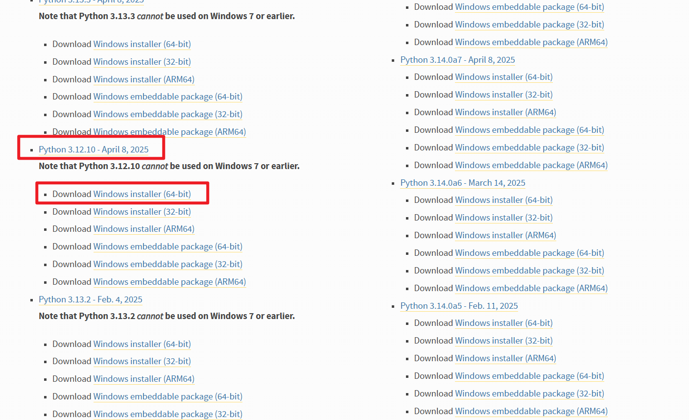
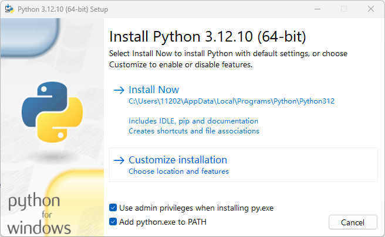
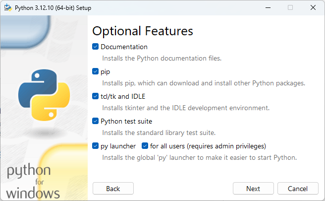
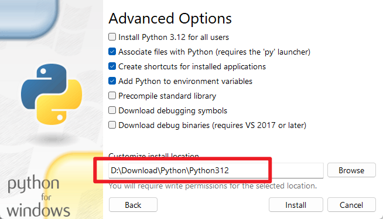
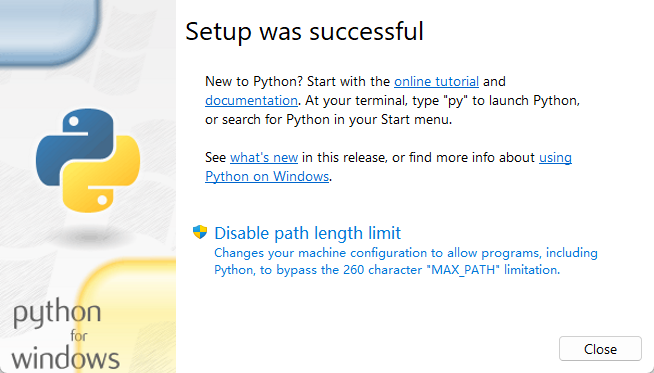
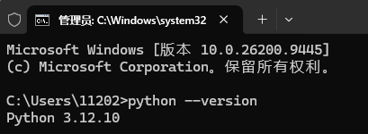

# Python卸载、安装

## 一、卸载

### （一）卸载程序

控制面板 -> 卸载程序，卸载即可。



### （二）清理Python相关文件

打开cmd，输入`where python`

```cmd
C:\Users\11202>where python
C:\Users\11202\AppData\Local\Microsoft\WindowsApps\python.exe
```

去对应目录下删除文件



另外，找到之前的Python安装目录，删掉（默认安装路径应该是`C:\Program Files`）

我之前安装在`D:\Download\Python314`下，找到，删除。




## 二、安装

### （一）下载安装包

去Python官网下载安装包。`https://www.python.org/`



点击Downloads -> Windows。

找到3.12版本。



下载Windows installer (64-bit)。

### （二）安装

把下面两个框勾选上。



然后点击`Customize installation`（自定义安装）。



默认全部勾选，保持不变，点`Next`。



上面的勾选项保持不变，把下方的安装路径改到C盘之外的路径。此处我安装在了`D:\Download\Python\Python312`下。

点击Install，等待安装完毕。



安装成功，直接点击Close即可。

### （三）环境配置

由于我们在安装的第一步就勾选了`Add python.exe to PATH`，因此环境配置可以省略。

### （四）检验是否安装成功

打开`cmd`，输入`python --version`。



