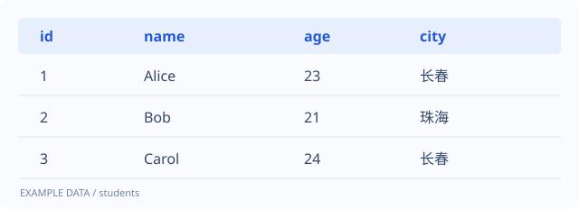

# SQL 查询：从「条件筛选」到结果排序

一条查询语句可以拆成几个小问题：数据来自哪里、需要哪些记录，以及结果应该怎样排列。先把这些问题想清楚，再组织 SQL。

> 示例笔记：用于展示分类、代码、表格、图片和文章目录，可以自由修改或删除。

## 一张用于练习的表

假设有一张 `students` 表，包含学生编号、姓名、年龄和城市。



## SELECT 与 WHERE

`SELECT` 指定需要返回的列，`WHERE` 对记录进行条件筛选。

```sql
SELECT name, age
FROM students
WHERE age >= 22;
```

这里关心的是姓名和年龄，因此没有使用 `SELECT *`。当表的结构变化时，明确列名也更容易看出查询的意图。

### 组合多个条件

```sql
SELECT name, age, city
FROM students
WHERE age >= 22
  AND city = '长春';
```

`AND` 表示条件需要同时成立，`OR` 表示满足其中一个条件即可。混合使用时，可以用括号明确分组。

## 排序与限制结果数量

```sql
SELECT id, name, age
FROM students
ORDER BY age DESC, id ASC
LIMIT 10;
```

先按年龄从高到低排列，再用编号处理年龄相同的情况。

| 关键字 | 作用 |
| --- | --- |
| `SELECT` | 选择返回的列 |
| `FROM` | 指定数据来源 |
| `WHERE` | 筛选记录 |
| `ORDER BY` | 排列结果 |
| `LIMIT` | 限制返回条数 |

## 继续阅读

涉及统计时，可以接着阅读 [分组与聚合：WHERE 和 HAVING 有什么区别？](2.md#where-与-having)。
