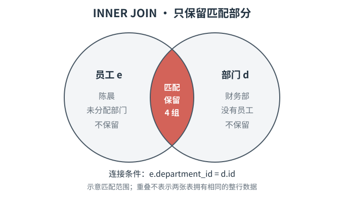
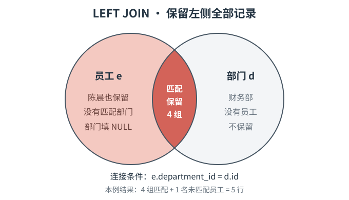
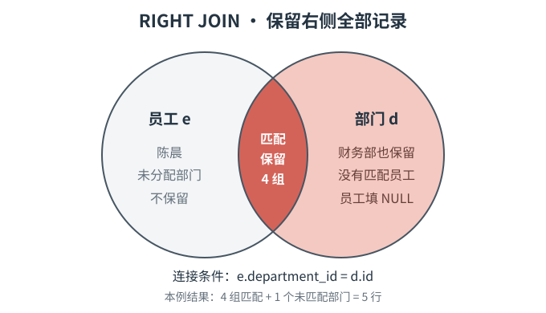
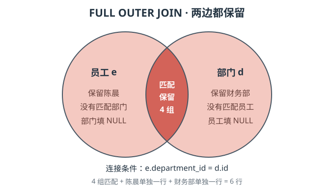

# SQL进阶语法

## 数据表

以下所有语法演示均在下表的基础上执行：

```sql
mysql> SELECT * FROM students;
+----+------+--------+------------+-------+
| id | name | gender | major      | score |
+----+------+--------+------------+-------+
|  1 | 张伟 | 男     | 计算机技术 | 88.50 |
|  2 | 李娜 | 女     | 软件工程   | 92.00 |
|  3 | 王强 | 男     | 计算机技术 | 80.00 |
|  4 | 赵敏 | 女     | 人工智能   | 95.50 |
|  5 | 陈晨 | 女     | 软件工程   | 84.00 |
|  6 | 刘洋 | 男     | 人工智能   |  NULL |
|  7 | 孙悦 | 女     | 计算机技术 | 88.50 |
|  8 | 周杰 | 男     | 网络安全   | 69.00 |
|  9 | 吴桐 | 女     | 数据科学   | 91.50 |
| 10 | 郑凯 | 男     | 计算机技术 |  NULL |
| 11 | 何静 | 女     | 网络安全   | 87.00 |
+----+------+--------+------------+-------+
11 rows in set (0.00 sec)
```


## SQL SELECT TOP子句

限制结果集行数的子句用于只返回查询结果中的前若干条记录，常用于查看部分数据、排行榜和分页查询。

不同数据库使用的关键字有所不同：SQL Server和MS Access使用`TOP`，MySQL和PostgreSQL使用`LIMIT`，Oracle 12c及以上版本可以使用`FETCH FIRST`。

### 语法

#### SQL Server / MS Access

```sql
-- 返回指定数量的记录
SELECT TOP number column1, column2, ...
FROM table_name
ORDER BY column1 [ASC | DESC];

-- 按百分比返回记录
SELECT TOP percent PERCENT column1, column2, ...
FROM table_name
ORDER BY column1 [ASC | DESC];
```

#### MySQL

```sql
SELECT column1, column2, ...
FROM table_name
ORDER BY column1 [ASC | DESC]
LIMIT row_count;

-- 跳过offset条记录，再返回row_count条记录
SELECT column1, column2, ...
FROM table_name
ORDER BY column1 [ASC | DESC]
LIMIT row_count OFFSET offset;
```

#### Oracle

```sql
SELECT column1, column2, ...
FROM table_name
ORDER BY column1 [ASC | DESC]
FETCH FIRST row_count ROWS ONLY;
```

#### PostgreSQL

```sql
SELECT column1, column2, ...
FROM table_name
ORDER BY column1 [ASC | DESC]
LIMIT row_count OFFSET offset;
```

### 说明

- `number`或`row_count`表示最多返回多少条记录，一般使用非负整数。
- `offset`表示返回结果前要跳过的记录数，从`0`开始计算。例如，`OFFSET 3`表示跳过前三条记录。
- MySQL还支持`LIMIT offset, row_count`的写法。例如，`LIMIT 3, 5`表示跳过前三条记录，再返回五条记录。不过，`LIMIT row_count OFFSET offset`的含义通常更加直观。
- 如果满足条件的记录数少于指定数量，数据库只会返回实际存在的记录。
- `TOP`、`LIMIT`或`FETCH FIRST`只限制查询结果的行数，不会修改表中的数据。
- 限制行数本身并不规定哪些记录排在前面。需要获得确定的“前几条”记录时，应配合`ORDER BY`使用；如果排序字段存在重复值，可以继续添加主键等唯一字段作为最后一个排序条件。
- 限制返回数量通常可以减少结果传输和客户端处理的数据量，但查询性能是否提高，还取决于筛选条件、排序方式和索引等因素。

### 示例

在MySQL中查询成绩最高的三名学生。这里使用`id`作为最后一个排序字段，以保证排序结果稳定：

```sql
mysql> SELECT id, name, score
    -> FROM students
    -> WHERE score IS NOT NULL
    -> ORDER BY score DESC, id ASC
    -> LIMIT 3;
+----+------+-------+
| id | name | score |
+----+------+-------+
|  4 | 赵敏 | 95.50 |
|  2 | 李娜 | 92.00 |
|  9 | 吴桐 | 91.50 |
+----+------+-------+
3 rows in set (0.00 sec)
```

按照`id`升序排列，跳过前三条记录，再返回三条记录：

```sql
mysql> SELECT id, name
    -> FROM students
    -> ORDER BY id ASC
    -> LIMIT 3 OFFSET 3;
+----+------+
| id | name |
+----+------+
|  4 | 赵敏 |
|  5 | 陈晨 |
|  6 | 刘洋 |
+----+------+
3 rows in set (0.00 sec)
```

如果使用SQL Server，实现“查询成绩最高的三名学生”可以写成：

```sql
SELECT TOP 3 id, name, score
FROM students
WHERE score IS NOT NULL
ORDER BY score DESC, id ASC;
```


## SQL LIKE操作符

`LIKE`操作符用于在`WHERE`子句中按照指定模式进行模糊查询，通常与`%`和`_`通配符一起使用。

### SQL通配符

在SQL中，通配符与`LIKE`操作符一起使用。

SQL通配符用于搜索表中的数据。

MySQL的`LIKE`操作符支持以下两种通配符：

- `%`：匹配零个或多个任意字符。
- `_`：匹配恰好一个任意字符。

> `[charlist]`、`[^charlist]`等写法只适用于部分数据库，并不是MySQL `LIKE`支持的通配符。在MySQL中需要进行字符集合等更复杂的模式匹配时，可以使用`REGEXP`。

### 语法

```sql
SELECT column1, column2, ...
FROM table_name
WHERE column_name LIKE pattern;
```

也可以使用`NOT LIKE`排除符合指定模式的记录：

```sql
SELECT column1, column2, ...
FROM table_name
WHERE column_name NOT LIKE pattern;
```

### 说明

- `column_name`：要进行模式匹配的字段名称。
- `pattern`：匹配模式，属于字符串，因此通常使用单引号包裹。
- `'张%'`表示以“张”开头，`'%杰'`表示以“杰”结尾，`'%工程%'`表示任意位置包含“工程”。
- `'刘_'`表示以“刘”开头，并且“刘”后面恰好还有一个字符。
- `%`可以匹配零个字符，因此`'张%'`不仅能匹配“张伟”，也能匹配只有一个字符的“张”。
- 不包含通配符时，`LIKE`相当于按照完整模式进行匹配，但判断大小写等行为仍受数据库字符集和排序规则影响。
- 在MySQL中，`LIKE`是否区分英文字母大小写通常由字段的排序规则决定。例如，名称以`_ci`结尾的排序规则通常不区分大小写，不能一概认为`LIKE`始终区分或始终不区分大小写。
- 如果字段值为`NULL`，`LIKE`和`NOT LIKE`都不会将其作为匹配成功的记录。判断`NULL`仍应使用`IS NULL`或`IS NOT NULL`。
- 以`%`开头的模式（如`'%工程'`）通常难以有效利用普通索引。在数据量较大时，应避免没有必要的前置`%`。

### 示例

查询姓名以“张”开头的学生：

```sql
mysql> SELECT id, name
    -> FROM students
    -> WHERE name LIKE '张%';
+----+------+
| id | name |
+----+------+
|  1 | 张伟 |
+----+------+
1 row in set (0.00 sec)
```

查询专业名称中包含“工程”的学生：

```sql
mysql> SELECT id, name, major
    -> FROM students
    -> WHERE major LIKE '%工程%';
+----+------+----------+
| id | name | major    |
+----+------+----------+
|  2 | 李娜 | 软件工程 |
|  5 | 陈晨 | 软件工程 |
+----+------+----------+
2 rows in set (0.00 sec)
```

查询姓名由任意一个字符开头、并以“杰”结尾的学生：

```sql
mysql> SELECT id, name
    -> FROM students
    -> WHERE name LIKE '_杰';
+----+------+
| id | name |
+----+------+
|  8 | 周杰 |
+----+------+
1 row in set (0.00 sec)
```

查询专业名称中不包含“技术”的学生：

```sql
mysql> SELECT id, name, major
    -> FROM students
    -> WHERE major NOT LIKE '%技术%'
    -> ORDER BY id ASC;
+----+------+----------+
| id | name | major    |
+----+------+----------+
|  2 | 李娜 | 软件工程 |
|  4 | 赵敏 | 人工智能 |
|  5 | 陈晨 | 软件工程 |
|  6 | 刘洋 | 人工智能 |
|  8 | 周杰 | 网络安全 |
|  9 | 吴桐 | 数据科学 |
| 11 | 何静 | 网络安全 |
+----+------+----------+
7 rows in set (0.00 sec)
```


## SQL IN操作符

`IN`操作符用于判断某个字段的值是否与给定列表中的任意一个值相等，可以简化包含多个相等条件的查询。

### 语法

```sql
SELECT column1, column2, ...
FROM table_name
WHERE column_name IN (value1, value2, ...);
```

使用`NOT IN`可以排除值列表中的记录：

```sql
SELECT column1, column2, ...
FROM table_name
WHERE column_name NOT IN (value1, value2, ...);
```

### 说明

- `column_name`：要进行判断的字段名称。
- `value1, value2, ...`：用于匹配的值列表，各个值之间使用英文逗号分隔。
- 字符串和日期通常需要使用单引号包裹，数值通常不需要引号。
- `IN`只要匹配列表中的任意一个值，条件就成立；`NOT IN`则要求字段值不等于列表中的所有值。
- `WHERE major IN ('人工智能', '网络安全')`与`WHERE major = '人工智能' OR major = '网络安全'`的含义相同。需要比较的值较多时，使用`IN`通常更加简洁。
- `IN`用于匹配一组离散的值，而不是表示连续范围。查询某个区间内的数据时，通常可以使用比较运算符或`BETWEEN`。
- 值列表中重复出现同一个值不会产生重复的查询结果。
- `IN`不会按照值在列表中的先后顺序排列结果。需要确定返回顺序时，仍应使用`ORDER BY`。
- `NULL`不能通过`IN (NULL)`匹配，应使用`IS NULL`。同时，应避免在`NOT IN`的值列表中包含`NULL`，否则可能因为SQL对`NULL`的判断规则而得不到预期结果。

### 示例

查询专业为“人工智能”或“网络安全”的学生：

```sql
mysql> SELECT id, name, major
    -> FROM students
    -> WHERE major IN ('人工智能', '网络安全')
    -> ORDER BY id ASC;
+----+------+----------+
| id | name | major    |
+----+------+----------+
|  4 | 赵敏 | 人工智能 |
|  6 | 刘洋 | 人工智能 |
|  8 | 周杰 | 网络安全 |
| 11 | 何静 | 网络安全 |
+----+------+----------+
4 rows in set (0.00 sec)
```

下面两种写法的查询条件等价：

```sql
-- 使用IN
SELECT *
FROM students
WHERE id IN (1, 4, 9);

-- 使用OR
SELECT *
FROM students
WHERE id = 1 OR id = 4 OR id = 9;
```

查询专业既不是“计算机技术”也不是“软件工程”的学生：

```sql
mysql> SELECT id, name, major
    -> FROM students
    -> WHERE major NOT IN ('计算机技术', '软件工程')
    -> ORDER BY id ASC;
+----+------+----------+
| id | name | major    |
+----+------+----------+
|  4 | 赵敏 | 人工智能 |
|  6 | 刘洋 | 人工智能 |
|  8 | 周杰 | 网络安全 |
|  9 | 吴桐 | 数据科学 |
| 11 | 何静 | 网络安全 |
+----+------+----------+
5 rows in set (0.00 sec)
```

如果需要同时查询列表中的值和`NULL`，应分别编写条件：

```sql
mysql> SELECT *
    -> FROM students
    -> WHERE score IN (80.00, 88.50)
    ->    OR score IS NULL;
+----+------+--------+------------+-------+
| id | name | gender | major      | score |
+----+------+--------+------------+-------+
|  1 | 张伟 | 男     | 计算机技术 | 88.50 |
|  3 | 王强 | 男     | 计算机技术 | 80.00 |
|  6 | 刘洋 | 男     | 人工智能   |  NULL |
|  7 | 孙悦 | 女     | 计算机技术 | 88.50 |
| 10 | 郑凯 | 男     | 计算机技术 |  NULL |
+----+------+--------+------------+-------+
5 rows in set (0.00 sec)
```


## SQL BETWEEN操作符

`BETWEEN`操作符用于判断某个值是否位于指定范围内，可以用于数值、文本和日期等可比较的数据。

### 语法

```sql
SELECT column1, column2, ...
FROM table_name
WHERE column_name BETWEEN lower_value AND upper_value;
```

使用`NOT BETWEEN`可以查询指定范围之外的数据：

```sql
SELECT column1, column2, ...
FROM table_name
WHERE column_name NOT BETWEEN lower_value AND upper_value;
```

### 说明

- `column_name`：要进行范围判断的字段名称。
- `lower_value`和`upper_value`分别表示范围的下限和上限，通常应按照“较小值在前、较大值在后”的顺序书写。
- `BETWEEN`包含范围两端的边界值，即“大于等于下限，并且小于等于上限”。
- `score BETWEEN 80 AND 90`与`score >= 80 AND score <= 90`的含义相同。
- `NOT BETWEEN`用于选取范围之外的值。`score NOT BETWEEN 80 AND 90`相当于`score < 80 OR score > 90`。
- 数值通常不需要引号；文本和日期通常使用单引号包裹。文本的范围判断结果会受到字符集和排序规则的影响。
- 如果字段值为`NULL`，`BETWEEN`和`NOT BETWEEN`都不会将该记录判断为匹配。需要查询`NULL`时，应另外使用`IS NULL`。
- 对`DATETIME`等包含时间的字段，`'2026-09-30'`会被理解为`'2026-09-30 00:00:00'`。因此，使用`BETWEEN '2026-09-01' AND '2026-09-30'`会遗漏9月30日零点之后的数据。查询整个9月时，推荐写成`>= '2026-09-01' AND < '2026-10-01'`，即包含9月1日，但不包含10月1日。即，对于`DATETIME`或`TIMESTAMP`字段，通常推荐使用“左闭右开”的范围：`字段 >= 开始时间 AND 字段 < 下一个时间段的开始时间`。

### 示例

查询成绩在`80`到`90`之间的学生。由于`BETWEEN`包含边界，因此成绩正好为`80`或`90`的记录也会被选中：

```sql
mysql> SELECT id, name, score
    -> FROM students
    -> WHERE score BETWEEN 80 AND 90
    -> ORDER BY id ASC;
+----+------+-------+
| id | name | score |
+----+------+-------+
|  1 | 张伟 | 88.50 |
|  3 | 王强 | 80.00 |
|  5 | 陈晨 | 84.00 |
|  7 | 孙悦 | 88.50 |
| 11 | 何静 | 87.00 |
+----+------+-------+
5 rows in set (0.00 sec)
```

下面两种写法的查询条件等价：

```sql
-- 使用BETWEEN
SELECT *
FROM students
WHERE score BETWEEN 80 AND 90;

-- 使用比较运算符
SELECT *
FROM students
WHERE score >= 80 AND score <= 90;
```

查询成绩不在`80`到`90`之间的学生。成绩为`NULL`的记录不会被`NOT BETWEEN`选中：

```sql
mysql> SELECT id, name, score
    -> FROM students
    -> WHERE score NOT BETWEEN 80 AND 90
    -> ORDER BY id ASC;
+----+------+-------+
| id | name | score |
+----+------+-------+
|  2 | 李娜 | 92.00 |
|  4 | 赵敏 | 95.50 |
|  8 | 周杰 | 69.00 |
|  9 | 吴桐 | 91.50 |
+----+------+-------+
4 rows in set (0.00 sec)
```


## SQL别名

SQL别名用于为字段或表临时指定另一个名称，可以让查询结果和SQL语句更加清晰易读。

### 语法

```sql
-- 字段别名
SELECT column_name AS alias_name
FROM table_name;

-- 表别名
SELECT table_alias.column_name
FROM table_name AS table_alias;
```

在MySQL中，`AS`通常可以省略：

```sql
SELECT column_name alias_name
FROM table_name table_alias;
```

### 说明

- 字段别名用于改变查询结果中显示的字段名称，常用于简化名称或为计算结果命名。
- 表别名用于简化较长的表名。为表设置别名后，可以通过`表别名.字段名`引用该表中的字段。
- 别名只在当前SQL语句中有效，不会修改数据库中原有的表名或字段名。
- `AS`关键字通常可以省略，但保留`AS`能够更清楚地表明后面的名称是别名。
- 如果别名中包含空格、特殊字符或与关键字冲突，可以在MySQL中使用反引号包裹，例如``score AS `学生成绩` ``。
- 字段别名可以在`ORDER BY`中使用，但通常不能直接在同一层查询的`WHERE`子句中使用。
- 为表设置别名后，建议在该查询中始终使用这个别名引用字段，避免与原表名混用。

### 示例

为`name`和`score`字段设置更容易理解的别名：

```sql
mysql> SELECT name AS student_name, score AS exam_score
    -> FROM students
    -> ORDER BY id ASC
    -> LIMIT 3;
+--------------+------------+
| student_name | exam_score |
+--------------+------------+
| 张伟         |      88.50 |
| 李娜         |      92.00 |
| 王强         |      80.00 |
+--------------+------------+
3 rows in set (0.00 sec)
```

别名也可以用于为计算结果命名，并在`ORDER BY`中引用：

```sql
mysql> SELECT name, score + 5 AS adjusted_score
    -> FROM students
    -> WHERE score IS NOT NULL
    -> ORDER BY adjusted_score DESC;
+------+----------------+
| name | adjusted_score |
+------+----------------+
| 赵敏 |         100.50 |
| 李娜 |          97.00 |
| 吴桐 |          96.50 |
| 张伟 |          93.50 |
| 孙悦 |          93.50 |
| 何静 |          92.00 |
| 陈晨 |          89.00 |
| 王强 |          85.00 |
| 周杰 |          74.00 |
+------+----------------+
9 rows in set (0.00 sec)
```

将`students`表设置别名`s`，随后通过`s.字段名`引用其中的字段：

```sql
mysql> SELECT s.id, s.name, s.major
    -> FROM students AS s
    -> WHERE s.major = '计算机技术'
    -> ORDER BY s.id ASC;
+----+------+------------+
| id | name | major      |
+----+------+------------+
|  1 | 张伟 | 计算机技术 |
|  3 | 王强 | 计算机技术 |
|  7 | 孙悦 | 计算机技术 |
| 10 | 郑凯 | 计算机技术 |
+----+------+------------+
4 rows in set (0.00 sec)
```


## SQL JOIN

`JOIN`用于按照指定条件，把不同表中有关联的记录组合成一个查询结果。

#### 准备两个数据表，便于演示

新建一个数据库`join_learning_lab`，在里面新建两个表`departments`、`employees`，分别表示部门表、员工表。

```sql
mysql> SELECT * FROM departments;
+----+--------+
| id | name   |
+----+--------+
|  3 | 人事部 |
|  2 | 市场部 |
|  1 | 技术部 |
|  4 | 财务部 |
+----+--------+
4 rows in set (0.00 sec)

mysql> SELECT * FROM employees;
+----+------+---------------+
| id | name | department_id |
+----+------+---------------+
|  1 | 张伟 |             1 |
|  2 | 李娜 |             1 |
|  3 | 王强 |             2 |
|  4 | 赵敏 |             3 |
|  5 | 陈晨 |          NULL |
+----+------+---------------+
5 rows in set (0.00 sec)
```

#### 为什么要使用JOIN

实际数据库通常把不同事物分开存储。例如，员工表保存员工姓名和部门编号，部门表保存部门编号和部门名称。这样不必在每条员工记录中重复保存部门名称；部门改名时，只需修改部门表中的一条记录。

但当我们需要一份“员工姓名 + 部门名称”的名单时，单独查询员工表只能得到部门编号，单独查询部门表又看不到员工。这时就需要`JOIN`，根据“员工的部门编号 = 部门的编号”把两边的信息拼到同一行中。

`JOIN`产生的是查询结果，不会把两张表永久合并，也不要求两张表拥有完全相同的字段。连接条件应依据业务关系确定，不能仅因为两个字段都叫`id`就把它们连接起来。

#### 为什么会有不同类型的JOIN

关键在于：**如果某条记录在另一张表中找不到匹配，你是否仍然需要保留它？** 例如，`陈晨`尚未分配部门，`财务部`尚无员工。不同的业务需求，对这两种记录有不同的处理方式。

以下固定以员工表`employees`为左表、部门表`departments`为右表：

| 你想得到什么结果 | 适用的连接 | 没有匹配时如何处理 |
| --- | --- | --- |
| 只列出能找到所属部门的员工及其部门 | `INNER JOIN` | 陈晨和无人任职的财务部都不出现 |
| 列出所有员工，部门信息有就显示 | `LEFT JOIN` | 保留陈晨，其部门信息显示为`NULL` |
| 列出所有部门，以及各部门的员工 | `RIGHT JOIN` | 保留财务部，其员工信息显示为`NULL` |
| 两边都要完整列出，包括未分配部门的员工和空部门 | `FULL OUTER JOIN` | 陈晨和财务部都保留，缺失的一侧填`NULL` |

左表是`FROM`后面的表，右表是`JOIN`后面的表。“左”和“右”取决于SQL中的书写位置。MySQL不直接支持`FULL OUTER JOIN`，后面学习时需要使用其他写法实现。

另外，`CROSS JOIN`用于列出所有可能的组合；`SELF JOIN`表示同一张表以不同角色参与连接；`NATURAL JOIN`按同名字段自动决定匹配条件。它们与上述“保留哪一侧记录”的分类角度不同。


### INNER JOIN

`INNER JOIN`用于连接两个表，只返回满足连接条件的记录组合。它经常被直观地描述为两个表的“交集”，但更准确地说，是从两个表中找出能够按照指定条件对应起来的记录。

#### 语法

```sql
SELECT
    left_table.column_name,
    right_table.column_name
FROM left_table
INNER JOIN right_table
    ON left_table.related_column = right_table.related_column;
```

在MySQL中，单独使用`JOIN`与使用`INNER JOIN`含义相同：

```sql
SELECT ...
FROM left_table
JOIN right_table
    ON left_table.related_column = right_table.related_column;
```

#### 说明

**什么时候使用INNER JOIN？** 当所需信息分散在两张表中，而且你的需求明确要求“两边必须能够对应上，才算一条有效结果”时，就适合使用它。它既补充另一张表的信息，也会筛掉找不到对应记录的数据。

例如，需求是“制作已经确定所属部门的员工名单，并显示部门名称”：员工必须能找到部门，才应进入名单，所以使用`INNER JOIN`。如果需求是“制作全体员工名单，未分配部门的人也要列出”，则应以员工表为左表使用`LEFT JOIN`，否则陈晨会被漏掉。

- `left_table`和`right_table`分别表示参与连接的左表和右表。
- `ON`后面是连接条件，用于说明两个表中的记录应当怎样对应。本例使用`employees.department_id = departments.id`，表示根据部门编号把员工与所属部门连接起来。
- 只有能够在两张表中成功匹配的记录才会出现在结果中。没有员工的“财务部”不会出现；没有部门编号的“陈晨”也不会出现。
- 一个部门可以对应多名员工，因此该部门会在结果中出现多次。例如，技术部对应张伟和李娜，查询结果中会形成两条记录。这是正常的一对多连接结果，并不是数据被错误地重复了。
- 如果用于连接的字段值为`NULL`，使用等号连接时通常无法匹配。例如，陈晨的`department_id`为`NULL`，所以不会出现在本次连接结果中。
- `JOIN`本身不保证结果顺序。如果需要固定顺序，应另外使用`ORDER BY`。

下面用重叠圆表示匹配范围，左右顺序与后面的SQL一致：左边是员工，右边是部门，着色区域表示保留的匹配组合。



这是一张辅助理解的示意图。员工和部门是不同事物，不能把它理解成“取两张表中完全相同的记录”。实际操作是检查`e.department_id = d.id`，每找到一组满足条件的员工和部门，就组合成一行结果：

| 员工 | 对应部门 | 是否进入结果 |
| --- | --- | --- |
| 张伟（部门编号1） | 技术部（编号1） | 是 |
| 李娜（部门编号1） | 技术部（编号1） | 是 |
| 王强（部门编号2） | 市场部（编号2） | 是 |
| 赵敏（部门编号3） | 人事部（编号3） | 是 |
| 陈晨（部门编号NULL） | 找不到匹配部门 | 否 |
| 没有匹配员工 | 财务部（编号4） | 否 |

#### 示例

查询已经分配部门的员工，并显示员工编号、员工姓名和部门名称：

> 这里也体现出了`SQL别名`的意义所在。

```sql
mysql> SELECT
    ->     e.id AS employee_id,
    ->     e.name AS employee_name,
    ->     d.name AS department_name
    -> FROM employees AS e
    -> INNER JOIN departments AS d
    ->     ON e.department_id = d.id
    -> ORDER BY e.id ASC;
+-------------+---------------+-----------------+
| employee_id | employee_name | department_name |
+-------------+---------------+-----------------+
|           1 | 张伟          | 技术部          |
|           2 | 李娜          | 技术部          |
|           3 | 王强          | 市场部          |
|           4 | 赵敏          | 人事部          |
+-------------+---------------+-----------------+
4 rows in set (0.00 sec)
```

从结果中可以看到：

- 张伟和李娜的`department_id`都是`1`，因此都与技术部匹配。
- 王强与市场部匹配，赵敏与人事部匹配。
- 财务部没有员工与之匹配，所以没有出现在结果中。
- 陈晨没有部门编号，也无法与任何部门匹配，所以没有出现在结果中。


### LEFT JOIN

`LEFT JOIN`（左外连接）以左表为基础：左表的每条记录都保留，右表有匹配就补充对应信息，没有匹配就用`NULL`填充右表的字段。

#### 语法

```sql
SELECT
    l.column_name,
    r.column_name
FROM left_table AS l
LEFT JOIN right_table AS r
    ON l.related_column = r.related_column;
```

`LEFT JOIN`也可以写成`LEFT OUTER JOIN`，两者含义相同。`FROM`后面的是左表，`LEFT JOIN`后面的是右表。

#### 说明

**什么时候使用LEFT JOIN？** 当需求要求“完整保留某一类对象，同时补充它们可能存在的关联信息”时，应把必须保留的对象放在左表。例如，“列出所有员工及其部门，未分配部门的员工也不能漏掉”，就应以员工表为左表，使用`LEFT JOIN`连接部门表。

如果使用`INNER JOIN`，陈晨因为没有对应部门而被排除；使用`LEFT JOIN`后，陈晨仍在员工名单中，只是部门名称显示为`NULL`。这种区别直接取决于需求是否允许遗漏没有关联信息的记录。类似地，“列出所有客户及其订单，无订单的客户也要保留”，也适合以客户表为左表使用左连接。

- `ON`规定匹配条件。本例用`e.department_id = d.id`把员工与所属部门对应起来。
- 找到匹配时，将左右两边的信息组合成一行；找不到匹配时，保留左表记录，并把右表字段填为`NULL`。这个`NULL`是在查询结果中补出的，不会写回原表。
- 右表中没有匹配左表记录的行不会单独出现。因此，以员工表为左表时，无人任职的财务部不会出现。
- “保留左表”不表示结果行数一定等于左表行数。如果一条左表记录匹配多条右表记录，就会生成多行。例如，以部门表为左表连接员工表时，技术部会对应张伟、李娜两行。
- 表的顺序很重要：员工表放左边，保留全部员工；部门表放左边，保留全部部门。应先确定“哪些对象不能漏”，再决定左表。
- 左连接完成后，`WHERE`仍会筛选结果。例如，添加`WHERE d.name = '技术部'`会排除陈晨，因为其右侧部门名称为`NULL`。因此，“保留全部左表记录”描述的是连接本身，后续筛选仍可能将记录排除。
- 如需固定显示顺序，应使用`ORDER BY`。

下面固定以员工表为左表、部门表为右表。左圆全部着色，包括中间匹配部分和左侧未匹配部分：



这张图表示保留范围，实际结果仍是按照连接条件组合记录，而不是直接对两张表进行集合运算：

| 左表员工 | 匹配到的右表部门 | 是否进入结果 |
| --- | --- | --- |
| 张伟（部门编号1） | 技术部 | 是 |
| 李娜（部门编号1） | 技术部 | 是 |
| 王强（部门编号2） | 市场部 | 是 |
| 赵敏（部门编号3） | 人事部 | 是 |
| 陈晨（部门编号NULL） | 无匹配，部门字段补为`NULL` | 是 |
| 没有对应员工 | 财务部 | 否，右表的未匹配记录不单独保留 |

#### 示例

查询全部员工及其部门名称，尚未分配部门的员工也要列出：

```sql
mysql> SELECT
    ->     e.id AS employee_id,
    ->     e.name AS employee_name,
    ->     d.name AS department_name
    -> FROM employees AS e
    -> LEFT JOIN departments AS d
    ->     ON e.department_id = d.id
    -> ORDER BY e.id ASC;
+-------------+---------------+-----------------+
| employee_id | employee_name | department_name |
+-------------+---------------+-----------------+
|           1 | 张伟          | 技术部          |
|           2 | 李娜          | 技术部          |
|           3 | 王强          | 市场部          |
|           4 | 赵敏          | 人事部          |
|           5 | 陈晨          | NULL            |
+-------------+---------------+-----------------+
5 rows in set (0.00 sec)
```

与前面的内连接相比，这里多出了陈晨一行；其员工编号和姓名来自左表，因此正常显示，部门名称因没有匹配记录而显示为`NULL`。财务部仍不出现，因为本次需求是列出全部员工，并非全部部门。

左连接也常用于**查找没有关联记录的对象**。例如，只查询没有匹配部门的员工：

```sql
SELECT e.id, e.name
FROM employees AS e
LEFT JOIN departments AS d
    ON e.department_id = d.id
WHERE d.id IS NULL
ORDER BY e.id ASC;
```

结果只有陈晨。这里检查的是右表主键`d.id`：它在真实部门记录中不可能为`NULL`，因此连接后出现`NULL`就说明没有匹配到部门。当前数据中也可以直接使用`e.department_id IS NULL`查到陈晨；这里展示的是可以用于检查关联记录是否存在的通用写法。


### RIGHT JOIN

`RIGHT JOIN`（右外连接）以右表为基础：右表的每条记录都保留，左表有匹配就补充对应信息，没有匹配就用`NULL`填充左表的字段。

#### 语法

```sql
SELECT l.column_name, r.column_name
FROM left_table AS l
RIGHT JOIN right_table AS r
    ON l.related_column = r.related_column;
```

`RIGHT JOIN`也可以写成`RIGHT OUTER JOIN`，两者含义相同。`FROM`后面的是左表，`RIGHT JOIN`后面的是右表。

#### 说明

**什么时候使用RIGHT JOIN？**当需求要求“完整保留右表中的对象，再补充左表可能存在的关联信息”时，可以使用右连接。例如，“列出所有部门及其员工，即使部门暂时没有员工，也必须出现在名单中”。如果员工表写在左边、部门表写在右边，就应使用`RIGHT JOIN`。

本例中，财务部没有员工。如果使用`INNER JOIN`，财务部会被排除；使用`RIGHT JOIN`后，财务部仍然出现，只是员工信息显示为`NULL`。陈晨没有匹配部门，因此不会出现——这次要求完整列出的是部门，而不是员工。

- `ON`规定两边的匹配关系，本例使用`e.department_id = d.id`。
- 匹配成功时，将员工与部门的信息组合成一行；匹配失败时，保留右表部门，并将左表员工字段补为`NULL`。补出的`NULL`只存在于查询结果中，不会修改原表。
- 右表的每条记录都会被保留，但不一定只产生一行。技术部有张伟、李娜两名员工，所以技术部会在结果中出现两次。本例有4个部门，连接结果有5行。
- 左表中没有匹配右表记录的行不会单独保留，因此陈晨不会出现。
- `RIGHT JOIN`与`LEFT JOIN`的核心区别是保留哪一侧。交换两张表的位置，并把`RIGHT JOIN`改成`LEFT JOIN`，保持连接条件和选取字段一致，可以得到相同的结果。
- 连接后的`WHERE`仍会筛选结果。例如，添加`WHERE e.name = '张伟'`会排除财务部对应的行，因为该行的员工姓名为`NULL`。
- `JOIN`不保证返回顺序，需要固定顺序时应使用`ORDER BY`。

下面仍以员工表为左表、部门表为右表。右圆全部着色，包括中间的匹配部分和右侧没有员工的财务部：



圆形图表示保留范围，实际查询按连接条件生成以下记录组合：

| 左表员工 | 右表部门 | 是否进入结果 |
| --- | --- | --- |
| 张伟 | 技术部 | 是 |
| 李娜 | 技术部 | 是 |
| 王强 | 市场部 | 是 |
| 赵敏 | 人事部 | 是 |
| 无匹配，员工字段补为`NULL` | 财务部 | 是 |
| 陈晨 | 没有匹配部门 | 否，左表的未匹配记录不单独保留 |

#### 示例

查询全部部门及其员工，尚无员工的部门也要列出：

```sql
mysql> SELECT
    ->     d.id AS department_id,
    ->     d.name AS department_name,
    ->     e.name AS employee_name
    -> FROM employees AS e
    -> RIGHT JOIN departments AS d
    ->     ON e.department_id = d.id
    -> ORDER BY d.id ASC, e.id ASC;
+---------------+-----------------+---------------+
| department_id | department_name | employee_name |
+---------------+-----------------+---------------+
|             1 | 技术部          | 张伟          |
|             1 | 技术部          | 李娜          |
|             2 | 市场部          | 王强          |
|             3 | 人事部          | 赵敏          |
|             4 | 财务部          | NULL          |
+---------------+-----------------+---------------+
5 rows in set (0.00 sec)
```

财务部虽然没有员工，但部门编号和名称仍正常显示；只有来自员工表的字段被补为`NULL`。技术部对应两名员工，因此产生两行。

同一个需求也可以把部门表放在左边，用`LEFT JOIN`表达：

```sql
SELECT
    d.id AS department_id,
    d.name AS department_name,
    e.name AS employee_name
FROM departments AS d
LEFT JOIN employees AS e
    ON e.department_id = d.id
ORDER BY d.id ASC, e.id ASC;
```

这两条查询返回相同结果。选择哪种写法，主要取决于表的排列方式和阅读习惯；把“必须完整保留的表”放在左边使用`LEFT JOIN`，通常更方便从左到右理解。

如果只想找出尚无员工的部门，可以在右连接后检查左表主键是否为`NULL`：

```sql
SELECT d.id, d.name
FROM employees AS e
RIGHT JOIN departments AS d
    ON e.department_id = d.id
WHERE e.id IS NULL
ORDER BY d.id ASC;
```

结果只有编号为`4`的财务部。真实员工记录的主键`e.id`不可能为`NULL`，因此这里的`NULL`说明连接时没有找到对应员工。


### FULL OUTER JOIN

`FULL OUTER JOIN`（全外连接）保留两边的全部记录：匹配成功的组合正常显示，两边各自没有匹配的记录也保留，缺失一侧的字段补为`NULL`。

#### 语法

下面是支持全外连接的数据库中的写法，**不能直接在MySQL中执行**：

```sql
SELECT e.name AS employee_name, d.name AS department_name
FROM employees AS e
FULL OUTER JOIN departments AS d
    ON e.department_id = d.id;
```

MySQL可以用“全部左连接结果 + 右侧未匹配记录”实现，完整可执行写法见下面示例。

#### 说明

**什么时候使用？** 当需求是“两边的信息都不能漏，还要看出哪些能对应、哪些不能对应”时，适合全外连接。例如，做员工和部门的完整分配核对：既要看到已分配的员工，也要看到未分配的陈晨和暂无员工的财务部。它也常用于两份清单的对账。

- 匹配成功的每组记录组合成一行；单侧未匹配记录各自形成一行，另一侧补为`NULL`。
- 陈晨和财务部虽然都没有匹配，但不会被强行拼成一行。它们不满足连接条件，应分别保留。
- 本例结果为4组匹配、1名未匹配员工、1个未匹配部门，共6行。
- “两边都保留”不等于把两张表的行直接上下拼接，也不等于员工数加部门数。一对多匹配仍会生成多行。
- MySQL示例中的`UNION ALL`用于上下拼接两个查询结果，两个查询的字段数量与对应位置必须一致。
- 第二段只保留右侧未匹配记录，避免把已匹配的4组记录重复添加。不能简单把完整左连接和完整右连接用`UNION ALL`拼起来。



| 记录情况 | 处理方式 |
| --- | --- |
| 张伟、李娜、王强、赵敏各自匹配部门 | 保留4组员工与部门 |
| 陈晨没有部门 | 保留陈晨，部门字段补NULL |
| 财务部没有员工 | 保留财务部，员工字段补NULL |

#### 示例

在MySQL中完整列出员工与部门的对应情况：

```sql
SELECT e.id AS employee_id, e.name AS employee_name,
       d.id AS department_id, d.name AS department_name
FROM employees AS e
LEFT JOIN departments AS d ON e.department_id = d.id

UNION ALL

SELECT e.id, e.name, d.id, d.name
FROM employees AS e
RIGHT JOIN departments AS d ON e.department_id = d.id
WHERE e.id IS NULL
ORDER BY employee_id, department_id;
```

按照本节初始数据，预期结果为：

| employee_id | employee_name | department_id | department_name |
| --- | --- | --- | --- |
| NULL | NULL | 4 | 财务部 |
| 1 | 张伟 | 1 | 技术部 |
| 2 | 李娜 | 1 | 技术部 |
| 3 | 王强 | 2 | 市场部 |
| 4 | 赵敏 | 3 | 人事部 |
| 5 | 陈晨 | NULL | NULL |

第一段保留全部员工，第二段通过`e.id IS NULL`找出没有员工的部门。最终的`ORDER BY`作用于合并后的整体结果。


### CROSS JOIN

`CROSS JOIN`（交叉连接）把左表的每条记录与右表的每条记录配对，生成所有可能的组合，称为笛卡尔积。

#### 语法

```sql
SELECT e.name AS employee_name, d.name AS department_name
FROM employees AS e
CROSS JOIN departments AS d;
```

这里不写`ON`，因为不根据所属部门筛选配对。

#### 说明

**什么时候使用？** 当你要列举“所有可能搭配”，而不是查询现有对应关系时。例如，为每名员工列出全部可考虑的部门，作为分配方案候选；或者把所有商品颜色和所有尺码组合成规格清单。

- 本例有5名员工、4个部门，没有额外筛选时产生`5 × 4 = 20`行。
- 张伟不仅会与技术部组合，还会与市场部、人事部、财务部组合。这些是候选搭配，不代表真实任职关系。
- 陈晨也会与4个部门组合，因为交叉连接不检查其`department_id`。
- 任意一张表没有记录时，就没有可配对对象，结果为0行。
- 数据量会相乘。需要全部组合时才使用，后续加`WHERE`则可以进一步筛选组合。
- MySQL允许`CROSS JOIN`使用类似内连接的语法，但本节按“无连接条件、生成全部组合”的用途学习，意图最清楚。

#### 结构关系图

下面的每个格子都代表一行结果：

| 员工 × 部门 | 技术部 | 市场部 | 人事部 | 财务部 |
| --- | --- | --- | --- | --- |
| 张伟 | ✓ | ✓ | ✓ | ✓ |
| 李娜 | ✓ | ✓ | ✓ | ✓ |
| 王强 | ✓ | ✓ | ✓ | ✓ |
| 赵敏 | ✓ | ✓ | ✓ | ✓ |
| 陈晨 | ✓ | ✓ | ✓ | ✓ |

交叉连接不适合用圆的重叠区域表示；这里的网格更直接地展示了20种组合。

#### 示例

为了让结果简短，先列出张伟可以考虑的全部部门：

```sql
SELECT e.name AS employee_name, d.name AS candidate_department
FROM employees AS e
CROSS JOIN departments AS d
WHERE e.id = 1
ORDER BY d.id;
```

| employee_name | candidate_department |
| --- | --- |
| 张伟 | 技术部 |
| 张伟 | 市场部 |
| 张伟 | 人事部 |
| 张伟 | 财务部 |

删除`WHERE e.id = 1`即可得到全部员工的20种组合。查询不会真的修改员工的部门。


### SELF JOIN

自连接是让同一张表在一个查询中以不同角色参与连接。它不是一个名为`SELF JOIN`的SQL关键字，实际仍使用`INNER JOIN`、`LEFT JOIN`等。

#### 语法

```sql
SELECT a.column_name, b.column_name
FROM table_name AS a
INNER JOIN table_name AS b
    ON a.related_column = b.related_column;
```

两处`table_name`是同一张表，通过不同别名区分两个角色。

#### 说明

**什么时候使用？** 当需要比较同一张表中不同记录之间的关系时，例如找出同部门的同事、比较同表中的两个对象，或者查询员工与其主管。主管示例需要主管编号字段；当前表没有该字段，因此这里直接用“查找同部门同事”演示。

- `a`与`b`表示员工表的两个角色，不会复制或创建新的实体表。
- `a.department_id = b.department_id`筛选同部门的两名员工。
- 还要排除“自己与自己”，并避免同时返回“张伟—李娜”和“李娜—张伟”。本例使用`a.id < b.id`，一次解决这两个问题。
- 如果只使用`a.id <> b.id`，虽然排除了自己，但每对同事仍会以相反顺序出现两次。
- `NULL = NULL`不会成立，所以不会把未分配部门的员工自动归为同一个部门。
- 自连接描述的是参与连接的表相同，保留哪些未匹配记录仍取决于选择内连接还是外连接。

#### 结构关系图

同一张员工表，分别扮演“同事A”和“同事B”：

| 同事A | 同事B | 判断 |
| --- | --- | --- |
| 张伟（id=1，部门1） | 张伟（id=1，部门1） | 自己，不满足1 < 1，排除 |
| 张伟（id=1，部门1） | 李娜（id=2，部门1） | 同部门且1 < 2，保留 |
| 李娜（id=2，部门1） | 张伟（id=1，部门1） | 反向重复，不满足2 < 1，排除 |
| 张伟（部门1） | 王强（部门2） | 部门不同，排除 |

#### 示例

列出同部门的员工两两组合，每对同事只显示一次：

```sql
SELECT a.name AS colleague_a, b.name AS colleague_b,
       a.department_id
FROM employees AS a
INNER JOIN employees AS b
    ON a.department_id = b.department_id
   AND a.id < b.id
ORDER BY a.id, b.id;
```

| colleague_a | colleague_b | department_id |
| --- | --- | --- |
| 张伟 | 李娜 | 1 |

当前只有技术部有两名员工，因此只有这一对。如果一个部门有3名员工，会形成3对不同的同事组合。


### NATURAL JOIN

`NATURAL JOIN`（自然连接）自动找出两张表中所有同名字段，并要求这些字段分别相等。单独写`NATURAL JOIN`时采用内连接，只保留匹配组合。

#### 语法

```sql
SELECT ...
FROM table_a
NATURAL JOIN table_b;
```

不再编写`ON`或`USING`，匹配条件由同名字段自动决定。

#### 说明

**什么时候使用？** 只有在两张表的同名字段确实都代表同一关联含义，而且你明确希望把全部同名字段作为匹配条件时，才适合使用。例如，两张表唯一同名字段都是`department_id`，且它们都代表部门编号。

- “同名”并不意味着“含义相同”。当前员工表与部门表都有`id`和`name`，但分别表示员工编号、员工姓名和部门编号、部门名称，不适合直接自然连接。
- 直接连接当前两张表，会隐含要求`e.id = d.id AND e.name = d.name`，而不是所需的`e.department_id = d.id`。当前数据因此返回空结果。
- 自然连接的`SELECT *`会把同名连接字段合并显示为一列。
- 如果没有任何同名字段，自然连接会产生笛卡尔积。
- 后续新增同名字段可能悄悄改变匹配条件。实际写查询时，显式使用`JOIN ... ON ...`通常更便于检查。

#### 结构关系图

| 当前字段对应 | NATURAL JOIN是否自动比较 | 是否符合部门关联需求 |
| --- | --- | --- |
| employees.id ↔ departments.id | 是，同名 | 否，员工编号不是部门编号 |
| employees.name ↔ departments.name | 是，同名 | 否，员工姓名不是部门名称 |
| employees.department_id ↔ departments.id | 否，不同名 | 是，这才是需要的关系 |

#### 示例

先观察直接自然连接的结果：

```sql
SELECT e.id, e.name
FROM employees AS e
NATURAL JOIN departments AS d;
```

按本节初始数据，结果为空。原因是没有员工与部门同时满足编号和名称相等，并不是数据库没有员工或部门。

为了展示正确用法，可以在查询中临时把部门表字段改成`department_id`和`department_name`，使两边仅有`department_id`同名：

```sql
SELECT e.id AS employee_id, e.name AS employee_name,
       d.department_name
FROM employees AS e
NATURAL JOIN (
    SELECT id AS department_id, name AS department_name
    FROM departments
) AS d
ORDER BY e.id;
```

括号中的查询产生一份临时查询结果，并命名为`d`，不修改原表。这涉及派生表，当前只需理解它在这里用于临时调整列名。

| employee_id | employee_name | department_name |
| --- | --- | --- |
| 1 | 张伟 | 技术部 |
| 2 | 李娜 | 技术部 |
| 3 | 王强 | 市场部 |
| 4 | 赵敏 | 人事部 |

两边唯一同名字段现在是`department_id`，所以匹配符合预期；陈晨没有匹配部门，仍被排除。用之前学过的`INNER JOIN ... ON e.department_id = d.id`表达同一需求更直接。

有关MySQL连接语法及自然连接规则，可参阅[MySQL官方JOIN文档](https://dev.mysql.com/doc/refman/8.4/en/join.html)。


