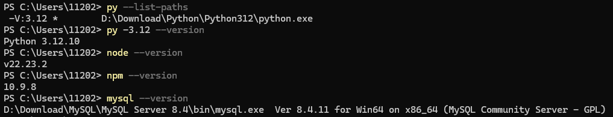

# 00-项目所需基本运行环境


## 一、准备软件环境

浏览器负责Vue页面的交互，Vite在开发阶段编译Vue文件并转发`/api`请求；Uvicorn运行FastAPI；后端通过SQLAlchemy、PyMySQL访问MySQL。AI功能还需让后端访问模型服务。

| 软件               | 版本              | 用途                   |
| ------------------ | ----------------- | ---------------------- |
| Python             | 3.12.10           | 后端、初始化脚本、测试 |
| Node.js与npm       | Node 22.23.2      | 前端开发和构建         |
| MySQL Server客户端 | 8.4               | InnoDB表、事务、查询   |
| 代码编辑器         | WebStorm、PyCharm | 编辑Python、Vue、SQL等 |
| 浏览器             | Chrome浏览器      | 查看页面               |
| PowerShell         | Windows自带终端   | 执行本地命令           |

安装步骤略，请自行查阅相关资料。

检查软件环境是否都已具备：




## 二、固定本项目位置

项目根目录位于`E:\work\projects\mall-v1.0-learning`。

可以先构建一个初步的项目结构：

```
> mall-v1.0-learning
	- docs/            文档
	- database/        即将设计实现的SQL
	- backend/
		- app/         接下来实现的后端应用
		- scripts/     一些程序入口
```


## 三、把环境与源文件分开

代码说明程序要执行的逻辑。

而`.env`提供运行时所使用的数据库账号、数据库密码、连接位置和模型设置等。

虚拟环境与`node_modules`由依赖工具生成。

因此先建立文件忽略规则，防止不必要的文件上传到Git。

**在项目根目录下创建`.gitignore`**

```
.env
.env.*
!.env.example
*.pem
*.key
*.p12
*.pfx
*.crt
*.cer
*.sql.gz
*.sql.zip
*.tar
*.tar.gz
*.tgz
*.zip
*.bak
*.dump
secrets/
backups/
deploy/runtime/
.venv/
__pycache__/
*.pyc
.pytest_cache/
node_modules/
dist/
.coverage
*.log
reports/local-*
backend/requirements.local.lock.txt
frontend/package-lock.json
```


## ※ 总结

- 能够确认Python、Node、npm、MySQL的版本。
- 知道MySQL的root账号密码。
- 构建基本的项目目录和`.gitignore`。
- 下一步先考虑好系统的基本业务需求。
