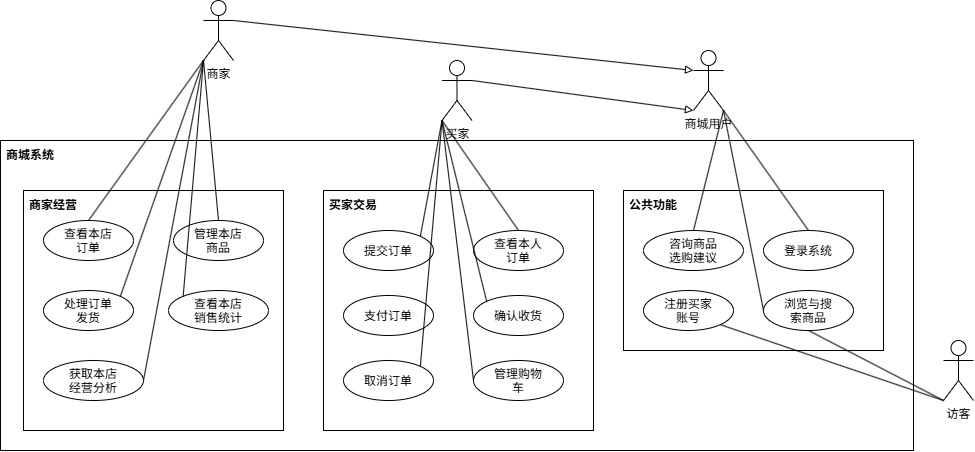

# 01-业务需求与系统总体设计

基于商城的使用场景，讨论角色、用例、业务规则和模块边界。以此为下一步设计数据库提供依据。

## 一、从一次购物和一次经营理解系统

买家浏览商品，选择具体规格，设置购物车数量，然后按店铺提交订单。

系统在下单时确定成交金额、扣减库存，并保存收货信息。

买家支付（模拟）后，商家发货（模拟），买家确认收货。

买家也可以取消待支付订单，系统归还库存。

商家维护本店商品、规格、售价和可售库存，处理本店订单，查看销售统计。

智能导购读取公开商品与资料回答选购问题。

经营分析助手读取登录店铺的统计并生成解释。

## 二、角色与用例

### （一）角色

| 角色 | 可以发起的操作                                     | 操作的数据                       |
| ---- | -------------------------------------------------- | -------------------------------- |
| 访客 | 浏览、搜索、查看详情、注册买家、登录               | 上架商品、公开品类               |
| 买家 | 设置购物车、下单、查看订单、支付、取消、收货、导购 | 本人购物车与订单、公开商品和资料 |
| 商家 | 管理商品和SKU、查看和发货、统计与经营分析、导购    | 本店经营数据、公开商品和资料     |

### （二）用例图

### （三）用例文字描述

以下文字描述与用例图中的 15 个用例一一对应，按公共功能、买家交易、商家经营的顺序编号。图中的“商城用户”是买家与商家的共同角色，因此相关用例的 Actor 写作“商城用户（买家、商家）”；登录用例中的角色不表示已经登录。

描述采用“ID、Actor、前置条件、主流程、后置条件、备选流程、异常流程”的格式。主流程描述一次典型的成功交互；A 表示正常的备选路径，E 表示阻止目标完成的异常路径，编号在各用例内独立使用。后置条件分别说明成功结果与失败时应保持的状态。登录是受保护用例的前置条件，不表示每次操作都要重新执行登录。

支付与发货均为模拟操作；下文中的状态和错误码沿用该项目约定。

#### 用例：浏览与搜索商品

**ID**：UC-001

**Actor**：访客、商城用户（买家、商家）

**前置条件**：无需登录。

**主流程**：

1. Actor 进入商品页面，浏览商品列表，或输入关键词、选择品类发起查询。
2. 系统校验查询条件，仅查询已上架商品，并按条件返回分页列表与总数。
3. Actor 选择一件商品查看详情。
4. 系统确认商品仍处于上架状态，展示商品说明、所属店铺、SKU、当前售价和可售库存。

**后置条件**：成功时，Actor 获得公开商品信息；无论成功或失败，商品、库存和订单数据均不发生变更。

**备选流程**：

- A1：第 2 步没有符合条件的商品 → 返回空列表，Actor 可调整条件重新查询。
- A2：Actor 只浏览列表，不查看详情 → 在第 2 步完成本次查询。

**异常流程**：

- E1：第 2 步查询参数不合法 → 返回参数错误，提示修改后重试。
- E2：第 4 步商品不存在或已下架 → 返回 404，提示商品不可访问。

#### 用例：注册买家账号

**ID**：UC-002

**Actor**：访客

**前置条件**：系统已开启公开注册功能。

**主流程**：

1. 访客输入用户名、密码并提交注册请求。
2. 系统检查注册开关、输入格式和用户名是否可用；用户名按项目规则统一转为小写。
3. 系统对密码进行哈希处理，创建角色固定为买家的账号。
4. 系统返回注册成功及账号信息。

**后置条件**：成功时，新增一个可用于登录的买家账号，密码不以明文保存；失败时，不创建账号。注册本身不代表登录成功，也不创建商家账号或店铺。

**异常流程**：

- E1：第 2 步发现公开注册已关闭 → 拒绝注册，提示当前不允许注册。
- E2：第 2 步用户名或密码不符合输入要求 → 返回 422，提示修改输入。
- E3：用户名已经存在，或保存时发生同名冲突 → 返回 409，提示更换用户名。
- E4：账号保存失败 → 不保留本次未完成的账号记录，提示稍后重试。

#### 用例：登录系统

**ID**：UC-003

**Actor**：商城用户（买家、商家）

**前置条件**：Actor 已有账号；买家账号通过注册或初始化建立，商家账号由系统初始化建立。

**主流程**：

1. Actor 输入用户名、密码并提交登录请求。
2. 系统查询账号，验证用户名和密码是否匹配。
3. 系统读取账号的真实角色，签发有有效期的身份令牌。
4. 系统返回令牌和用户信息，客户端保存令牌，供后续受保护请求使用。

**后置条件**：成功时，Actor 获得可用于后续身份验证的令牌，账号角色保持不变；失败时，不签发新的有效令牌。

**异常流程**：

- E1：第 1 步输入格式不合法 → 返回参数错误，提示修正输入。
- E2：第 2 步账号不存在或密码错误 → 拒绝登录，提示用户名或密码错误。
- E3：认证过程中服务不可用 → 本次登录失败，提示稍后重试。

#### 用例：咨询商品选购建议

**ID**：UC-004

**Actor**：商城用户（买家、商家）

**前置条件**：Actor 已登录。

**主流程**：

1. Actor 提交选购问题，可同时填写预算和品类。
2. 系统验证登录身份和输入，并确定查询条件；显式填写的预算、品类优先于问题文本中识别的条件。
3. 系统查询符合条件、已上架且有库存的商品规格，并检索公开选购说明和购物规则。
4. 系统依据查询结果和资料生成建议，校验推荐商品和引用资料是否来自本次检索结果。
5. 系统返回回答、推荐商品、引用资料及实际运行模式，供 Actor 查看。

**后置条件**：成功时，Actor 获得基于公开商品与资料的建议，展示的商品信息来自查询结果；本用例不修改购物车、订单或库存，也不读取其他用户的私有交易数据。失败时，不返回未经来源校验的推荐结果。

**备选流程**：

- A1：第 3 步没有符合条件的商品 → 正常返回无候选商品的说明，推荐列表为空，Actor 可调整预算或品类。
- A2：系统配置为 mock 模式 → 使用程序规则组织回答，并标明 mock 模式。
- A3：真实模型、向量检索或生成结果校验失败，但基础商品查询等仍可用 → 使用本地检索或规则回答降级处理，返回 degraded 模式及提示。

**异常流程**：

- E1：第 2 步身份令牌无效或过期 → 拒绝请求，提示重新登录。
- E2：第 2 步问题、预算或品类等输入不符合要求 → 返回参数错误。
- E3：基础商品数据查询等必要环节失败，无法完成降级回答 → 提示服务暂不可用，不把失败结果伪装成正常推荐。

#### 用例：管理购物车

**ID**：UC-005

**Actor**：买家

**前置条件**：买家已登录。新增或设置购物车条目时，需指定商品规格（SKU）及目标数量。

**主流程**：

1. 买家选择一个 SKU，输入希望购买的数量并提交加入或更新购物车的请求。
2. 系统确认买家身份和本人购物车范围，校验商品状态、数量、库存与购物车容量。
3. 系统将该 SKU 在本人购物车中的数量设置为本次提交的目标值；原条目不存在时创建条目。
4. 系统返回操作结果，买家查看更新后的购物车及当前商品价格、库存和店铺信息。

**后置条件**：成功时，仅本人购物车中的目标条目发生相应变更；失败时，本次请求不改变购物车。购物车不预占或扣减库存，展示金额不作为最终成交金额。

**备选流程**：

- A1：买家仅查看购物车 → 系统返回本人条目；购物车为空时返回空列表。
- A2：买家移除某条目 → 系统删除本人对应条目；重复移除已不存在的条目仍返回成功。
- A3：买家重复提交同一 SKU 和目标数量 → 数量保持为该值，不重复累加。
- A4：已有条目的商品后来下架或库存不足 → 仍可查看其状态或移除，是否可购买在设置数量及结算时校验。

**异常流程**：

- E1：身份无效或不是买家 → 拒绝访问本人购物车以外的资源或买家专属功能。
- E2：目标数量不是 1—99 范围内的整数 → 返回参数错误。
- E3：目标商品或 SKU 不可用，或目标数量超过当前库存 → 拒绝本次设置，提示重新选择或调整数量。
- E4：新增条目会使购物车超过 50 种 SKU → 拒绝新增，提示先整理购物车。

#### 用例：提交订单

**ID**：UC-006

**Actor**：买家

**前置条件**：买家已登录；首次提交时，选中的 SKU 已在本人购物车中且属于同一店铺；请求包含所选 SKU、收货信息和标识本次下单意图的幂等键。

**主流程**：

1. 买家选定同一店铺的购物车条目，确认收货信息并提交订单。
2. 系统识别当前买家，检查幂等键是否已用于本次请求；首次请求继续后续步骤。
3. 系统读取本人购物车中的实际数量，锁定并校验所选商品和 SKU，确认上架状态、店铺归属及库存满足要求。
4. 系统按照服务端当前价格和购物车数量计算成交金额。
5. 系统创建待支付（`pending`）订单及明细，保存收货信息和成交时的商品名称、规格、单价、数量快照。
6. 系统扣减对应可售库存，移除本人购物车中已结算的条目，并将上述变更作为一个事务提交。
7. 系统返回订单信息，买家查看下单结果。

**后置条件**：成功时，同一次下单意图只产生一笔订单，订单金额与快照固定，库存和购物车同步更新；失败时，未完成的订单、库存与购物车变更全部回滚，不留下部分成功的数据。

**备选流程**：

- A1：第 2 步发现相同买家使用原幂等键重发相同请求 → 返回已创建订单，不再次扣库存或创建订单；即使原购物车条目已被结算移除，也可以返回原结果。

**异常流程**：

- E1：身份无效或不是买家 → 拒绝下单。
- E2：第 2 步使用原幂等键，但改变了收货信息或商品选择 → 返回 409，提示同一幂等键不能代表不同下单意图。
- E3：所选 SKU 跨店铺，或请求字段不合法 → 返回 422，提示按店铺结算或修正输入。
- E4：第 3 步发现商品下架、所选购物车条目缺失或库存不足 → 返回 409，提示刷新购物车后重新确认。
- E5：第 5—6 步事务执行失败 → 回滚全部未完成变更；若客户端因网络问题未收到结果，应使用原幂等键和相同请求重试以确认结果。

#### 用例：查看本人订单

**ID**：UC-007

**Actor**：买家

**前置条件**：买家已登录。

**主流程**：

1. 买家进入本人订单页面，发起订单列表查询。
2. 系统验证买家身份，以当前买家身份限定查询范围，返回分页订单列表。
3. 买家选择一笔订单查看详情。
4. 系统再次按订单编号及当前买家身份查询，返回订单状态、成交金额、收货信息和订单明细快照。

**后置条件**：成功时，买家获得本人订单信息，历史成交信息不随当前商品编辑而改变；无论成功或失败，本用例不改变订单状态、金额或库存。

**备选流程**：

- A1：第 2 步本人尚无订单或当前页无记录 → 返回空列表。
- A2：买家只查看列表 → 在第 2 步结束本次查询。

**异常流程**：

- E1：身份无效或不是买家 → 拒绝查询，按情况提示重新登录或无权访问。
- E2：第 4 步订单不存在或不属于当前买家 → 返回 404，不暴露他人订单信息。
- E3：分页等查询参数不合法 → 返回参数错误，提示修正后重试。

#### 用例：支付订单

**ID**：UC-008

**Actor**：买家

**前置条件**：买家已登录；首次支付的目标订单属于本人，且处于待支付（`pending`）状态。

**主流程**：

1. 买家选择本人待支付订单，发起模拟支付。
2. 系统验证买家身份及订单归属，锁定订单并检查当前状态。
3. 系统将订单由 `pending` 更新为已支付（`paid`），记录当前 UTC 支付时间。
4. 系统提交变更，返回支付后的订单信息。

**后置条件**：成功时，订单进入已支付状态并具有支付时间；不再次扣减下单时已扣除的库存，不改变成交金额，也不发生真实资金扣款。失败时，本次请求不改变订单状态和库存。

**备选流程**：

- A1：第 2 步订单已经是 `paid`、`shipped` 或 `completed` → 作为支付请求重放返回当前订单，不重复处理支付，不重写首次支付时间。

**异常流程**：

- E1：身份无效或不是买家 → 拒绝支付操作。
- E2：订单不存在或不属于当前买家 → 返回 404。
- E3：订单已取消，不满足支付状态要求 → 返回 409，提示当前状态不能支付。
- E4：状态更新失败 → 回滚本次未完成变更，提示重试。

#### 用例：取消订单

**ID**：UC-009

**Actor**：买家

**前置条件**：买家已登录；首次取消的目标订单属于本人，且处于待支付（`pending`）状态。

**主流程**：

1. 买家选择本人待支付订单，发起取消请求。
2. 系统验证买家身份和订单归属，锁定订单并确认仍可取消。
3. 系统依据订单明细，将下单时扣减的数量归还至各 SKU 的可售库存。
4. 系统将订单更新为已取消（`cancelled`），与库存归还一并提交。
5. 系统返回取消后的订单信息。

**后置条件**：成功时，订单为已取消状态，原扣减库存仅归还一次，订单及成交快照仍保留；失败时，订单状态与库存归还均不留下部分变更。取消不自动恢复购物车条目。

**备选流程**：

- A1：第 2 步订单已取消 → 返回当前订单，不再次归还库存。

**异常流程**：

- E1：身份无效或不是买家 → 拒绝取消操作。
- E2：订单不存在或不属于当前买家 → 返回 404。
- E3：订单已支付、已发货或已完成 → 返回 409；本版本不通过取消用例处理退款或退货。
- E4：库存归还或状态更新失败 → 回滚整个事务，不允许出现订单已取消但库存未归还的中间结果。

#### 用例：确认收货

**ID**：UC-010

**Actor**：买家

**前置条件**：买家已登录；首次确认收货的目标订单属于本人，且处于已发货（`shipped`）状态。

**主流程**：

1. 买家选择本人已发货订单，发起确认收货请求。
2. 系统验证买家身份与订单归属，锁定订单并检查当前状态。
3. 系统将订单由 `shipped` 更新为已完成（`completed`）。
4. 系统提交变更，返回完成后的订单信息。

**后置条件**：成功时，订单进入已完成状态；失败时，本次请求不改变订单状态。确认收货不再扣减库存，也不修改成交金额和快照。

**备选流程**：

- A1：第 2 步订单已完成 → 返回当前订单，不重复执行状态变更。

**异常流程**：

- E1：身份无效或不是买家 → 拒绝确认收货操作。
- E2：订单不存在或不属于当前买家 → 返回 404。
- E3：订单处于待支付、已支付但未发货或已取消状态 → 返回 409，提示当前状态不能确认收货。
- E4：状态更新失败 → 回滚本次未完成变更，提示重试。

#### 用例：管理本店商品

**ID**：UC-011

**Actor**：商家

**前置条件**：商家已登录，且账号关联有效店铺；修改已有商品或 SKU 时，目标资源须属于本店。

**主流程**：

1. 商家进入商品管理页面，选择创建商品，填写名称、品类、说明、上架状态及至少一条 SKU 信息。
2. 系统根据登录身份确定店铺，验证商品信息、规格编码、售价和库存等输入。
3. 系统将商品及其 SKU 归属到当前店铺，并在同一事务中保存。
4. 系统返回保存结果，商家查看更新后的本店商品列表。

**后置条件**：成功时，本店商品或 SKU 按本次操作完成变更；失败时，本次未完成修改不生效。其他店铺商品和既有订单成交快照不受影响。

**备选流程**：

- A1：商家只查看商品 → 系统返回本店商品及规格信息，不修改数据。
- A2：商家编辑已有商品 → 系统验证归属后，更新名称、品类、说明或上架状态。
- A3：商家新增或编辑 SKU → 系统验证本店归属及输入后，保存规格、售价和库存；新增规格还需校验规格数量上限。
- A4：商家设置库存 → 输入表示当前可售库存的目标绝对值，例如输入 12 表示设为 12，不是增加 12。

**异常流程**：

- E1：身份无效、不是商家或未关联店铺 → 拒绝管理操作。
- E2：目标商品或 SKU 不存在，或不属于本店 → 返回 404。
- E3：创建商品未提供 SKU，或名称、售价、库存等输入不符合要求 → 拒绝保存并提示修正。
- E4：同一商品内规格编码冲突，或新增后超过每件商品 20 个 SKU 的限制 → 拒绝本次新增。
- E5：保存过程中发生数据写入错误 → 回滚本次未完成变更，不保留不完整的商品与规格记录。

#### 用例：查看本店订单

**ID**：UC-012

**Actor**：商家

**前置条件**：商家已登录，且账号关联有效店铺。

**主流程**：

1. 商家进入本店订单页面，发起分页查询。
2. 系统验证商家身份，根据登录账号确定店铺范围。
3. 系统查询本店订单，返回订单列表、总数及订单明细信息。
4. 商家查看订单状态、成交金额、收货信息和商品明细，了解待处理订单情况。

**后置条件**：成功时，商家获得本店订单信息，不获取其他店铺订单；无论成功或失败，本用例不改变订单状态和库存。

**备选流程**：

- A1：本店尚无订单或当前页无记录 → 正常返回空列表。

**异常流程**：

- E1：身份无效、不是商家或未关联店铺 → 拒绝查询。
- E2：分页等查询参数不合法 → 返回参数错误，提示修正后重试。
- E3：订单读取失败 → 提示查询失败，不把服务错误显示为“暂无订单”。

#### 用例：处理订单发货

**ID**：UC-013

**Actor**：商家

**前置条件**：商家已登录且关联有效店铺；首次发货的目标订单属于本店，且处于已支付（`paid`）状态。

**主流程**：

1. 商家选择本店已支付订单，发起模拟发货。
2. 系统验证商家身份及订单店铺归属，锁定订单并检查当前状态。
3. 系统将订单由 `paid` 更新为已发货（`shipped`）。
4. 系统提交变更，返回发货后的订单信息，供买家后续确认收货。

**后置条件**：成功时，订单进入已发货状态；不再次扣减库存，不改变成交金额。本版本仅模拟状态变更，不要求生成物流运单或调用物流平台；失败时，本次请求不改变订单状态。

**备选流程**：

- A1：第 2 步订单已处于 `shipped` 状态 → 返回当前订单，不重复执行发货状态变更。

**异常流程**：

- E1：身份无效、不是商家或未关联店铺 → 拒绝发货操作。
- E2：订单不存在或不属于本店 → 返回 404。
- E3：订单待支付、已取消或已完成 → 返回 409，提示当前状态不能发货。
- E4：状态更新失败 → 回滚本次未完成变更，提示重试。

#### 用例：查看本店销售统计

**ID**：UC-014

**Actor**：商家

**前置条件**：商家已登录，且账号关联有效店铺。

**主流程**：

1. 商家选择统计天数并请求查看销售统计；未指定时采用默认的 7 天。
2. 系统验证商家身份和统计天数，按登录账号确定本店范围。
3. 系统以当天 UTC 00:00 为结束时刻，确定此前指定天数的完整日区间，以及紧邻其前的等长对比区间；本期不含当天。
4. 系统按支付时间统计本店状态为已支付、已发货或已完成的订单，计算订单数、销售额、客单价、销售额环比、每日趋势和销售额前五的商品汇总。
5. 系统返回统计结果及时间范围，商家查看本期表现和与上期的比较。

**后置条件**：成功时，商家获得仅属于本店、统计口径一致的销售数据；无论成功或失败，本用例不修改商品、库存或订单。

**备选流程**：

- A1：本期没有符合条件的支付订单 → 订单数、销售额和客单价为 0，无订单的日期补 0，商品排行为空。
- A2：上期销售额为 0 → 销售额环比返回空值，表示无法按该公式计算，不展示为 0% 增长。

**异常流程**：

- E1：身份无效、不是商家或未关联店铺 → 拒绝查询。
- E2：统计天数不是 1—90 范围内的整数 → 返回 422，提示调整范围。
- E3：统计数据读取或计算失败 → 提示查询失败，不以零值代替失败结果。

#### 用例：获取本店经营分析

**ID**：UC-015

**Actor**：商家

**前置条件**：商家已登录，且账号关联有效店铺。

**主流程**：

1. 商家选择分析天数，提交经营分析请求。
2. 系统验证商家身份和输入，从登录账号确定店铺，不接受客户端指定其他店铺。
3. 系统读取本店销售统计，沿用 UC-014 的完整 UTC 日、支付时间、订单状态及等长对比区间口径。
4. 系统依据统计结果生成经营观察、待验证的原因假设和后续检查建议。
5. 系统返回统计指标、分析说明及实际运行模式，商家查看结果并判断后续经营动作。

**后置条件**：成功时，商家获得本店统计及其解释，指标数值来自统计服务，原因假设与已确认事实分别展示；本用例不自动修改商品价格、库存或订单。失败时，不返回其他店铺数据或虚构的统计结果。

**备选流程**：

- A1：本期无成交或上期销售额为 0 → 沿用统计服务的零值和空值口径进行解释，不编造增长率或确定性的经营原因。
- A2：系统配置为 mock 模式 → 返回基于真实统计结果组织的规则分析，标明 mock 模式。
- A3：真实模型调用或输出校验失败，但统计读取成功 → 返回规则分析，标明 degraded 模式及提示，保留可核对的统计指标。

**异常流程**：

- E1：身份无效、不是商家或未关联店铺 → 拒绝经营分析请求。
- E2：分析天数不符合输入要求，或请求额外提交店铺编号等不允许的字段 → 返回 422。
- E3：本店统计读取失败 → 本次分析失败，提示稍后重试；不能仅凭模型生成经营结论。

## 三、业务规则与职责分配

