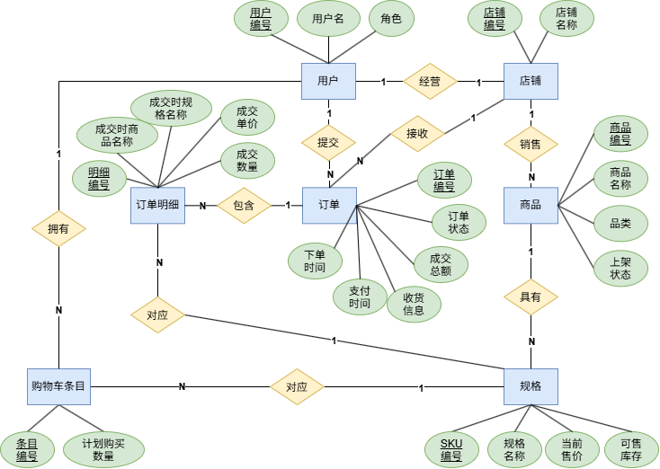

# 02-数据库概念模型与逻辑设计

## 一、怎样基于业务需求，有条不紊地整理出数据表

上一章已经描述了商城中的角色、用例及其需要的信息。本节接着回答一个实际问题：如果手里只有这些需求，怎样通过人工分析逐步形成数据表，而不是凭印象猜出“用户表、商品表、订单表”？

可以把设计过程理解为：**先记录业务事实，再将事实组织成候选对象，用具体场景检查，发现问题后修正，最后形成候选表。** 上一章列出的七类对象可以作为核对结果，但不必假设自己一开始就能完整发现它们。

下面以本项目为例重建一条可实际操作的推导路径。其中的粗稿、错误尝试和修正是教学推演，不代表原项目真实经历过这些设计版本，也不是唯一正确的设计顺序。

### （一）先明确本轮要解决的问题

这一轮要确定的是“有哪些信息需要长期保存、怎样分组、彼此有什么联系”。具体字段长度、索引和建表 SQL 在后面继续设计。

分析每个业务动作时，都使用同一组问题，避免想到哪里算哪里：

1. **事前需要知道什么？** 没有这些信息，系统能否完成操作？
2. **事后产生或改变什么？** 是新增一件事实，还是更新已有记录？
3. **之后还需要用到什么？** 页面关闭、商品改价或订单完成后，哪些内容仍须保留？
4. **这些信息属于谁、指向什么？** 例如是哪个买家的选择、哪家店铺的商品、哪笔订单的明细。

准备一张分析草稿，按“业务动作—读取信息—新增或修改的信息—待确认问题”记录即可。先用中文表达，不必立即给每个对象起英文表名。

同时固定当前范围：本项目按店铺结算，支付与发货为模拟操作，销售统计来自订单，AI 功能负责读取和解释信息。其他电商系统中的优惠券、退款、仓库、物流运单等功能，不能仅凭“电商一般都有”就加入本次模型。

### （二）沿业务主线盘点信息，不按页面顺序猜表

先走一遍“商家准备商品 → 买家选择商品 → 下单 → 支付 → 发货 → 收货”，再补取消、查询、统计和 AI。此时使用“商品规格”“购买选择”等业务词语，暂不假定它们各自对应一张表。

| 业务动作 | 事前需要读取的信息 | 事后需要保存或改变的信息 |
| --- | --- | --- |
| 注册、登录 | 注册要求；已有账号及其登录凭据 | 注册产生账号及角色；登录使用已有账号确认身份 |
| 商家准备商品 | 商家身份、经营的店铺 | 商品介绍、可售规格、各规格售价与库存、上架状态 |
| 买家浏览与选择 | 已上架商品、规格、价格、库存 | 单纯浏览不产生新的购买记录 |
| 买家管理购物车 | 买家身份、目标规格和当前可售情况 | 该买家打算购买的规格及数量，可增加、修改或移除 |
| 买家提交订单 | 选中的购买条目、当前售价、库存、收货信息 | 一次交易及购买内容；库存减少，所选购物车条目移除 |
| 支付、发货、收货 | 同一笔订单的归属、金额、当前状态 | 订单状态改变；支付发生时还要记住支付时间 |
| 取消待支付订单 | 订单状态、原购买规格及数量 | 订单取消，对应库存归还，历史订单保留 |
| 查询订单、查看统计 | 买家或店铺归属、订单状态、时间、金额及明细 | 本版本以读取和计算为主，不因此新增一套交易事实 |
| 使用导购与经营分析 | 公开商品与资料，或当前店铺统计 | 本版本返回建议与解释，不自动产生订单或修改商品 |

这一步的产出是**需要保存的信息清单**。同一份信息可能被多个动作使用，例如订单状态会被支付、取消、发货和收货共同读取。多个功能使用同一份信息，不意味着每个功能都要建立一张表。

### （三）用一个具体例子写出第一份粗稿

只看“商品”“订单”这样的抽象名词，很容易忽略内部差异。可以先在纸上写出一段具体业务经历：

> 商家甲经营“行旅店”，销售一款背包，黑色款单价 200 元、库存 30 件，蓝色款单价 220 元、库存 80 件；店里还销售单价 50 元的收纳包。买家乙选择两件黑色背包和一件收纳包，向行旅店提交订单，总额为 450 元。

先写成便于阅读的草稿，不要求这时就是合格的数据库结构：

```text
账号：商家甲、买家乙，各有登录凭据和角色
商家甲经营的店铺：行旅店
商品：背包，包含黑色款和蓝色款，收纳包。各有价格与库存
购买选择：买家乙选择黑色背包 2 件、收纳包 1 件
交易：买家乙向行旅店购买以上内容，总额 450 元，寄往所填地址，待支付
```

第一反应可能只是准备“账号、商品、订单”三个候选集合。这是一份可供检查的初稿。旁边还应记下几个没有解决的问题：店铺信息放在哪里？颜色不同怎么办？购买选择与正式订单能否共用记录？一笔订单里的两种东西怎样表示？

**粗稿允许不完整，但不确定之处要显式记下来。** 后续每发现一个具体问题，就修改模型并写下原因，而不是默默增加一张表。

### （四）逐个解决粗稿中装不下的业务事实

#### 1. 先检查账号、角色与店铺是不是同一件事

一种初稿是分别建立买家表和商家表。但检查注册、登录用例后发现，二者都需要账号和登录凭据，主要区别在于业务角色。本版本可以先使用统一的账号候选表，用角色区分买家与商家；访客不是一种必须保存的账号记录。

这不意味着所有系统都只能采用一张用户表。如果未来买家、商家拥有大量不同的档案信息，可以再讨论角色档案与账号分开保存。本轮先依据现有需求作出选择。

再看店铺：店铺具有自己的名称，会拥有多件商品，还要接收订单、汇总销售。如果把店铺名称重复写进每件商品，店铺改名就需要修改多条商品记录；如果只记录一个“商家姓名”，也没有清楚表达登录账号与经营主体的区别。

因此增加**店铺**候选表，记录经营主体，并与商家账号建立关系。本项目限制一个商家账号对应一个店铺，这是当前范围内的关系约束，不是电商系统永远只能如此。

这一轮可暂记为：账号、店铺、商品、订单；商品规格、购买选择和订单内部内容仍待处理。

#### 2. 用“同一商品有多种规格”检查商品候选表

假设初稿把一条商品记录写成“背包，价格 200 元，库存 30 件”。蓝色款的 220 元和 80 件就没有位置了。

一种补救是添加“黑色价格、黑色库存、蓝色价格、蓝色库存”等字段。但以后增加绿色、尺寸或其他规格组合时，就要不断改变字段；同样的信息结构被重复写了多次。

再检查这些信息描述的对象：

- 名称、品类、介绍，描述整款商品。
- 颜色等规格组合、售价、库存，描述一种可以独立销售的版本。

于是将它们拆成**商品**与 **SKU** 两类候选记录。一个商品可以有多条 SKU，每条 SKU 有自己的售价和库存。

这里依据的是“同一商品包含多个可独立定价和计库存的规格”，不是“最多 20 个 SKU”这个项目上限。规格种类数与每种规格的库存件数是两回事，上限改变也不应迫使我们重新添加一组颜色字段。

#### 3. 用“加入后暂时不买”发现购物车条目

如果初稿只有订单，就需要回答：买家今天加入购物车、明天再来时，系统从哪里恢复他的选择？

可以尝试将购物车也当作一种订单，但继续走场景会遇到差异：购物车可以不断修改，尚未确定成交价格，也不扣库存；正式订单形成后需要保存成交内容，所选购物车条目还会被移除。两者的存在时间与变化规则不同。

因此增加**购物车条目**候选表。一条记录的含义是：

> 某个买家，当前打算购买某个 SKU，数量为多少。

数量不能简单放到用户记录里，因为一个买家会选择多种 SKU；也不能放到 SKU 记录里，因为不同买家的购买数量不同。它属于“这个买家选择这个 SKU”的联系，所以这份联系本身需要记录。

本项目规定同一买家的同一 SKU 只保留一个条目，修改数量就是更新该条目。当前购物车没有独立的名称、状态、共享成员等信息，因此先用条目表达购物车内容，不额外建立购物车总表。以后如果需求改变，再重新判断。

#### 4. 用“一笔订单买两种东西”发现订单明细

如果一条订单记录只能保存一个商品和数量，那么例子中的背包与收纳包怎么办？

把两种购买内容拆成两笔订单，会丢失“它们共同构成一次交易、共用收货信息和处理状态”的事实。反过来，在订单记录中添加“商品一、商品二、商品三”等字段，又会遇到数量不固定、字段重复的问题。

可以先把信息分成两组：

| 描述对象 | 一条记录的含义 | 需要表达的信息 |
| --- | --- | --- |
| 整笔订单 | 某买家向某店铺提交的一次交易 | 买家、店铺、收货信息、状态、时间、总额 |
| 订单明细 | 某笔订单中的一种成交规格 | 订单、SKU、成交单价、成交数量等 |

这样，一笔订单可以拥有多条明细。例子中是同一笔订单下两条明细：黑色背包 2 件，收纳包 1 件。

“一条记录到底代表什么”必须能用一句话说清楚。这句话确定了记录的粒度，比先讨论字段名称更重要。粒度不清楚，就容易把整笔订单的信息与每种商品的信息混在一起。

#### 5. 用“第二天改价”检查是否遗漏历史事实

到这里，账号、店铺、商品、SKU、购物车条目、订单、订单明细已经有了初步位置，但这不代表设计结束。

假设订单明细只存 SKU 和数量，显示价格时总是读取 SKU 当前价格。第二天黑色背包涨价到 230 元，原订单就可能被错误展示成 510 元，而不是成交时的 450 元。

这次修正不需要增加一张新表，而是为订单明细补充**成交时的名称、规格和单价**。订单的收货信息也按下单时的内容保留。

当前 SKU 单价与历史成交单价虽然都叫“价格”，却描述不同时间的事实。保存成交快照不是无意义地重复当前数据，而是在保存原本缺失的历史信息。

经过这一轮，用例不仅帮助我们发现表，还帮助我们判断哪些字段不能只通过当前数据临时查询得到。

### （五）用状态、查询和重复操作继续查漏补缺

不要等所有表“看起来齐了”才检查业务。每修正一版，就换几个场景推演。下面这些问题通常会补出属性、关系或约束，而不是新表：

| 用来检查的问题 | 初稿可能存在的缺口 | 应补充或修正的内容 |
| --- | --- | --- |
| 怎样保证买家只看本人订单、商家只看本店订单？ | 订单只记录商品和金额，没有明确归属 | 订单关联买家及店铺；权限由使用这些归属信息的业务逻辑判断 |
| 是否能先收货再支付？取消后还能发货吗？ | 只有“存在一笔订单”，没有当前进展 | 记录订单状态，明确允许的状态变化；并非每个动作都自动需要一张表 |
| 今天下单、明天支付，销售额算在哪一天？ | 只记录一个含义模糊的“订单时间” | 区分下单时间与支付时间；待支付时支付时间尚不存在 |
| 取消时归还哪个库存，归还多少？ | 明细只有显示文本，没有准确规格和数量 | 明细关联具体 SKU，保留数量；是否已经归还结合取消状态判断 |
| 同一买家下周又买相同商品，会不会被当成重复订单？ | 错把“买家＋SKU”当成订单唯一标识 | 每次交易具有独立身份，同一买家可以多次购买同一 SKU |
| 没收到下单响应后重试，怎样避免新建第二笔订单？ | 只能识别订单，不能识别原下单意图 | 需要保存下单意图标识及可核对的请求内容特征；区别于正常的再次购买 |
| 需要按店铺和时段统计销售吗？ | 有金额，但缺少店铺归属或支付时间 | 检查订单与明细是否提供统计所需的原始信息 |

查询需求尤其适合反向检查模型。例如，先写一句“查出行旅店上周支付的订单及金额”，再沿草稿寻找店铺、支付时间、状态和成交金额。如果其中任何一项找不到，就有一个明确的待补问题。

重复请求的标识、状态更新的一致性和并发库存处理，会在后续设计与实现中继续细化。本节先识别需要保存的事实与必须成立的条件，不在这里展开锁、事务代码或重试算法。

### （六）逐项回放用例，检查覆盖与多余设计

主线推演帮助建立第一版模型，但仅走一次正常购物流程仍可能漏掉登录、管理、统计等需求。接下来按上一章的用例编号逐一检查，使核对范围明确可见。

| 用例 | 模型应提供的数据支持 | 是否因此需要新的独立记录 |
| --- | --- | --- |
| UC-001 浏览与搜索商品 | 商品介绍、上架状态、店铺、SKU、当前售价与库存 | 读取已有数据 |
| UC-002 注册买家账号 | 账号身份、唯一登录名、登录凭据、角色 | 注册创建用户记录 |
| UC-003 登录系统 | 根据账号核对凭据并识别角色 | 本版本使用已有账号，不因登录动作新建一张业务表 |
| UC-004 咨询商品选购建议 | 可售商品与 SKU、公开资料 | 本版本读取并组织回答，不要求保存聊天历史 |
| UC-005 管理购物车 | 买家、SKU、目标数量 | 创建、修改或移除购物车条目 |
| UC-006 提交订单 | 购物车选择、店铺、收货信息、成交内容、下单意图 | 新建订单和明细，同时调整相关库存与购物车条目 |
| UC-007 查看本人订单 | 买家归属、订单状态、时间、金额、成交明细 | 读取订单及明细 |
| UC-008 支付订单 | 订单归属、金额、状态、支付时间 | 本版本模拟支付，更新原订单 |
| UC-009 取消订单 | 订单归属、状态、成交 SKU 和数量 | 更新原订单及 SKU 库存，保留订单和明细 |
| UC-010 确认收货 | 订单归属和当前状态 | 更新原订单 |
| UC-011 管理本店商品 | 商家与店铺关系、商品介绍、SKU、价格和库存 | 创建或修改商品、SKU |
| UC-012 查看本店订单 | 订单的店铺归属及成交内容 | 读取订单及明细 |
| UC-013 处理订单发货 | 店铺归属、收货信息、当前订单状态 | 本版本模拟发货，更新原订单 |
| UC-014 查看本店销售统计 | 店铺、支付时间、订单状态、成交金额和明细 | 本版本从交易记录计算，不额外保存一套销售事实 |
| UC-015 获取本店经营分析 | 与销售统计一致的本店指标 | 读取统计并解释，不要求保存独立分析报告 |

这张表提供的是“业务操作与数据之间的对应关系”，不是“一个用例对应一张表”。导购的公开文本资料也属于信息来源，但本项目在后续章节以资料文件及检索结构组织，不要求全部塞入当前商城关系表。

然后进行反向检查：对每张候选表、每项候选信息，都问“哪个需求会使用它？如果不保存，具体哪一步会失败？”

例如，真实支付通常可能涉及多次尝试、渠道流水或退款，但本项目当前只模拟一次订单支付。因此，不能仅凭“有支付用例”就增加完整支付流水模型；同样，也不能据此得出“支付永远不需要独立记录”的结论。

同一份信息被多个用例读取，是共享数据；同一笔订单下次再次被查询，还是原记录；同一买家再次购买同一商品，则是新交易。**是否重复，应依据事实的身份与时间含义判断。**

### （七）遇到不确定需求时，记录假设并验证

很多设计分歧来自需求尚未确定，而不是设计者不会建表。遇到会改变对象或关系的问题，应先查用例和项目说明；仍无依据时，把它作为待确认项保留，不能把个人习惯写成事实。

可以用下面的形式记录设计判断：

| 问题 | 本项目当前依据或决定 | 如果条件改变，可能影响什么 |
| --- | --- | --- |
| 一个商家能否经营多家店？ | 当前按一个商家对应一个店铺组织 | 账号与店铺的关系数量、店铺选择与权限判断 |
| 一笔订单能否包含多家店？ | 当前按店铺分别下单 | 订单归属、拆单方式、发货和收货的状态边界 |
| 收货地址是否需要长期复用和独立管理？ | 当前仅要求记录每笔订单的收货信息 | 若增加地址簿，再考虑独立地址记录；订单仍需保留当时的收货信息 |
| 商品品类是否需要独立编码、层级或管理功能？ | 当前将品类作为商品上的分类信息 | 若增加层级或独立管理，再评估品类实体及关联关系 |
| 一个订单是否需要多次支付记录或多次发货？ | 当前采用订单级模拟支付、发货 | 支付或发货可能需要独立身份、状态与历史记录 |
| 是否要记录库存每次变化的原因和历史？ | 当前维护可售库存，并由订单支持交易扣还 | 若要求完整审计，需要补充库存变动记录等模型 |

这些是有条件的设计选择，不是让当前项目提前实现未来所有功能。需要在本次范围内作出决定，同时知道决定依赖什么条件。

也可以为修正保留一句简短说明：

> 初稿只有一个商品价格 → 多规格场景无法表达 → 区分商品与 SKU。
>
> 初稿订单明细只引用当前商品 → 改价后历史金额失真 → 补充成交快照。

这样的记录比单独记住最终表名更有价值：下次遇到不同业务，可以沿着问题重新推导，而不是套用商城模板。

### （八）形成可进入后续设计的候选表清单

经历信息盘点、粗稿修正、场景推演和用例核对后，再为稳定的候选对象确定表名。到这里，本项目得到的清单才有明确依据：

| 候选表 | 一条记录表达什么 | 为什么需要独立保存 |
| --- | --- | --- |
| `users` | 一个登录账号 | 统一识别使用者，保存账号与角色信息 |
| `shops` | 一个商家经营的店铺 | 商品、订单和经营数据需要明确经营归属 |
| `products` | 一款商品的共同介绍 | 多个可售规格共享名称、品类和说明 |
| `skus` | 商品的一种具体可售规格 | 每种规格独立定价和计库存 |
| `cart_items` | 某买家当前对某 SKU 的购买意愿与数量 | 购买前可修改，独立于正式成交记录 |
| `orders` | 某买家向某店铺提交的一次交易 | 一次交易有自己的身份、收货信息、时间和状态 |
| `order_items` | 某订单中一种 SKU 的成交内容 | 一笔订单包含多项购买内容，并需保存成交快照 |

七张表是本项目在当前需求下的设计结果，不是预先规定的数量。后续如果发现某个真实场景无法表达，仍然可以修正；修正应说明新增了什么事实、为什么原模型不能支持。

在开始完整 E-R 图和字段设计前，检查是否已经做到：

1. 每张候选表都能用一句话说明“一行代表什么”，没有把多种不同粒度混在一起。
2. 能区分已有记录的更新与新事实的产生，例如修改购物车数量与再次下单。
3. 能说清主要关系，例如商品与 SKU、订单与明细、买家与订单，并标出关系数量上的待确认问题。
4. 已按 15 个用例核对所需信息，并用多规格、一单多件、改价、取消、重复提交等场景检查过草稿。
5. 已区分原始业务事实、历史快照与可计算结果，明确哪些信息需要保存、哪些目前只需计算或从其他来源读取。

接下来再将这些判断整理成概念模型，并继续确定完整字段、标识和约束。此时画 E-R 图，是把已经推导和检查过的关系表达清楚；设计仍可继续修正，但不再依靠临时猜测表名来推进。


## 二、先确定每张表的一行代表什么

| 中文名     | 表          | 一行的含义                   | 关键业务标识                | 说明                                       |
| ---------- | ----------- | ---------------------------- | --------------------------- | ------------------------------------------ |
| 用户表     | users       | 一个登录账号                 | username唯一                | 统一识别使用者，保存账号与角色信息         |
| 店铺表     | shops       | 一个商家经营的店铺           | owner_id唯一                | 商品、订单和经营数据需要明确经营归属       |
| 商品表     | products    | 店铺下一个商品的共同介绍     | id                          | 多个可售规格共享名称、品类和说明           |
| 商品规格表 | skus        | 商品的一种可售规格           | 同商品内code唯一            | 每种规格独立定价和计库存                   |
| 购物车表   | cart_items  | 某买家计划购买某SKU的数量    | user_id + sku_id唯一        | 购买前可修改，独立于正式成交记录           |
| 订单表     | orders      | 某买家向某店铺提交的一次交易 | user_id+idempotency_key唯一 | 一次交易有自己的身份、收货信息、时间和状态 |
| 订单明细表 | order_items | 某订单中一个SKU的成交快照    | order_id+sku_id唯一         | 一笔订单包含多项购买内容，并需保存成交快照 |

以买家在某店铺购买“行旅 Air 14”为例：

- 买家和商家的登录账号分别对应`users`中的一行。
- 商家经营的店铺对应`shops`中的一行。
- 该店铺销售的“行旅 Air 14”对应`products`中的一行，保存商品名称、品类和描述。
- 16GB/512GB与32GB/1TB两种可售规格则分别对应`skus`中的一行，各有售价和库存。
- 假设买家把这两种规格分别加入购物车，数量分别为2台和1台，就会形成两条`cart_items`记录，每条记录表示“这个买家准备购买这个SKU，数量是多少”。
- 买家将这两条记录一起按店铺结算后，生成一条`orders`记录，保存整笔交易的买家、店铺、收货信息、状态和总金额。
- 同时生成两条`order_items`记录，分别保存两种SKU的成交名称、规格、单价和数量。因此，此处购买3台电脑意味着有1条订单和2条订单明细。

另外：

- 购物车：表达尚可调整的购买意愿
- 订单及明细：表达已经提交的交易。
- 下单成功后，所选购物车条目被移除，订单和明细仍然保留。
- 购物车与订单明细都关联SKU，以明确具体购买的规格。
- 订单明细保存成交快照，确保商品日后改名、改价时，历史交易仍能准确展示。


## 三、E-R图

矩形表示实体，菱形表示联系，椭圆形表示属性，下划线表示作为标识的属性。



**实体、属性、主键、外键**

- 用户
  - 表示一个登录账号。
  - 属性：<u>用户编号</u>、用户名、角色。（角色区分买家与商家）
  - 外键：无。
- 店铺
  - 表示一个商家经营的店铺。
  - 属性：<u>店铺编号</u>、店铺名称。
  - 外键：经营者编号，指向用户。（本项目还要求该字段唯一，以限制一个账号最多经营一家店铺）
- 商品
  - 表示一款商品的共同信息。
  - 属性：<u>商品编号</u>、商品名称、品类、上架状态。
  - 外键：店铺编号，指向所属店铺。
- 规格（SKU）
  - 表示商品的一种具体可售规格。
  - 属性：<u>SKU编号</u>、规格名称、当前售价、可售库存。
  - 外键：商品编号，指向所属商品。
- 购物车条目
  - 表示某买家准备购买某个SKU的数量。
  - 属性：<u>条目编号</u>、计划购买数量。
  - 外键：用户编号、SKU编号，分别指向买家和所选规格。
- 订单
  - 表示某买家向某店铺提交的一次交易。
  - 属性：<u>订单编号</u>、订单状态、成交总额、收货信息、下单时间、支付时间。
  - 外键：用户编号、店铺编号，分别指向买家和收单店铺。
- 订单明细
  - 表示一笔订单中某个SKU的成交内容。
  - 属性：<u>明细编号</u>、成交时商品名称、成交时规格名称、成交单价、成交数量。（成交属性保存历史快照，不随商品后续改名、改价而改变）
  - 外键：订单编号、SKU编号。

**各个联系**

- 用户——经营——店铺：`1:1`

一个商家账号最多经营一家店铺，每家店铺由一个商家账号经营。普通买家没有店铺。

- 店铺——销售——商品：`1:N`

一家店铺可以销售多款商品，每款商品属于一家店铺。

- 商品——具有——规格：`1:N`

一款商品可以有多个SKU，每个SKU属于一款商品。

- 用户——拥有——购物车条目：`1:N`

一个买家可以拥有多条购物车记录，每条记录属于一个买家。

- 规格——对应——购物车条目：`1:N`

一个SKU可以出现在多个买家的购物车中，每条购物车记录只对应一个SKU。

- 用户——提交——订单：`1:N`

一个买家可以提交多笔订单，每笔订单属于一个买家。

- 店铺——接收——订单：`1:N`

一家店铺可以接收多笔订单，每笔订单只属于一家店铺。

- 订单——包含——订单明细：`1:N`

一笔订单包含一条或多条明细，每条明细属于一笔订单。

- 规格——对应——订单明细：`1:N`

同一个SKU可以在不同订单中多次成交，每条订单明细只对应一个SKU。


## 四、完整字段字典

说明：

- PK（主键）：唯一标识本表的一行记录。各表的`id`均为`BIGINT`自增主键。
- FK（外键）：本表字段引用另一张表的键；表中明确写出引用目标。
- 唯一约束：可以作用于单个字段，也可以作用于字段组合。联合唯一不要求每个字段分别唯一。
- 可空性：“否”表示`NOT NULL`。本项目仅`orders.paid_at`允许为`NULL`。
- 时间与金额：`DATETIME`统一保存不带时区标记的UTC时间，返回API时补`Z`；`DECIMAL(12,2)`用于保存精确到两位小数的金额。

### （一）用户表：`users`

一行表示一个登录账号，通过角色区分买家与商家。

| 字段            | MySQL类型      | 可空 | 键及约束                  | 业务含义                           |
| --------------- | -------------- | ---- | ------------------------- | ---------------------------------- |
| `id`            | `BIGINT`       | 否   | PK，自增                  | 账号内部标识                       |
| `username`      | `VARCHAR(40)`  | 否   | 单字段唯一                | 登录名，接口统一转为小写           |
| `password_hash` | `VARCHAR(255)` | 否   | -                         | Argon2密码哈希，保存密码的哈希结果 |
| `role`          | `VARCHAR(16)`  | 否   | 仅允许`buyer`、`merchant` | 账号角色：买家或商家               |
| `created_at`    | `DATETIME`     | 否   | -                         | 账号创建时间                       |

> username是“单字段唯一”，意思是：“仅凭这一个字段，就要求不同记录的值不能重复”，简单来说就是“username不能有重复的”。
>
> 那为啥不用username作为主键？——因为username可能会被用户修改，比如`zhangsan`改为`zhangsan123`，而`id`不会变，可以更稳定地标识一条用户记录。

### （二）店铺表：`shops`

一行表示一家店铺，通过经营者账号确定归属。

| 字段       | MySQL类型      | 可空 | 键及约束                  | 业务含义             |
| ---------- | -------------- | ---- | ------------------------- | -------------------- |
| `id`       | `BIGINT`       | 否   | PK，自增                  | 店铺标识             |
| `owner_id` | `BIGINT`       | 否   | FK->`user.id`；单字段唯一 | 经营该店铺的用户编号 |
| `name`     | `VARCHAR(100)` | 否   | -                         | 店铺展示名称         |

`owner_id`是外键（引用一个用户），也是唯一字段（一个用户最多关联一个店铺）。

### （三）商品表：`products`

一行表示某店铺中的一款商品，保存不同规格共享的介绍信息。

| 字段          | MySQL类型      | 可空 | 键及约束                   | 业务含义                       |
| ------------- | -------------- | ---- | -------------------------- | ------------------------------ |
| `id`          | `BIGINT`       | 否   | PK，自增                   | 商品标识                       |
| `shop_id`     | `BIGINT`       | 否   | FK->`shops.id`             | 商品所属店铺的编号             |
| `name`        | `VARCHAR(120)` | 否   | -                          | 商品名称                       |
| `category`    | `VARCHAR(40)`  | 否   | -                          | 品类字符串，用于按品类精确过滤 |
| `description` | `TEXT`         | 否   | -                          | 商品介绍                       |
| `status`      | `VARCHAR(16)`  | 否   | 仅允许`active`、`inactive` | 商品状态：上架/下架            |
| `created_at`  | `DATETIME`     | 否   | -                          | 商品创建时间                   |

`shop_id`是外键，不要求唯一，因此同一家店铺可以拥有多件商品。

### （四）规格表：`skus`

| 字段         | MySQL类型       | 可空 | 键及约束               | 业务含义                          |
| ------------ | --------------- | ---- | ---------------------- | --------------------------------- |
| `id`         | `BIGINT`        | 否   | PK，自增               | SKU标识                           |
| `product_id` | `BIGINT`        | 否   | FK->`products.id`      | 该规格所属商品的编号              |
| `code`       | `VARCHAR(50)`   | 否   | 与`product_id`联合唯一 | 商品内部的规格编码                |
| `label`      | `VARCHAR(100)`  | 否   | -                      | 规格展示名称，如“16GB/512GB/银色” |
| `price`      | `DECIMAL(12,2)` | 否   | 大于0                  | 当前人民币单价                    |
| `stock`      | `INT`           | 否   | 大于等于0              | 当前可售库存件数                  |

联合唯一约束：`(product_id, code)`。同一商品内的规格编码不能重复，不同商品可以使用相同编码。`id`是整条SKU记录的主键，`code`是商品内部使用的业务编码。

### （五）购物车条目表：`cart_items`

一行表示某买家计划购买某个SKU的数量。

| 字段       | MySQL类型 | 可空 | 键及约束                            | 业务含义                           |
| ---------- | --------- | ---- | ----------------------------------- | ---------------------------------- |
| `id`       | `BIGINT`  | 否   | PK，自增                            | 购物车条目标识                     |
| `user_id`  | `BIGINT`  | 否   | FK->`users.id`                      | 该条目所属买家的用户编号           |
| `sku_id`   | `BIGINT`  | 否   | FK->`skus.id`；参与下述联合唯一约束 | 买家选择的SKU编号                  |
| `quantity` | `INT`     | 否   | 1-99                                | 计划购买数量；设置为目标值，不累加 |

联合唯一约束：`(user_id, sku_id)`。同一买家的同一SKU只保留一条购物车记录；两个字段各自可以重复。

### （六）订单表：`orders`

一行表示某买家向某店铺提交的一次交易，保存整笔订单的共同信息。

| 字段               | MySQL类型       | 可空 | 键及约束              | 业务含义                                                   |
| ------------------ | --------------- | ---- | --------------------- | ---------------------------------------------------------- |
| `id`               | `BIGINT`        | 否   | PK，自增              | 订单标识                                                   |
| `user_id`          | `BIGINT`        | 否   | FK->`users.id`        | 购买者的用户编号                                           |
| `shop_id`          | `BIGINT`        | 否   | FK->`shops.id`        | 接收该订单的店铺编号                                       |
| `idempotency_key`  | `VARCAHR(64)`   | 否   | 与`user_id`联合唯一   | 客户端生成的下单意图标识，同一次下单重试时保持不变         |
| `request_hash`     | `VARCHAR(64)`   | 否   | -                     | 所选SKU与收货信息的SHA-256摘要，用于核对是否为同一下单请求 |
| `status`           | `VARCHAR(16)`   | 否   | 仅允许下述5种订单状态 | 订单当前所处阶段                                           |
| `total_amount`     | `DECIMAL(12,2)` | 否   | 大于0                 | 服务端计算的成交总额，等于各明细成交单价乘数量之和         |
| `shipping_address` | `VARCHAR(500)`  | 否   | -                     | 下单时填写的收货信息文本                                   |
| `created_at`       | `DATETIME`      | 否   | -                     | 下单时间                                                   |
| `paid_at`          | `DATETIME`      | 是   | -                     | 首次支付时间；未发生支付时为空                             |

联合唯一约束：`(user_id, idempotency_key)`。同一买家的同一下单意图最多对应一笔订单，后端还需核对`request_hash`并处理重复请求。

订单状态取值：`pending`（待支付）、`paid`（已支付）、`shipped`（已发货）、`completed`（已完成）、`cancelled`（已取消）。

### （七）订单明细表：`order_items`

一行表示某笔订单中一个SKU的成交内容，保存成交时的快照。

| 字段           | MySQL类型       | 可空 | 键及约束                            | 业务含义                          |
| -------------- | --------------- | ---- | ----------------------------------- | --------------------------------- |
| `id`           | `BIGINT`        | 否   | PK，自增                            | 订单明细标识                      |
| `order_id`     | `BIGINT`        | 否   | FK->`orders.id`                     | 该明细所属订单的编号              |
| `sku_id`       | `BIGINT`        | 否   | FK->`skus.id`；参与下述联合唯一约束 | 本条明细对应的SKU编号             |
| `product_name` | `VARCHAR(120)`  | 否   | -                                   | 成交时的商品名称                  |
| `sku_label`    | `VARCHAR(100)`  | 否   | -                                   | 成交时的规格名称                  |
| `unit_price`   | `DECIMAL(12,2)` | 否   | 大于0                               | 成交时的单价，不随SKU当前价格变化 |
| `quantity`     | `INT`           | 否   | 1-99                                | 本条明细的成交数量                |

联合唯一约束：`(order_id, sku_id)`。同一订单中的同一SKU只保留一条明细，购买多件通过`quantity`表达；同一SKU可以出现在不同订单中。

`product_name`、`sku_label`、`unit_price`和`quantity`共同记录成交快照。它们与当前商品、SKU信息具有不同的时间含义。


## 五、索引

| 索引                       | 对应访问模式                               |
| -------------------------- | ------------------------------------------ |
| products(shop_id,status)   | 商家按店铺读取、状态过滤                   |
| products(status,category)  | 公共目录按上架状态及品类过滤               |
| orders(user_id,created_at) | 某买家的订单及时间范围                     |
| orders(shop_id,paid_at)    | 某店铺某时间段的支付订单统计               |
| 各联合唯一键               | 购物车定位、幂等订单定位、SKU 编码冲突检查 |

数据库索引主要用来加快数据查询，类似书的目录。

**索引也有代价：占用存储空间，而且新增、修改、删除数据时，需要同步维护索引。**所以通常根据查询需要建立，并非每个字段都加。


## 六、一些补充

products 保存所有规格共享的信息，skus 保存每个规格独有的信息，因此修改商品描述不需要逐条更新 SKU。

shops 保存店铺名，商品用 shop_id 关联，因此改店铺名也不会重写所有商品。

订单明细里的 product_name、sku_label、unit_price 则表示**成交当时的事实**。假设今天以 2899 元买入某规格，明天商家改名、改价，订单仍然要显示今天的名称和价格。这些字段与当前商品目录具有不同的时间含义，因此下单时主动复制。

orders.total_amount 是所有明细 `unit_price × quantity` 的和。它便于读取订单和统计，由同一笔下单事务计算、写入。浏览器的预估金额不会直接写到这里。

| 约束                             | 保护的事实                                | 后端还要做什么                 |
| -------------------------------- | ----------------------------------------- | ------------------------------ |
| 外键                             | 引用的账号、店铺、商品、SKU、订单必须存在 | 检查角色、商品归属和上架状态   |
| 用户名唯一                       | 一个登录名对应一个账号                    | 统一小写，返回可理解的冲突信息 |
| `(user_id,sku_id)` 唯一          | 同一规格只有一条购物车记录                | PUT 更新绝对数量               |
| `(user_id,idempotency_key)` 唯一 | 同次意图只产生一个订单                    | 校验 request_hash，返回原订单  |
| price > 0、stock >= 0            | 持久化数值合法                            | 读取最新价格，事务内扣库存     |
| 状态 CHECK                       | 状态值属于允许集合                        | 判断从旧状态能否转到新状态     |
