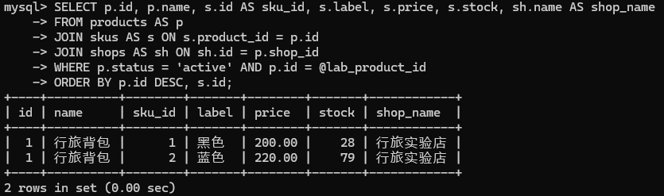
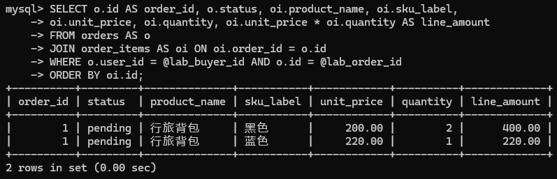
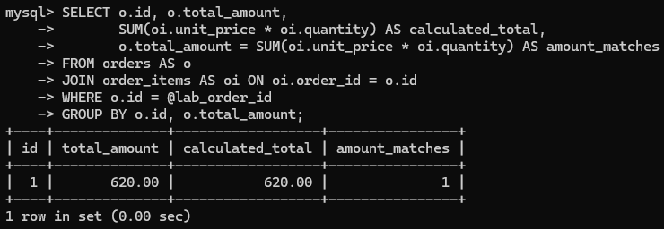
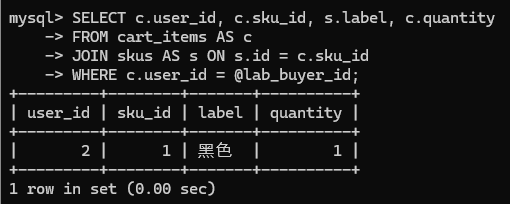

# 03-数据库建表与查询验证

上一章确定了七张表的字段、关系和约束。本章将这些设计翻译成MySQL SQL语句，并通过实际写入和查询验证它们。

学习顺序：读懂建表语法 -> 创建表 -> 检查结构 -> 用少量数据验证查询与约束 -> 回滚实验数据。

下一章再让Python后端连接这些表。

建表语句统一写入`database/001_initial.sql`，再执行一次。

本章使用`MySQL 8.4`和独立的`mall_learning`数据库。

## 一、把字段字典翻译成建表语句

先把第02章中的一些设计与SQL对应起来。

| 设计                     | 建表SQL                                                    | 作用                                               |
| ------------------------ | ---------------------------------------------------------- | -------------------------------------------------- |
| 用户编号是自增主键       | `id BIGINT NOT NULL AUTO_INCREMENT PRIMARY KEY`            | 自动分配编号，唯一标识一行，不允许为空             |
| 用户名必填，最多40个字符 | `username VARCHAR(40) NOT NULL`                            | 确定类型、长度和可空性；是否为空字符串仍需业务校验 |
| 用户名不能重复           | `UNIQUE KEY uq_users_username (username)`                  | 建立唯一索引，限制用户名重复                       |
| 同一商品内规格编码唯一   | `CONSTRAINT uq_sku_product_code UNIQUE (product_id, code)` | 限制两个字段的组合重复，不要求各字段分别唯一       |
| 店铺经营者引用用户       | `FOREIGN KEY (owner_id) REFERENCES users(id)`              | 要求被引用的用户存在                               |
| 库存不小于0              | `CONSTRAINT ck_sku_stock CHECK (stock >= 0)`               | 拒绝不符合条件的写入                               |
| 按店铺和状态查询商品     | `KEY ix_product_shop_status (shop_id, status)`             | 建立普通联合索引，帮助查找，不限制重复             |

`CREATE TABLE 表名 (...)`中，既可以声明字段，也可以声明作用于整张表的约束和索引。各项用逗号分隔，最后一项后面不加逗号。

`ENGINE=InnoDB`指定存储引擎，使这些表支持需要的事务和外键。

在这里，`KEY`是`INDEX`的同义写法。

`UNIQUE KEY`和`CONSTRAINT 名称 UNIQUE`都可以用来声明唯一约束。

`uq_`、`ck_`、`ix_`分别是唯一约束、检查约束、普通索引的命名前缀，便于定位错误；约束效果来自SQL关键字，不来自名称（即，不是说这个名称叫`uq_`它就天生带有唯一约束的效果了）。

主键和唯一约束已经建立了相应索引，不需要再对同样的字段组合机械地追加普通索引。

`AUTO_INCREMENT`提供标识，不保证编号连续，也不表示当前共有多少行。

### 一些语法

**`UNIQUE KEY uq_users_username (username)`**

通用语法：

```sql
UNIQUE KEY 索引名称 (字段名)
```

- UNIQUE KEY：创建唯一索引，要求索引中的值不能重复
- uq_users_username：自己起的索引名称，方便查看、修改和定位错误
- (username)：这个索引作用于`(username)`字段


**`CONSTRAINT uq_sku_product_code UNIQUE (product_id, code)`**

通用语法：

```sql
CONSTRAINT 约束名称 UNIQUE (字段1, 字段2, ...)
```

- CONSTRAINT：声明一个有名称的约束
- uq_sku_product_code：约束名称
- UNIQUE：要求唯一
- (product_id, code)：要求这两个字段的组合不能重复

在MySQL中，这里也可以写成：

```sql
UNIQUE KEY uq_sku_product_code (product_id, code)
```


**`FOREIGN KEY (owner_id) REFERENCES users(id)`**

通用语法：

```sql
FOREIGN KEY (本表字段)
REFERENCES 被引用的表名(被引用的字段)
```

- FOREIGN KEY (owner_id)：把当前表的`owner_id`声明为外键
- REFERENCES：表示“引用”
- users(id)：就是`users`表的`id`字段

也可以给外键起名字：

```sql
CONSTRAINT fk_shop_owner
FOREIGN KEY (owner_id) REFERENCES users(id)
```


**`CONSTRAINT ck_sku_stock CHECK (stock >= 0)`**

通用语法：

```sql
CONSTRAINT 约束名称 CHECK (条件表达式)
```

- CONSTRAINT ck_sku_stock：声明一个名为`ck_sku_stock`的约束
- CHECK：检查数据是否满足指定条件
- (stock >= 0)：要求库存不小于0


**`KEY ix_product_shop_status (shop_id, status)`**

通用语法：

```sql
KEY 索引名称 (字段1, 字段2, ...)
```

- KEY：创建普通索引。也可以写成`INDEX`
- ix_product_shop_status：索引名称
- (shop_id, status)：按这两个字段的顺序建立联合索引

它主要帮助这样的查询：

```sql
SELECT *
FROM products
WHERE shop_id = 8 AND status = 'active';
```

可以把它粗略理解为：先按店铺组织，再在同一店铺内按状态组织。

因此，它通常也能帮助只按店铺查询：

```sql
SELECT * FROM products WHERE shop_id = 8;
```

但只按`status`查询时，不能认为它与单独建立的`status`索引同样有效。

**联合索引的字段顺序有意义。**


## 二、按依赖顺序编写七张表

外键引用的表要先存在。

所以，顺序为`users -> shops -> products -> skus -> cart_items -> orders -> order_items`。

统一使用InnoDB，使后续下单能够使用事务和行锁。

> 事务：把一组数据库操作作为一个整体，成功时一起保存，需要撤销时一起回滚。
>
> 行锁：是协调并发操作的机制，一个事务锁定某条记录后，其他事务对它申请冲突的锁时，需要等待。例如，
>
> | 时刻 | 用户甲的下单事务         | 用户乙的下单事务                   |
> | ---- | ------------------------ | ---------------------------------- |
> | 1    | 锁定该 SKU，读到库存为 1 | —                                  |
> | 2    | 判断库存足够，准备扣减   | 尝试锁定同一 SKU，等待             |
> | 3    | 扣减为 0，提交并释放锁   | —                                  |
> | 4    | —                        | 获得锁，读到库存为 0，判断不能购买 |

在`database/001_initial.sql`先写字符集设置，随后依次追加七张表。

**新建`database/001_initial.sql`**

```sql
SET NAMES utf8mb4;
```

### （一）users：账号

唯一用户名用于登录定位，role的CHECK固定账号角色。created_at由后端写入。

在文件末尾追加：

```sql
CREATE TABLE users
(
    id            BIGINT       NOT NULL AUTO_INCREMENT PRIMARY KEY,
    username      VARCHAR(40)  NOT NULL,
    password_hash VARCHAR(255) NOT NULL,
    role          VARCHAR(16)  NOT NULL,
    created_at    DATETIME     NOT NULL,
    UNIQUE KEY uq_users_username (username),
    CONSTRAINT ck_user_role CHECK (role IN ('buyer', 'merchant'))
) ENGINE = InnoDB;
```

### （二）shops：店铺归属

owner_id同时具有外键与唯一约束，所以一个账号最多拥有一个店铺。

在文件末尾追加：

```sql
CREATE TABLE shops
(
    id       BIGINT       NOT NULL AUTO_INCREMENT PRIMARY KEY,
    owner_id BIGINT       NOT NULL,
    name     VARCHAR(100) NOT NULL,
    UNIQUE KEY uq_shop_owner (owner_id),
    FOREIGN KEY (owner_id) REFERENCES users (id)
) ENGINE = InnoDB;
```

### （三）products：商品介绍

状态控制公开目录是否展示商品；两个组合索引分别对应商家与公开目录的过滤入口。

在文件末尾追加：

```sql
CREATE TABLE products
(
    id          BIGINT       NOT NULL AUTO_INCREMENT PRIMARY KEY,
    shop_id     BIGINT       NOT NULL,
    name        VARCHAR(120) NOT NULL,
    category    VARCHAR(40)  NOT NULL,
    description TEXT         NOT NULL,
    status      VARCHAR(16)  NOT NULL,
    created_at  DATETIME     NOT NULL,
    CONSTRAINT ck_product_status CHECK (status IN ('active', 'inactive')),
    FOREIGN KEY (shop_id) REFERENCES shops (id),
    KEY ix_product_shop_status (shop_id, status),
    KEY ix_product_status_category (status, category)
) ENGINE = InnoDB;
```

### （四）skus：规格与可售库存

DECIMAL(12, 2)表示总共12位数字、其中2位小数的精确数值类型，用于金额。code在同一product内唯一。库存不能为负。

在文件末尾追加：

```sql
CREATE TABLE skus
(
    id         BIGINT         NOT NULL AUTO_INCREMENT PRIMARY KEY,
    product_id BIGINT         NOT NULL,
    code       VARCHAR(50)    NOT NULL,
    label      VARCHAR(100)   NOT NULL,
    price      DECIMAL(12, 2) NOT NULL,
    stock      INT            NOT NULL,
    CONSTRAINT uq_sku_product_code UNIQUE (product_id, code),
    CONSTRAINT ck_sku_price CHECK (price > 0),
    CONSTRAINT ck_sku_stock CHECK (stock >= 0),
    FOREIGN KEY (product_id) REFERENCES products (id)
) ENGINE = InnoDB;
```

### （五）cart_items：购买意愿

联合唯一键让“更新某人的某SKU数量”有明确的单行目标。

在文件末尾追加：

```sql
CREATE TABLE cart_items
(
    id       BIGINT NOT NULL AUTO_INCREMENT PRIMARY KEY,
    user_id  BIGINT NOT NULL,
    sku_id   BIGINT NOT NULL,
    quantity INT    NOT NULL,
    CONSTRAINT uq_cart_user_sku UNIQUE (user_id, sku_id),
    CONSTRAINT ck_cart_quantity CHECK (quantity BETWEEN 1 AND 99),
    FOREIGN KEY (user_id) REFERENCES users (id),
    FOREIGN KEY (sku_id) REFERENCES skus (id)
) ENGINE = InnoDB;
```

### （六）orders：交易主体

幂等键定位同一次下单，request_hash核对所选SKU与收货信息是否变化；paid_at单独保存支付时间以支持统计。摘要由后端计算，数据库只保存它；数量来自购物车、重试时如何读取原订单，留到后面再实现。

在文件末尾追加：

```sql
CREATE TABLE orders
(
    id               BIGINT         NOT NULL AUTO_INCREMENT PRIMARY KEY,
    user_id          BIGINT         NOT NULL,
    shop_id          BIGINT         NOT NULL,
    idempotency_key  VARCHAR(64)    NOT NULL,
    request_hash     VARCHAR(64)    NOT NULL,
    status           VARCHAR(16)    NOT NULL,
    total_amount     DECIMAL(12, 2) NOT NULL,
    shipping_address VARCHAR(500)   NOT NULL,
    created_at       DATETIME       NOT NULL,
    paid_at          DATETIME       NULL,
    CONSTRAINT uq_order_idempotency UNIQUE (user_id, idempotency_key),
    CONSTRAINT ck_order_status CHECK (status IN ('pending', 'paid', 'shipped', 'completed', 'cancelled')),
    CONSTRAINT ck_order_total CHECK (total_amount > 0),
    FOREIGN KEY (user_id) REFERENCES users (id),
    FOREIGN KEY (shop_id) REFERENCES shops (id),
    KEY ix_order_user_created (user_id, created_at),
    KEY ix_order_shop_paid (shop_id, paid_at)
) ENGINE = InnoDB;
```

### （七）order_items：成交快照

外键保留与真实SKU的关联，快照字段保留成交时的信息。

在文件末尾追加：

```sql
CREATE TABLE order_items
(
    id           BIGINT         NOT NULL AUTO_INCREMENT PRIMARY KEY,
    order_id     BIGINT         NOT NULL,
    sku_id       BIGINT         NOT NULL,
    product_name VARCHAR(120)   NOT NULL,
    sku_label    VARCHAR(100)   NOT NULL,
    unit_price   DECIMAL(12, 2) NOT NULL,
    quantity     INT            NOT NULL,
    CONSTRAINT uq_order_item_sku UNIQUE (order_id, sku_id),
    CONSTRAINT ck_order_item_quantity CHECK (quantity BETWEEN 1 AND 99),
    CONSTRAINT ck_order_item_price CHECK (unit_price > 0),
    FOREIGN KEY (order_id) REFERENCES orders (id),
    FOREIGN KEY (sku_id) REFERENCES skus (id)
) ENGINE = InnoDB;
```


## 三、创建数据库并执行建表文件

在powershell中执行：

```powershell
mysql -u root -p
```

然后输入root用户的密码。

`mall_learning`是我们要新建的空库。

**新建数据库、新建用户、赋予用户权限、执行建表SQL**

```sql
# 建库
CREATE DATABASE mall_learning CHARACTER SET utf8mb4 COLLATE utf8mb4_0900_ai_ci;

# 创建管理用户，'123456'是要设置的密码
CREATE USER 'mall_learning_app'@'127.0.0.1' IDENTIFIED BY '123456';

# 为新建的管理用户赋予操作mall_learning库的权限
GRANT SELECT, INSERT, UPDATE, DELETE ON mall_learning.* TO 'mall_learning_app'@'127.0.0.1';

USE mall_learning;

SOURCE E:/work/projects/mall-v1.0-learning/database/001_initial.sql;
```


## 四、检查实际建立的结构

改用新建的用户连接。

```powershell
mysql -u mall_learning_app -p
```

然后执行：

```sql
USE mall_learning;

SELECT table_name, engine
FROM information_schema.tables
WHERE table_schema = DATABASE();

DESCRIBE orders;

SHOW CREATE TABLE orders;

SHOW INDEX FROM products;

SHOW INDEX FROM orders;

SHOW INDEX FROM cart_items;
```

预期看到七张表，存储引擎均为 InnoDB。`DESCRIBE` 适合快速查看字段、类型、可空性和默认值；完整的外键、CHECK 及联合约束，以 `SHOW CREATE TABLE` 为准。

阅读 `SHOW INDEX` 时先看四列：

| 列名           | 怎样理解                             |
| -------------- | ------------------------------------ |
| `Key_name`     | 索引名称；主键索引显示为 `PRIMARY`   |
| `Non_unique`   | `0` 表示要求唯一，`1` 表示不要求唯一 |
| `Seq_in_index` | 字段在索引中的次序，从 1 开始        |
| `Column_name`  | 本行描述的索引字段                   |


## 五、准备一组可回滚的实验数据

空表只能验证查询语句能否执行，无法观察结果。

这里构造一个小场景，覆盖七张表：

> - 商家经营“行旅实验店”，出售黑色和蓝色两种背包。
> - 买家已有一笔待支付订单：黑色2件，每件200元；蓝色1件，每件220元，总额620元。
> - 假设下单前库存分别为30和80，本次实验直接写入扣减后的可售库存28和79。
> - 买家又把黑色背包1件加入购物车，作为另一份购买意愿。

这里直接构造数据库用于学习查询，不是下单业务的完整实现。

在本章刚建好的空库中操作。

从`START TRANSACTION`到第9节的`ROLLBACK`，保持同一个MySQL连接，不执行`COMMIT`、新的`START TRANSACTION`或DDL。

`@lab_...`是当前连接的会话变量，用来记住自动生成的编号；不要假设编号一定从1开始。

```sql
USE mall_learning;
START TRANSACTION;

INSERT INTO users (username, password_hash, role, created_at)
VALUES ('lab03_merchant', 'lab-only-not-a-login-hash', 'merchant', UTC_TIMESTAMP());
SET @lab_merchant_id = LAST_INSERT_ID();

INSERT INTO users (username, password_hash, role, created_at)
VALUES ('lab03_buyer', 'lab-only-not-a-login-hash', 'buyer', UTC_TIMESTAMP());
SET @lab_buyer_id = LAST_INSERT_ID();

INSERT INTO shops (owner_id, name)
VALUES (@lab_merchant_id, '行旅实验店');
SET @lab_shop_id = LAST_INSERT_ID();

INSERT INTO products (shop_id, name, category, description, status, created_at)
VALUES (@lab_shop_id, '行旅背包', '箱包', '用于第03章查询实验', 'active', UTC_TIMESTAMP());
SET @lab_product_id = LAST_INSERT_ID();

INSERT INTO skus (product_id, code, label, price, stock)
VALUES (@lab_product_id, 'BLACK', '黑色', 200.00, 28);
SET @lab_black_sku_id = LAST_INSERT_ID();

INSERT INTO skus (product_id, code, label, price, stock)
VALUES (@lab_product_id, 'BLUE', '蓝色', 220.00, 79);
SET @lab_blue_sku_id = LAST_INSERT_ID();

INSERT INTO orders
  (user_id, shop_id, idempotency_key, request_hash, status,
   total_amount, shipping_address, created_at, paid_at)
VALUES
  (@lab_buyer_id, @lab_shop_id, 'lab03-checkout-0001', REPEAT('0', 64), 'pending',
   620.00, '实验收货信息', UTC_TIMESTAMP(), NULL);
SET @lab_order_id = LAST_INSERT_ID();

INSERT INTO order_items (order_id, sku_id, product_name, sku_label, unit_price, quantity)
VALUES
  (@lab_order_id, @lab_black_sku_id, '行旅背包', '黑色', 200.00, 2),
  (@lab_order_id, @lab_blue_sku_id, '行旅背包', '蓝色', 220.00, 1);

INSERT INTO cart_items (user_id, sku_id, quantity)
VALUES (@lab_buyer_id, @lab_black_sku_id, 1);
```

`LAST_INSERT_ID()`返回本连接最近一次插入产生的自增编号。这里的密码哈希和请求摘要都是明确的实验占位值，只满足列的存储要求，不用于登录或接口重试，后续会通过程序生成真实值。

所有正常插入都应成功，再继续查询。如果出现非预期错误，先 `ROLLBACK` 并排查，不要在部分数据缺失时继续执行后面的实验。


## 六、用查询检查数据之间的关系

### （一）商品、规格和店铺怎样连接

```sql
SELECT p.id, p.name, s.id AS sku_id, s.label, s.price, s.stock, sh.name AS shop_name
FROM products AS p
JOIN skus AS s ON s.product_id = p.id
JOIN shops AS sh ON sh.id = p.shop_id
WHERE p.status = 'active' AND p.id = @lab_product_id
ORDER BY p.id DESC, s.id;
```

`p`、`s`、`sh` 是表的别名；`JOIN ... ON ...` 按编号关联记录。结果应为两行，分别是黑色与蓝色，售价为 200.00、220.00，库存为 28、79，店铺均为“行旅实验店”。**这里一行表示一个 SKU，不是一款商品。** 商品名称重复出现，是因为同一商品具有两种规格。



### （二）买家订单怎样连接成交明细

```sql
SELECT o.id AS order_id, o.status, oi.product_name, oi.sku_label,
       oi.unit_price, oi.quantity, oi.unit_price * oi.quantity AS line_amount
FROM orders AS o
JOIN order_items AS oi ON oi.order_id = o.id
WHERE o.user_id = @lab_buyer_id AND o.id = @lab_order_id
ORDER BY oi.id;
```

预期仍为两行，订单编号相同，状态均为 `pending`：



这里一行表示一条订单明细。显示成交信息时读取 `order_items` 的快照，而不是 SKU 当前售价；以后商品改价，历史成交单价也不应随之改变。

### （三）检查订单总额是否等于明细合计

```sql
SELECT o.id, o.total_amount,
       SUM(oi.unit_price * oi.quantity) AS calculated_total,
       o.total_amount = SUM(oi.unit_price * oi.quantity) AS amount_matches
FROM orders AS o
JOIN order_items AS oi ON oi.order_id = o.id
WHERE o.id = @lab_order_id
GROUP BY o.id, o.total_amount;
```

`GROUP BY` 将同一订单的明细归为一组，`SUM` 计算合计。预期返回一行：`total_amount` 和 `calculated_total` 都是 620.00，`amount_matches` 为 1，表示相等。

这是一项数据核对，不是数据库已经定义的跨表约束。不要在订单连接多条明细后直接 `SUM(o.total_amount)`：本例会把同一笔 620 元重复计算两次。



### （四）区分购物车与已经提交的订单

```sql
SELECT c.user_id, c.sku_id, s.label, c.quantity
FROM cart_items AS c
JOIN skus AS s ON s.id = c.sku_id
WHERE c.user_id = @lab_buyer_id;
```

预期只有一行：黑色背包、数量 1。这份新的购买意愿与订单中黑色背包的成交数量 2 相互独立；以后修改购物车数量，不会修改既有订单明细。




## 七、故意写入错误数据，验证约束

本节继续使用上面的连接和未提交数据。**每次只执行一个示例，读完错误再执行下一个。** 以下语句预期失败，不要追加到初始建表文件，也不要把它们当成一次应当全部成功的脚本。

### 1. 用户名重复：唯一约束

```sql
INSERT INTO users (username, password_hash, role, created_at)
VALUES ('lab03_buyer', 'lab-only-not-a-login-hash', 'buyer', UTC_TIMESTAMP());
```

预期出现重复键错误，指出 `uq_users_username`。用户名已存在，不能插入第二个同名账号。

### 2. 同一买家的同一 SKU 重复：联合唯一约束

```sql
INSERT INTO cart_items (user_id, sku_id, quantity)
VALUES (@lab_buyer_id, @lab_black_sku_id, 3);
```

预期被 `uq_cart_user_sku` 拒绝。虽然数量不同，但 `(user_id, sku_id)` 组合已经存在；改变数量应更新原条目。

### 3. 引用不存在的 SKU：外键约束

```sql
SET @lab_missing_sku_id = (SELECT MAX(id) + 1 FROM skus);
INSERT INTO cart_items (user_id, sku_id, quantity)
VALUES (@lab_buyer_id, @lab_missing_sku_id, 1);
```

在本章独立、无并发写入的实验中，选取当前最大编号加 1 作为不存在的 SKU。预期出现外键错误：数据库中没有对应的父记录。

### 4. 负库存和非法状态：CHECK 约束

先执行：

```sql
UPDATE skus SET stock = -1 WHERE id = @lab_black_sku_id;
```

预期被 `ck_sku_stock` 拒绝，库存仍为 28。再单独执行：

```sql
UPDATE orders SET status = 'unknown' WHERE id = @lab_order_id;
```

预期被 `ck_order_status` 拒绝，订单仍为 `pending`。

### 5. 删除已被订单引用的 SKU：外键的删除限制

```sql
DELETE FROM skus WHERE id = @lab_blue_sku_id;
```

预期失败，因为订单明细仍引用这条 SKU。当前外键没有声明 `ON DELETE CASCADE`；在 InnoDB 中，省略删除动作相当于限制删除被引用的父记录，不会自动删除历史明细。这也解释了为什么本项目用下架状态控制销售，而不直接移除已被交易引用的数据。[MySQL 外键删除规则](https://dev.mysql.com/doc/refman/8.4/en/create-table-foreign-keys.html)

这些预期的约束错误会拒绝相应语句，不代表前面成功插入的实验数据已经全部回滚。可以再次查询库存和订单状态，确认它们未被非法写入改变，最后统一执行第 9 节的 `ROLLBACK`。

还要分清数据库尚未保证的规则：`paid`、`shipped` 都是合法字符串，状态 CHECK 不会检查它们的转换顺序；`total_amount > 0` 也不能保证总额等于明细合计。买家与商家身份、单店订单、至少一条明细、正确扣还库存等，仍需后端逻辑和事务共同保证。


## 八、用 EXPLAIN 观察索引，而不是猜测

先观察商品目录查询：

```sql
EXPLAIN SELECT id, name FROM products
WHERE status = 'active' AND category = '箱包'
ORDER BY id DESC LIMIT 8;
```

再观察某买家的订单列表，与第 02 章的索引说明对应：

```sql
EXPLAIN SELECT id, status, total_amount, created_at
FROM orders
WHERE user_id = @lab_buyer_id
ORDER BY id DESC LIMIT 20;
```

先认识四项结果：`possible_keys` 表示候选索引，`key` 表示实际选择的索引，`rows` 是估计扫描行数，`Extra` 提供额外处理信息。出现 `Using filesort` 表示需要额外排序，不等于一定发生磁盘排序。[MySQL EXPLAIN 输出说明](https://dev.mysql.com/doc/refman/8.4/en/explain-output.html)

`(user_id, created_at)` 索引可以帮助按买家定位记录，但这条查询按 `id` 排序，不能仅凭存在该索引就断言一定免排序。实际选择由优化器决定。

此时数据很少，优化器选择扫描也可能合理；不同数据量和统计信息下，执行计划可能不同。本节学习的是如何读计划，不用这几条数据证明索引的性能，也不要求得到某个固定的 `key` 值。第 06 章准备更多样例数据后，可以重新观察。


## 九、回滚实验数据，理解事务边界

所有实验完成后，在同一个MySQL连接中执行：

```sql
ROLLBACK;

SELECT COUNT(*) AS remaining_lab_users
FROM users WHERE username IN ('lab03_merchant', 'lab03_buyer');

SELECT COUNT(*) AS remaining_lab_orders
FROM orders WHERE id = @lab_order_id;

SHOW TABLES;
```

两个计数都应为 0，七张表仍然存在。事务内插入的数据被撤销，之前已经建好的表保留；本章不留下这些实验账号和订单，第 06 章再通过初始化程序准备正式演示数据。

自增编号可能已经消耗，回滚后不要求重用，因此第 06 章新增记录的编号不一定从 1 开始。如果中途关闭连接，未提交事务也会回滚，但会话变量同时丢失；重新实验时应从第 5 节开始。

本次练习说明了 `START TRANSACTION`、`COMMIT`、`ROLLBACK` 的基本关系：开始一组操作，成功时提交保存，需要撤销时回滚。在后续真实下单中，订单、明细、库存、购物车修改必须全部成功才提交，不能先保存订单再单独扣库存。

`SELECT ... FOR UPDATE` 将在事务中用于协调并发修改。它的锁定范围受查询条件、索引及隔离级别影响，可能涉及记录和间隙，不能简单理解为“只锁最终返回的几行”。详细实现留到第 07 章，本章先理解提交与回滚的边界。