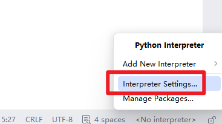
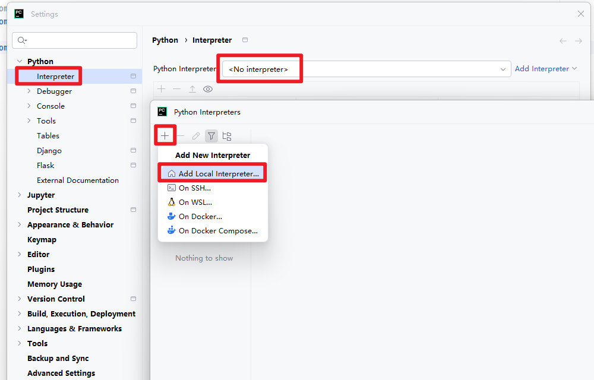

# 04-后端环境配置与数据映射

第03章已经用SQL建好了七张表。

本章沿着一个问题继续：**Python后端怎样连接这些表，并用对象读取和组织数据？**

学习顺序：`准备环境 -> 读取配置 -> 验证连接 -> 理解并编写ORM映射 -> 区分请求模型 -> 核对数据库结构`

本章完成配置、数据库会话、ORM模型和请求模型。

HTTP入口在第05章建立，因此这里还不启动Uvicorn，也不需要实现登录、下单或AI功能。

先认识几个文件的分工，后面按顺序创建：

| 文件                          | 要解决的问题                                 |
| ----------------------------- | -------------------------------------------- |
| `app/config.py`               | 连接哪台数据库，使用哪个账号，配置从哪里来？ |
| `app/db.py`                   | 怎样取得连接，并为一次工作创建会话？         |
| `scripts/check_connection.py` | 当前配置能否真正连接到预期的数据库？         |
| `app/models.py`               | Python类和属性怎样对应数据库表和列？         |
| `app/schemas.py`              | 调用者可以提交哪些数据，格式是否符合要求？   |
| `scripts/check_schema.py`     | Python映射与第03章建立的结构是否相符？       |


## 一、项目依赖

| 依赖                                                   | 负责的事情                           |
| ------------------------------------------------------ | ------------------------------------ |
| FastAPI、Uvicorn                                       | 声明路由、处理HTTP、运行ASGI应用     |
| SQLAlchemy、PyMySQL                                    | Python对象映射、SQL、MySQL驱动       |
| Pydantic、pydantic-settings                            | 请求数据校验、环境配置读取           |
| PyJWT、pwdlib[argon2]                                  | 登录令牌、密码哈希                   |
| LangChain、LangGraph、langchain-openai、text-splitters | AI章节的工具、图流程、模型接入和切块 |
| httpx、pytest                                          | HTTP验证与测试                       |

下面是项目采用的完整依赖清单。一次建立环境，后续按章节逐步使用其中的功能。

**本章重点理解SQLAlchemy、PyMySQL、Pydantic和pydantic-settings。**

`PyMySQL[rsa]`中的方括号表示安装额外依赖，用于支持MySQL相应的认证方式。

**新建`backend/requirements.txt`**

```
fastapi==0.141.1
uvicorn==0.52.4
SQLAlchemy==2.0.52
PyMySQL[rsa]==1.2.0
pydantic-settings==2.15.0
pydantic==2.13.5
PyJWT==2.13.0
pwdlib[argon2]==0.3.1
langchain==1.4.0
langgraph==1.2.11
langchain-openai==1.6.2
langchain-text-splitters==1.1.2
httpx==0.28.1
pytest==9.1.1
```

在PowerShell中执行（在PyCharm下面的Terminal执行即可）：

```powershell
# 先确定路径在E:\work\projects\mall-v1.0-learning\backend下
python -m venv .venv

# 激活当前项目的python环境（而不是使用python全局环境）
.\.venv\Scripts\Activate.ps1
python -m pip check

# PowerShell提示符前面会多一个(.venv)
# 确认一下python是当前项目的环境
python -c "import sys; print(sys.executable)"

# 接着，再执行
python -m pip install --upgrade pip
python -m pip install -r requirements.txt
python -m pip check
```

预期 `pip check` 输出 `No broken requirements found.`。直接调用虚拟环境内的 python，不需要激活脚本。以后在 backend 执行 Python 命令，均使用这个解释器。

之后，如果使用IDE（如PyCharm），要注意把python环境切过来。

例如，PyCharm，可以点右下角：





然后点`Generate new`。


## 二、配置怎样进入程序

`Settings`集中描述运行参数，`get_settings()`缓存一次解析结果。配置文件位置从config.py推导，因此不依赖当前终端目录。`SecretStr`让配置对象的常规展示不直接显示密码；真正交给驱动或模型客户端时才取出值。

配置文件与程序默认值的关系是：显示环境变量优先于`.env`，`.env`优先于字段默认值。因此models和服务代码不用知道学习库叫什么。

### （一）新建`backend/app/__init__.py`

```python
"""Mall e-commerce platform v1.0."""
```


### （二）新建`backend/scripts/__init__.py`

```python
"""User-run scripts; never executed on application startup."""
```


### （三）新建`backend/app/config.py`

```python
from functools import lru_cache
from pathlib import Path
from typing import Literal

from pydantic import Field, SecretStr, model_validator
from pydantic_settings import BaseSettings, SettingsConfigDict

BACKEND_DIR = Path(__file__).resolve().parents[1]


class Settings(BaseSettings):
    model_config = SettingsConfigDict(
        env_file=BACKEND_DIR / ".env", env_file_encoding="utf-8",
        extra="ignore", hide_input_in_errors=True,
    )
    app_env: Literal["development", "production"] = "development"
    registration_enabled: bool = True
    db_host: str = "127.0.0.1"
    db_port: int = 3306
    db_name: str = "mall_learning"
    db_user: str = "mall_learning_app"
    db_password: SecretStr
    jwt_secret: SecretStr
    cors_origins: list[str] = ["http://localhost:5173", "http://127.0.0.1:5173"]
    ai_mode: Literal["mock", "live"] = "mock"
    llm_api_key: SecretStr = SecretStr("")
    llm_base_url: str = "https://api.openai.com/v1"
    llm_model: str = ""
    embedding_model: str = ""
    embedding_base_url: str = ""
    embedding_api_key: SecretStr = SecretStr("")
    token_minutes: int = Field(default=120, ge=5, le=1440)

    @model_validator(mode="after")
    def validate_secrets(self):
        secret = self.jwt_secret.get_secret_value()
        if len(secret) < 32 or secret.startswith("replace-"):
            raise ValueError("请按操作手册生成至少 32 字符的 JWT_SECRET")
        if self.app_env == "production":
            if len(self.db_password.get_secret_value()) < 20 or self.db_password.get_secret_value().startswith("replace-"):
                raise ValueError("生产数据库密码必须使用至少 20 字符的随机值")
            if self.ai_mode == "live" and any(url and not url.startswith("https://") for url in (self.llm_base_url, self.embedding_base_url)):
                raise ValueError("生产模型接口必须使用 HTTPS")
        if self.ai_mode == "live" and not (
            self.llm_api_key.get_secret_value() and self.llm_model and self.embedding_model
        ):
            raise ValueError("live 模式必须填写 LLM_API_KEY、LLM_MODEL、EMBEDDING_MODEL")
        return self


@lru_cache
def get_settings() -> Settings:
    return Settings()
```

**带注释版：**

```python
from functools import lru_cache
from pathlib import Path
from typing import Literal

from pydantic import Field, SecretStr, model_validator
from pydantic_settings import BaseSettings, SettingsConfigDict

BACKEND_DIR = Path(__file__).resolve().parents[1]


class Settings(BaseSettings):
    """
    整个后端项目的统一配置类。
    BaseSettings是pydantic-settings提供的配置基类。
    它不仅能定义配置项，还可以自动从环境变量和.env文件读取配置。
    类中定义默认配置 + .env/系统环境变量覆盖配置 --> 最终得到完整的Settings对象。
    """

    # SettingsConfigDict用于配置BaseSettings本身的行为
    model_config = SettingsConfigDict(
        # 指定读取 backend/.env 文件
        env_file=BACKEND_DIR / ".env",

        # .env使用UTF-8编码读取
        env_file_encoding="utf-8",

        # 如果.env中存在Settings类没有声明的变量，忽略它们，而不是报错
        extra="ignore",

        # 当配置校验失败时，尽量避免在错误信息中直接显示输入值。对密码、密钥等敏感数据更安全
        hide_input_in_errors=True,
    )

    # ---------------------------------------------
    # 应用运行环境
    # ---------------------------------------------

    # 默认使用开发环境
    app_env: Literal["development", "production"] = "development"

    # 是否允许新用户注册。默认开启
    registration_enabled: bool = True

    # ---------------------------------------------
    # 数据库配置
    # ---------------------------------------------

    db_host: str = "127.0.0.1"
    
    # MySQL默认端口
    db_port: int = 3306

    # 数据库名称
    db_name: str = "mall_learning"

    # 数据库用户名
    db_user: str = "mall_learning_app"

    # 数据库密码
    # 没有提供默认值，意味着这是在.env或环境变量中必须指定的配置
    db_password: SecretStr

    # ---------------------------------------------
    # JWT配置
    # ---------------------------------------------

    # JWT 签名密钥，同样属于敏感信息，因此使用 SecretStr。
    # 这里也没有默认值，所以 JWT_SECRET 必须在环境中提供。
    jwt_secret: SecretStr

    # ---------------------------------------------
    # CORS配置
    # ---------------------------------------------

    # 允许哪些前端来源访问后端API
    # 开发阶段默认允许Vite常用的两个本地地址：
    # http://localhost:5173
    # http://127.0.0.1:5173
    cors_origins: list[str] = [
        "http://localhost:5173",
        "http://127.0.0.1:5173",
    ]

    # ---------------------------------------------
    # AI / 大模型配置
    # ---------------------------------------------

    # AI 工作模式：
    # mock: 使用模拟数据或模拟模型响应，一般用于开发、测试，不真正调用外部LLM
    # live: 真正调用大模型API
    ai_mode: Literal["mock", "live"] = "mock"

    # 大语言模型API key
    # 默认值为空字符串，因此mock模式下可以不填写
    # live模式会在后面的validate_secrets()中检查
    llm_api_key: SecretStr = SecretStr("")

    # LLM API基础地址，也可以通过.env覆盖
    llm_base_url: str = "https://api.openai.com/v1"

    # 实际使用的大语言模型名称。具体取决于你调用的模型服务
    llm_model: str = ""

    # Embedding模型名称。Embedding通常用于：文本向量化、语义检索、RAG等
    embedding_model: str = ""

    # Embedding服务地址。有些项目的LLM和Embedding可能来自不同服务，所以单独提供一个
    embedding_base_url: str = ""

    # ---------------------------------------------
    # Token / 登录有效期
    # ---------------------------------------------

    # JWT或登录Token的有效时间，单位是分钟。默认120分钟、不能小于5分钟、不能超过1440分钟（24小时）
    token_minutes: int = Field(
        default=120,
        ge=5,
        le=1440,
    )

    # ---------------------------------------------
    # 自定义配置校验
    # ---------------------------------------------

    @model_validator(mode="after")
    def validate_secrets(self):
        """
        对已经读取完成的配置进行进一步业务校验。
        mode="after"表示：Pydantic已经把所有字段读取、转换、基础校验完成后，再执行这个方法
        """

        # SecretStr不能直接当普通字符串使用，get_secret_value()用于取得真实JWT密钥
        secret = self.jwt_secret.get_secret_value()

        # JWT_SECRET至少需要32个字符
        if len(secret) < 32:
            raise ValueError(
                "请按操作手册生成至少 32 字符的 JWT_SECRET"
            )

        # ---------------------------------------------
        # production环境下执行更加严格的安全检查
        # ---------------------------------------------

        if self.app_env == "production":
            # 取得真实数据库密码
            db_password = self.db_password.get_secret_value()

            if len(db_password) < 20:
                raise ValueError(
                    "生产数据库密码必须使用至少 20 字符的随机值"
                )

            if self.ai_mode == "live" and any(
                    url and not url.startswith("https://")
                    for url in (
                            self.llm_base_url,
                            self.embedding_base_url,
                    )
            ):
                raise ValueError(
                    "生产模型接口必须使用 HTTPS"
                )

        # ---------------------------------------------
        # live AI模式所需配置检查
        # ---------------------------------------------

        # 如果 AI_MODE=live，说明程序需要真正调用 LLM。
        if self.ai_mode == "live" and not (
                self.llm_api_key.get_secret_value()
                and self.llm_model
                and self.embedding_model
        ):
            raise ValueError(
                "live 模式必须填写 "
                "LLM_API_KEY、LLM_MODEL、EMBEDDING_MODEL"
            )

        return self


@lru_cache
def get_settings() -> Settings:
    return Settings()

```


### （四）新建`backend/.env.example`

```
# Copy to .env inside backend; never commit the real file.
DB_HOST=127.0.0.1
DB_PORT=3306
DB_NAME=mall_learning
DB_USER=mall_learning_app
DB_PASSWORD=replace-with-your-database-password
# Generate using the command in the runbook. This placeholder is rejected.
JWT_SECRET=replace-this-with-a-random-secret
CORS_ORIGINS=["http://localhost:5173","http://127.0.0.1:5173"]
# mock: no model calls; live: chat + embedding API required.
AI_MODE=mock
LLM_API_KEY=
LLM_BASE_URL=https://api.openai.com/v1
LLM_MODEL=
EMBEDDING_MODEL=
# Optional: independent embedding endpoint/key; empty means use LLM settings.
EMBEDDING_BASE_URL=
EMBEDDING_API_KEY=

# Local learning defaults; deployment sets production and disables public registration.
APP_ENV=development
REGISTRATION_ENABLED=true
```

`.env.example`相当于准备了一个`.env`的抽象模版。

然后，准备具体的`.env`，在PowerShell中输入：

```powershell
# 路径在E:\work\projects\mall-v1.0-learning\backend下
> if (-not (Test-Path -LiteralPath .env)) { Copy-Item .env.example .env }

> .\.venv\Scripts\python.exe -c "import secrets; print(secrets.token_urlsafe(48))"

> notepad .env
```

然后，把生成的字符串填入`.env`的`JWT_SECRET`；同时，把之前设置的数据库密码填入`DB_PASSWORD`。（均不必加引号）


## 三、从配置建立连接，再按请求创建会话

**新建`backend/app/db.py`**

```python
from sqlalchemy import URL, create_engine
from sqlalchemy.orm import sessionmaker

from .config import get_settings

settings = get_settings()
# URL.create safely handles passwords containing @, :, / and other special characters.
engine = create_engine(
    URL.create("mysql+pymysql", username=settings.db_user,
               password=settings.db_password.get_secret_value(),
               host=settings.db_host, port=settings.db_port, database=settings.db_name,
               query={"charset": "utf8mb4"}),
    hide_parameters=True, pool_pre_ping=True, pool_size=5, max_overflow=5,
    isolation_level="READ COMMITTED",
    connect_args={"connect_timeout": 5},
)
SessionLocal = sessionmaker(bind=engine, expire_on_commit=False)


def get_db():
    with SessionLocal() as db:
        try:
            yield db
        except Exception:
            db.rollback()
            raise
        # Writes commit explicitly in their service/route; reads roll back on close.
```

**带注释版：**

```python
from sqlalchemy import URL, create_engine
from sqlalchemy.orm import sessionmaker

from .config import get_settings

# ---------------------------------------------
# 读取项目配置
# ---------------------------------------------

# get_settings()会返回统一的Settings配置对象。
# 由于get_settings()使用了@lru_cache，第一次调用时会创建Settings并读取.env
# 后续调用直接复用同一个Settings实例
settings = get_settings()

# ---------------------------------------------
# 创建SQLAlchemy Engine
# ---------------------------------------------

# Engine是SQLAlchemy与数据库通信的核心对象
# 可以把它理解为：
#     Python / SQLAlchemy
#            ↓
#          Engine
#            ↓
#       数据库连接池
#            ↓
#          MySQL
# Engine 本身不是某一次具体的数据库会话，
# 它负责管理数据库连接、连接池以及 SQL 的实际执行环境。
engine = create_engine(

    # 构造数据库连接URL
    URL.create(
        "mysql+pymysql",

        # 数据库用户名
        username=settings.db_user,

        # 数据库密码
        password=settings.db_password.get_secret_value(),

        # 数据库服务器地址
        host=settings.db_host,

        # MySQL端口
        port=settings.db_port,

        # 要连接的数据库名称
        database=settings.db_name,

        # 指定MySQL连接使用utf8mb4字符集
        query={"charset": "utf8mb4"},
    ),

    # ---------------------------------------------
    # 日志安全
    # ---------------------------------------------

    # 隐藏SQL日志中的参数值。
    # 开启True后，SQLAlchemy在异常或日志中不会轻易打印email、密码、Token等实际参数值
    # 减少敏感数据泄露风险
    hide_parameters=True,

    # ---------------------------------------------
    # 连接健康检查
    # ---------------------------------------------

    # 每次从连接池取出数据库连接之前，SQLAlchemy会先检查连接是否仍然可用
    # 解决MySQL可能由于长时间空闲等待而失效的问题
    pool_pre_ping=True,

    # ---------------------------------------------
    # 数据库连接池配置
    # ---------------------------------------------

    pool_size=5,
    max_overflow=5,

    # ---------------------------------------------
    # 事务隔离级别
    # ---------------------------------------------

    # 使用MySQL的READ COMITTED隔离级别
    # 含义是：一个事务只能读取其他事务已经提交的数据，不会读到其他事务尚未提交的修改
    # 这样可以避免"脏读（Dirty Read）"
    isolation_level="READ COMMITTED",

    # ---------------------------------------------
    # PyMySQL底层连接参数
    # ---------------------------------------------

    # 建立MySQL TCP连接时，最多等待5秒
    connect_args={
        "connect_timeout": 5
    },
)

# ---------------------------------------------
# 创建Session工厂
# ---------------------------------------------

SessionLocal = sessionmaker(
    bind=engine,
    expire_on_commit=False,
)


# ---------------------------------------------
# FastAPI数据库依赖
# ---------------------------------------------

def get_db():
    with SessionLocal() as db:
        try:
            yield db
        except Exception:
            db.rollback()
            raise
```


### 先验证连接，再继续写映射

`create_engine()`创建对象时还没有真正连接数据库。“能够导入db.py”不等于“数据库连接成功”。

**新建`backend/scripts/check_connection.py`**

```python
"""Read-only connection check; does not create tables or write business data."""
from app.config import get_settings
from app.db import engine


def main():
    settings = get_settings()
    with engine.connect() as connection:
        row = connection.exec_driver_sql(
            "SELECT DATABASE() AS database_name, CURRENT_USER() AS account, "
            "@@session.transaction_isolation AS isolation_level"
        ).mappings().one()
    if row["database_name"] != settings.db_name:
        raise SystemExit("Connected database differs from DB_NAME")
    print(f"Database: {row['database_name']}")
    print(f"Account: {row['account']}")
    print(f"Isolation: {row['isolation_level']}")
    print("Connection check OK")


if __name__ == "__main__":
    main()
```

**带注释版：**

```python
"""
只读数据库连接检查脚本。

作用：
1. 使用项目现有的数据库配置连接MySQL。
2. 检查当前实际连接到哪个数据库。
3. 检查当前使用的数据库账号。
4. 检查当前Session的事务隔离级别。
5. 不创建表，也不写入数据。

它适合用于：
- 部署后确认数据库连接是否正常
- 检查 .env 中的数据库配置是否生效
- 检查实际连接的数据库是否符合预期
"""

from app.config import get_settings
from app.db import engine


def main():
    # 读取项目统一配置。get_settings会返回config.py中定义的Settings对象。
    settings = get_settings()

    # 从SQLAlchemy Engine的连接池中获取一个数据库连接
    with engine.connect() as connection:
        # exec_driver_sql()用于直接执行原生SQL
        row = connection.exec_driver_sql(
            "SELECT DATABASE() AS database_name, "
            "CURRENT_USER() AS account, "
            "@@session.transaction_isolation AS isolation_level"
        ).mappings(  # 把查询结果转换为可以通过字段名访问的映射对象
        ).one()  # 表示这条查询理论上必须且只能返回一行

    # ------------------------------------------------------------
    # 校验实际连接数据库是否符合配置
    # ------------------------------------------------------------

    if row["database_name"] != settings.db_name:
        raise SystemExit(
            "Connected database differs from DB_NAME"
        )

    # ------------------------------------------------------------
    # 输出检查结果
    # ------------------------------------------------------------

    print(f"Database: {row['database_name']}")

    print(f"Account: {row['account']}")

    print(f"Isolation: {row['isolation_level']}")

    print("Connection check OK")


if __name__ == "__main__":
    main()

```

在终端执行：

```powershell
python -m scripts.check_connection
```

预期看到：

```
Database: mall_learning
Account: mall_learning_app@127.0.0.1
Isolation: READ-COMMITTED
Connection check OK
```


## 四、ORM映射要忠实表达刚才的表

**ORM**是**Object-Relational Mapping**，即**对象关系映射**。

> ORM可以简单理解为：把数据库表映射成Python对象，让你主要通过操作Python对象来读写数据库，而不是直接手写SQL。“用面向对象的Python代码操作数据库”。

它让程序用Python类、对象和属性来表达关系数据库中的表、记录和字段，再由SQLAlchemy生成并执行相应SQL。

| 数据库中的概念         | Python中的对应表达        |
| ---------------------- | ------------------------- |
| `users`表              | `User`模型类              |
| 查询得到的一条用户记录 | 一个`User`对象            |
| 记录的`username`和值   | 对象的`user.username`属性 |

例如，后面调用 `db.get(User, 8)` 是按主键读取用户，得到 `User` 对象或 `None`；它不是要求程序员手动从查询结果里逐列取值。反过来，创建一个 `User(...)` 对象只是在内存中创建对象，加入会话并执行相应写入后才会影响数据库，提交后才正式保存。

**数据库已建表，仍需写映射，是因为 Python 必须知道这些类和属性如何对应已有结构。** 本项目不调用 `Base.metadata.create_all()` 自动建表；修改 `models.py` 也不会自动修改现有数据库。映射中的 CHECK、唯一键和索引可供检查脚本与实际数据库对照，真实数据库约束仍由第 03 章的 SQL 建立。

写公共声明、账号模型、店铺模型、商品模型、SKU模型、交易模型。合起来形成完整 models.py。

**新建`backend/app/models.py`**

```python
from datetime import datetime, timezone
from decimal import Decimal

from sqlalchemy import (
    BigInteger,
    CheckConstraint,
    DateTime,
    ForeignKey,
    Index,
    Integer,
    Numeric,
    String,
    Text,
    UniqueConstraint,
)
from sqlalchemy.orm import DeclarativeBase, Mapped, mapped_column


# ------------------------------------------------------------
# 时间工具函数
# ------------------------------------------------------------

def utcnow() -> datetime:
    # 返回当前UTC时间。
    return datetime.now(timezone.utc).replace(tzinfo=None)


# ------------------------------------------------------------
# SQLAlchemy ORM 基类
# ------------------------------------------------------------

class Base(DeclarativeBase):
    # 所有ORM Model的统一基类，后面定义User、Shop等数据库模型时，都会继承Base
    pass


# ------------------------------------------------------------
# 用户表 ORM Model
# ------------------------------------------------------------

class User(Base):
    """
    对应数据库中的users表
    双下划线包裹的名字通常表示"特殊协议或框架约定"，这里是SQLAlchemy的特殊约定
    """

    # 指定该ORM Model对应的数据库表名
    __tablename__ = "users"

    # 定义表级别约束、索引等配置
    __table_args__ = (
        CheckConstraint(
            "role IN ('buyer', 'merchant')",
            name="ck_user_role",
        ),
    )

    # ----------
    # 用户ID
    # ----------
    # Mapped[int] 表示该ORM属性在Python中是int类型
    id: Mapped[int] = mapped_column(
        BigInteger,
        primary_key=True,
        autoincrement=True,
    )

    # ----------
    # 用户名
    # ----------
    username: Mapped[str] = mapped_column(
        String(40),
        unique=True,
    )

    # ----------
    # 密码哈希
    # ----------
    password_hash: Mapped[str] = mapped_column(
        String(255)
    )

    # ----------
    # 用户角色
    # ----------
    role: Mapped[str] = mapped_column(
        String(16),
        default="buyer",
    )

    # ----------
    # 创建时间
    # ----------
    created_at: Mapped[datetime] = mapped_column(
        DateTime,
        default=utcnow,
    )


# ------------------------------------------------------------
# 店铺表 ORM Model
# ------------------------------------------------------------

class Shop(Base):
    __tablename__ = "shops"

    # ----------
    # 店铺ID
    # ----------
    id: Mapped[int] = mapped_column(
        BigInteger,
        primary_key=True,
        autoincrement=True,
    )

    # ----------
    # 店铺所有者
    # ----------
    owner_id: Mapped[int] = mapped_column(
        ForeignKey("users.id"),
        unique=True,
    )

    # ----------
    # 店铺名称
    # ----------
    name: Mapped[str] = mapped_column(
        String(100)
    )


# ------------------------------------------------------------
# 商品表 ORM Model
# ------------------------------------------------------------
class Product(Base):
    __tablename__ = "products"

    __table_args__ = (
        # 限制商品状态
        CheckConstraint(
            "status IN ('active','inactive')",
            name="ck_product_status",
        ),

        # 创建联合索引: (shop_id, status)
        Index(
            "ix_product_shop_status",
            "shop_id",
            "status",
        ),

        # 创建联合索引: (status, category)
        Index(
            "ix_product_status_category",
            "status",
            "category",
        ),
    )

    # ----------
    # 商品ID
    # ----------
    id: Mapped[int] = mapped_column(
        BigInteger,
        primary_key=True,
        autoincrement=True,
    )

    # ----------
    # 商品所属店铺ID
    # ----------
    shop_id: Mapped[int] = mapped_column(
        ForeignKey("shops.id")
    )

    # ----------
    # 商品名称
    # ----------
    name: Mapped[str] = mapped_column(
        String(120)
    )

    # ----------
    # 商品分类
    # ----------
    category: Mapped[str] = mapped_column(
        String(40)
    )

    # ----------
    # 商品详细描述
    # ----------
    description: Mapped[str] = mapped_column(
        Text
    )

    # ----------
    # 商品状态
    # ----------
    status: Mapped[str] = mapped_column(
        String(16),
        default="active",
    )

    # ----------
    # 商品创建时间
    # ----------
    created_at: Mapped[datetime] = mapped_column(
        DateTime,
        default=utcnow,
    )


# ------------------------------------------------------------
# 商品规格表 ORM Model
# ------------------------------------------------------------
class SKU(Base):
    __tablename__ = "skus"

    __table_args__ = (
        # 联合唯一约束: product_id + code的组合不能重复
        UniqueConstraint(
            "product_id",
            "code",
            name="uq_sku_product_code"
        ),

        # 价格必须大于0
        CheckConstraint(
            "price > 0",
            name="ck_sku_price",
        ),

        # 库存不能为负
        CheckConstraint(
            "stock >= 0",
            name="ck_sku_stock",
        ),
    )

    # ----------
    # SKU ID
    # ----------
    id: Mapped[int] = mapped_column(
        BigInteger,
        primary_key=True,
        autoincrement=True,
    )

    # ----------
    # SKU属于哪个商品
    # ----------
    product_id: Mapped[int] = mapped_column(
        ForeignKey("products.id")
    )

    # ----------
    # SKU编码
    # ----------
    # 如: BLACK-256
    code: Mapped[str] = mapped_column(
        String(50)
    )

    # ----------
    # SKU对用户展示的名称
    # ----------
    label: Mapped[str] = mapped_column(
        String(100)
    )

    # ----------
    # SKU单价
    # ----------
    price: Mapped[Decimal] = mapped_column(
        Numeric(12, 2)
    )

    # ----------
    # 当前库存数量
    # ----------
    stock: Mapped[int] = mapped_column(
        Integer
    )


# ------------------------------------------------------------
# 购物车条目表 ORM Model
# ------------------------------------------------------------
class CartItem(Base):
    __tablename__ = "cart_items"

    __table_args__ = (
        UniqueConstraint(
            "user_id",
            "sku_id",
            name="uq_cart_user_sku",
        ),

        CheckConstraint(
            "quantity BETWEEN 1 AND 99",
            name="ck_cart_quantity",
        ),
    )

    id: Mapped[int] = mapped_column(
        BigInteger,
        primary_key=True,
        autoincrement=True,
    )

    user_id: Mapped[int] = mapped_column(
        ForeignKey("users.id")
    )

    sku_id: Mapped[int] = mapped_column(
        ForeignKey("skus.id")
    )

    quantity: Mapped[int] = mapped_column(
        Integer
    )


# ------------------------------------------------------------
# 订单表 ORM Model
# ------------------------------------------------------------
class Order(Base):
    __tablename__ = "orders"

    __table_args__ = (
        UniqueConstraint(
            "user_id",
            "idempotency_key",
            name="uq_order_idempotency",
        ),

        CheckConstraint(
            "status IN "
            "('pending','paid','shipped','completed','cancelled')",
            name="ck_order_status",
        ),

        CheckConstraint(
            "total_amount > 0",
            name="ck_order_total",
        ),

        Index(
            "ix_order_user_created",
            "user_id",
            "created_at",
        ),

        Index(
            "ix_order_shop_paid",
            "shop_id",
            "paid_at",
        ),
    )

    id: Mapped[int] = mapped_column(
        BigInteger,
        primary_key=True,
        autoincrement=True,
    )

    user_id: Mapped[int] = mapped_column(
        ForeignKey("users.id")
    )

    shop_id: Mapped[int] = mapped_column(
        ForeignKey("shops.id")
    )

    idempotency_key: Mapped[str] = mapped_column(
        String(64)
    )

    request_hash: Mapped[str] = mapped_column(
        String(64)
    )

    status: Mapped[str] = mapped_column(
        String(16),
        default="pending",
    )

    total_amount: Mapped[Decimal] = mapped_column(
        Numeric(12, 2)
    )

    shipping_address: Mapped[str] = mapped_column(
        String(500)
    )

    created_at: Mapped[datetime] = mapped_column(
        DateTime,
        default=utcnow,
    )

    paid_at: Mapped[datetime | None] = mapped_column(
        DateTime,
        nullable=True,
    )


# ------------------------------------------------------------
# 订单明细表 ORM Model
# ------------------------------------------------------------
class OrderItem(Base):
    __tablename__ = "order_items"
    __table_args__ = (
        UniqueConstraint(
            "order_id",
            "sku_id",
            name="uq_order_item_sku",
        ),

        CheckConstraint(
            "quantity BETWEEN 1 AND 99",
            name="ck_order_item_quantity",
        ),

        CheckConstraint(
            "unit_price > 0",
            name="ck_order_item_price",
        ),
    )

    id: Mapped[int] = mapped_column(
        BigInteger,
        primary_key=True,
        autoincrement=True,
    )

    order_id: Mapped[int] = mapped_column(
        ForeignKey("orders.id")
    )

    sku_id: Mapped[int] = mapped_column(
        ForeignKey("skus.id")
    )

    product_name: Mapped[str] = mapped_column(
        String(120)
    )

    sku_label: Mapped[str] = mapped_column(
        String(100)
    )

    unit_price: Mapped[Decimal] = mapped_column(
        Numeric(12, 2)
    )

    quantity: Mapped[int] = mapped_column(
        Integer
    )
```


## 五、请求模型定义“调用者能提交什么”

数据库模型描述持久化对象；请求模型描述接口输入。

例如订单表有 total_amount、user_id、status，但 `Checkout` 只接收 sku_ids、shipping_address、idempotency_key，因为这些才是调用者决定的内容。

| 对比               | `models.py` 中的 ORM 模型            | `schemas.py` 中的请求模型                |
| ------------------ | ------------------------------------ | ---------------------------------------- |
| 面向谁             | 数据库中的持久化记录                 | 接口调用者提交的数据                     |
| 主要工具           | SQLAlchemy                           | Pydantic                                 |
| 示例               | `Order` 保存订单状态、金额和买家归属 | `Checkout` 接收所选 SKU、地址和幂等键    |
| 是否执行数据库操作 | 与 Session 配合查询、写入            | 自身只负责解析与校验，不查询或写入数据库 |

同一个订单会涉及这两类模型，但它们承担的职责不同，不应该把数据库所有字段都交给调用者填写。买家身份从登录状态确定，金额由服务端计算；下单数量按本项目约定从购物车读取。

先建立传统业务所用的请求模型。基础 Input 禁止额外字段并清理普通字符串首尾空白。Credentials 对注册与登录共用，密码单独保留原始字符；SKUFields 用于新增，SKUUpdate 不包含 code，因此修改规格时编码不随请求更新。

**新建`backend/app/schemas.py`**

```python
from decimal import Decimal
from typing import Annotated, Literal

from pydantic import (
    BaseModel,
    ConfigDict,
    Field,
    StringConstraints,
    model_validator,
)


# ------------------------------------------------------------
# 所有输入模型的统一基类
# ------------------------------------------------------------

class Input(BaseModel):
    """
    项目中所有"请求输入数据模型"的统一基类。
    这些类主要用于：
    1. 接收前端传来的JSON数据
    2. 自动做类型转换
    3. 自动做数据校验
    4. 校验失败时，由FastAPI返回422等错误信息
    """

    model_config = ConfigDict(
        # 禁止请求中出现模型没有定义的额外字段
        extra="forbid",
        # 对普通字符串自动去除首尾空白字符
        str_strip_whitespace=True,
    )


# ------------------------------------------------------------
# 登录 / 注册凭据
# ------------------------------------------------------------

class Credentials(Input):
    """
    用户名和密码输入模型。
    这里只负责校验输入格式，不负责真正查询数据库或验证密码。
    """

    username: str = Field(
        min_length=3,
        max_length=40,
        pattern=r"^[a-zA-Z0-9_]+$",  # 英文字母、数字、下划线
    )

    password: Annotated[
        str,
        StringConstraints(strip_whitespace=False),
    ] = Field(
        min_length=8,
        max_length=128,
    )


# ------------------------------------------------------------
# 购物车数量修改
# ------------------------------------------------------------

class CartUpdate(Input):
    """
    修改购物车中某个SKU数量时使用的输入模型。
    """

    quantity: int = Field(
        ge=1,
        le=99,
    )


# ------------------------------------------------------------
# 结算 / 下单请求
# ------------------------------------------------------------

class Checkout(Input):
    """
    用户结算购物车、创建订单时提交的数据。
    """

    # 本次要结算的SKU ID列表
    sku_ids: list[int] = Field(
        min_length=1,
        max_length=50,
    )

    # 收货地址
    shipping_address: str = Field(
        min_length=5,
        max_length=500,
    )

    # 幂等键。用于防止同一次下单请求被重复执行。
    idempotency_key: str = Field(
        min_length=16,
        max_length=64,
        pattern=r"^[a-zA-Z0-9-]+$",
    )

    # --------------------------------------------------------
    # 跨字段 / 集合级校验
    # --------------------------------------------------------

    @model_validator(mode="after")
    def unique_items(self):
        """
        对sku_ids做进一步检查。
        1. SKU ID不能重复
        2. SKU ID必须是正整数
        """

        if (
                len(set(self.sku_ids)) != len(self.sku_ids)
                or min(self.sku_ids) < 1
        ):
            raise ValueError("sku_ids 必须是互不重复的正整数")

        return self


# ------------------------------------------------------------
# 商品公共字段
# ------------------------------------------------------------

class ProductFields(Input):
    """
    Product的公共输入字段。
    可以让ProductCreate等模型直接继承这些字段，避免重复定义。
    """

    # 商品名称
    name: str = Field(
        min_length=2,
        max_length=120,
    )

    # 商品分类
    category: str = Field(
        min_length=1,
        max_length=40,
    )

    # 商品描述
    description: str = Field(
        min_length=5,
        max_length=5000,
    )

    # 商品状态
    status: Literal[
        "active",
        "inactive",
    ] = "active"


# ------------------------------------------------------------
# SKU 公共字段
# ------------------------------------------------------------

class SKUFields(Input):
    """
    SKU的输入字段。
    """

    # SKU编码。
    # 例如: BLACK-256
    code: str = Field(
        min_length=1,
        max_length=50,
        pattern=r"^[a-zA-Z0-9_-]+$",
    )

    # SKU展示名称。
    # 例如: "黑色/256GB"
    label: str = Field(
        min_length=1,
        max_length=100,
    )

    # SKU价格。
    price: Decimal = Field(
        gt=0,
        le=1000000,
        max_digits=12,
        decimal_places=2,
    )

    # SKU库存。
    stock: int = Field(
        ge=0,
        le=1000000,
    )


# ------------------------------------------------------------
# 创建商品
# ------------------------------------------------------------

class ProductCreate(ProductFields):
    """
    创建商品时使用的请求。
    它继承ProductFields，因此自动拥有name,category,description,status
    """

    skus: list[SKUFields] = Field(
        min_length=1,
        max_length=20,
    )

    @model_validator(mode="after")
    def unique_codes(self):
        """
        保证同一个商品中的SKU code不重复
        """
        if len(
                {s.code.lower() for s in self.skus}
        ) != len(self.skus):
            raise ValueError(
                "SKU code 不可重复（不区分大小写）"
            )

        return self


# ------------------------------------------------------------
# 修改 SKU
# ------------------------------------------------------------

class SKUUpdate(Input):
    """
    修改已有SKU时的请求。
    允许修改label,price,stock
    """

    # SKU 展示名称。
    label: str = Field(
        min_length=1,
        max_length=100,
    )

    # SKU 新价格。
    price: Decimal = Field(
        gt=0,
        le=1000000,
        max_digits=12,
        decimal_places=2,
    )

    # SKU 新库存。
    stock: int = Field(
        ge=0,
        le=1000000,
    )
```

校验发生在路由函数执行之前：重复 SKU、数量越界、价格小数位超过两位等请求不会进入业务处理。资源是否属于用户、库存是否足够则需要数据库信息，放在后续路由或服务中。

`Annotated[str, StringConstraints(strip_whitespace=False)]` 为密码字段单独关闭首尾空白清理，长度限制仍然生效。例如 `"  password123  "` 必须保持原样，而用户名仍可去除首尾空白。这样不会因为继承 Input 配置而悄悄改变用户提交的密码。

可以先在 backend 目录的 PowerShell 中做一次不访问数据库的检查：

```powershell
python -c "from app.schemas import Credentials; p = '  password123  '; c = Credentials(username='  buyer  ', password=p); assert c.username == 'buyer' and c.password == p; print('Input check OK')"
```


## 六、检查SQL与ORM是否一致

连接检查通过后，再检查结构。脚本从 `Base.metadata` 获取预期，从 MySQL inspector 获取实际；全程只读，不负责修复或重建表。

本次检查的范围明确如下：

| 检查项     | 比较方式                                                     |
| ---------- | ------------------------------------------------------------ |
| 七张模型表 | 检查是否存在；不拒绝库中其他用途的表                         |
| 字段       | 字段集合、类型、可空性及自增属性                             |
| 主键       | 主键列及其顺序                                               |
| 唯一约束   | 比较列组合，发现缺少或额外的组合；不要求名称一致             |
| 外键       | 比较列、目标库表列、删除和更新动作，发现缺少或额外的定义     |
| CHECK      | 比较名称集合，不自动比较表达式含义                           |
| 显式索引   | 比较模型声明的索引名称、列顺序及唯一性；允许额外普通索引，如外键自动索引 |

CHECK 表达式、存储引擎、字符集、排序规则及 SQL 默认值仍应结合 `SHOW CREATE TABLE` 阅读。通过检查表示这些已列出的项目相符，不等于所有数据库行为都已验证。

**新建 `backend/scripts/check_schema.py`。**

```python
"""
只读数据库 Schema 检查脚本。

用途：
1. 读取数据库当前真实表结构。
2. 读取 SQLAlchemy ORM Model 中声明的表结构。
3. 比较二者是否一致。
4. 发现差异时直接退出并报告问题。

注意：
这个脚本只读取数据库结构，不会创建表，也不会修改业务数据。

典型使用场景：
- 你已经手动执行 SQL 建表脚本
- 然后运行本脚本
- 检查实际数据库结构是否与 ORM Model 保持一致
"""

import re

from sqlalchemy import CheckConstraint, UniqueConstraint, inspect

from app.db import engine
from app.models import Base


# ------------------------------------------------------------
# 数据类型标准化
# ------------------------------------------------------------

def normalized_type(value):
    """
    把数据库字段类型转换成一种更容易比较的统一形式。

    原因是：
    ORM 声明出来的类型字符串和数据库反射出来的类型字符串，
    有时语义相同，但写法不同。

    例如：
        NUMERIC(12, 2)
        DECIMAL(12,2)

    对 MySQL 来说可能表示同类数据类型，
    如果直接比较字符串就可能误判为不同。

    这里做三件事：

    1. str(value).upper()
       把类型转成字符串并统一为大写。

    2. re.sub(r"\\s+", "", ...)
       删除所有空白字符。

       例如：
           DECIMAL(12, 2)
       变成：
           DECIMAL(12,2)

    3. 统一部分同义类型名称：
           NUMERIC -> DECIMAL
           INTEGER -> INT

    最终得到更稳定的字符串用于比较。
    """

    return (
        re.sub(r"\s+", "", str(value).upper())
        .replace("NUMERIC", "DECIMAL")
        .replace("INTEGER", "INT")
    )


# ------------------------------------------------------------
# 外键动作标准化
# ------------------------------------------------------------

def reference_action(value):
    """
    标准化外键的 ON DELETE / ON UPDATE 动作。

    MySQL InnoDB 中：
        没有显式写动作
        NO ACTION
        RESTRICT

    在实际行为上通常等价。

    因此为了避免 ORM 和数据库因为写法不同而被误判，
    统一把 NO ACTION 转换成 RESTRICT。

    如果 value 本身为空，也视为 RESTRICT。
    """

    # 如果没有值，则默认使用 RESTRICT。
    action = (value or "RESTRICT").upper()

    # InnoDB 中 NO ACTION 与 RESTRICT 实际行为一致，
    # 所以统一转换成 RESTRICT。
    return "RESTRICT" if action == "NO ACTION" else action


# ------------------------------------------------------------
# 主检查逻辑
# ------------------------------------------------------------

def main():
    """
    比较 ORM Model 和实际数据库 Schema。
    """

    # inspect(engine) 创建 SQLAlchemy Inspector。
    #
    # Inspector 专门用于“反射”数据库结构，
    # 也就是向真实数据库查询：
    #
    # - 有哪些表
    # - 有哪些字段
    # - 字段类型是什么
    # - 主键是什么
    # - 外键是什么
    # - 唯一约束是什么
    # - CHECK 约束是什么
    # - 索引是什么
    #
    # 它不会修改数据库结构。
    inspector = inspect(engine)

    # 用于收集所有发现的问题。
    #
    # 不会遇到第一个问题就立即退出，
    # 而是尽量把所有差异都收集起来，
    # 最后一次性显示。
    problems = []

    # 获取当前数据库中真实存在的全部表名。
    #
    # 例如：
    #
    # {
    #     "users",
    #     "shops",
    #     "products",
    #     ...
    # }
    actual_tables = set(
        inspector.get_table_names()
    )

    # Base.metadata 中保存了所有 ORM Model 对应的表定义。
    #
    # sorted_tables 会根据表之间的外键依赖关系进行排序，
    # 例如：
    #
    # users
    #   ↓
    # shops
    #   ↓
    # products
    #
    # 从而以较合理的顺序遍历所有 ORM 表。
    for table in Base.metadata.sorted_tables:

        # --------------------------------------------------------
        # 1. 检查表是否存在
        # --------------------------------------------------------

        # ORM 定义了某张表，
        # 但数据库中不存在，则记录问题。
        if table.name not in actual_tables:
            problems.append(
                f"missing table: {table.name}"
            )

            # 当前表都不存在，
            # 后面的字段、主键、外键等就没必要继续检查了。
            continue

        # --------------------------------------------------------
        # 2. 获取实际数据库字段
        # --------------------------------------------------------

        # inspector.get_columns(table.name)
        # 返回真实数据库中该表的所有字段信息。
        #
        # 每个字段类似：
        #
        # {
        #     "name": "id",
        #     "type": BIGINT(...),
        #     "nullable": False,
        #     ...
        # }
        #
        # 这里转换为：
        #
        # {
        #     "id": {...},
        #     "username": {...},
        #     ...
        # }
        #
        # 方便后面通过字段名查找。
        actual = {
            c["name"]: c
            for c in inspector.get_columns(table.name)
        }

        # --------------------------------------------------------
        # 3. 检查字段名集合是否一致
        # --------------------------------------------------------

        # actual：
        # 数据库真实字段名
        #
        # table.columns.keys()：
        # ORM 声明的字段名
        #
        # 如果二者集合不同，
        # 说明存在：
        #
        # - ORM 有字段但数据库没有
        # - 数据库有字段但 ORM 没有
        if set(actual) != set(table.columns.keys()):
            problems.append(
                f"column names differ: {table.name}"
            )

        # --------------------------------------------------------
        # 4. 逐个字段检查
        # --------------------------------------------------------

        for col in table.columns:

            # 如果 ORM 字段在数据库中根本不存在，
            # 前面已经通过 column names differ 报过问题，
            # 这里跳过即可。
            if col.name not in actual:
                continue

            # 取得数据库中对应字段的信息。
            db_col = actual[col.name]

            # ----------------------------------------------------
            # 4.1 检查字段类型
            # ----------------------------------------------------

            # col.type.compile(engine.dialect)
            # 把 ORM 中的 SQLAlchemy 类型编译成当前数据库方言
            # 对应的 SQL 类型。
            #
            # 例如：
            #
            # Numeric(12, 2)
            #
            # 可能编译为：
            #
            # NUMERIC(12, 2)
            #
            # 然后经过 normalized_type() 标准化，
            # 再与数据库真实字段类型比较。
            if (
                normalized_type(
                    col.type.compile(engine.dialect)
                )
                != normalized_type(db_col["type"])
            ):
                problems.append(
                    f"type differs: {table.name}.{col.name}"
                )

            # ----------------------------------------------------
            # 4.2 检查是否允许 NULL
            # ----------------------------------------------------

            # ORM：
            # col.nullable
            #
            # 数据库：
            # db_col["nullable"]
            #
            # 二者必须一致。
            if col.nullable != db_col["nullable"]:
                problems.append(
                    f"nullable differs: "
                    f"{table.name}.{col.name}"
                )

            # ----------------------------------------------------
            # 4.3 检查 AUTO_INCREMENT
            # ----------------------------------------------------

            # 当前项目的七个模型中，
            # 只有 id 字段明确声明了：
            #
            # autoincrement=True
            #
            # 因此这里检查 ORM 和数据库中的
            # AUTO_INCREMENT 是否一致。
            #
            # col.autoincrement is True
            # 表示 ORM 明确声明自动增长。
            #
            # db_col.get("autoincrement", False)
            # 表示数据库真实字段是否具有 AUTO_INCREMENT。
            if (
                (col.autoincrement is True)
                != bool(db_col.get("autoincrement", False))
            ):
                problems.append(
                    f"autoincrement differs: "
                    f"{table.name}.{col.name}"
                )

        # --------------------------------------------------------
        # 5. 检查主键
        # --------------------------------------------------------

        # 从数据库获取真实主键字段。
        #
        # 例如：
        #
        # ["id"]
        pk = inspector.get_pk_constraint(
            table.name
        )["constrained_columns"]

        # 从 ORM Model 中获取主键字段。
        #
        # 例如：
        #
        # ["id"]
        wanted_pk = [
            c.name
            for c in table.primary_key.columns
        ]

        # 如果数据库和 ORM 的主键不一致，
        # 记录问题。
        if pk != wanted_pk:
            problems.append(
                f"primary key differs: {table.name}"
            )

        # --------------------------------------------------------
        # 6. 检查唯一约束
        # --------------------------------------------------------

        # 从 ORM 中找出所有 UniqueConstraint。
        #
        # 例如：
        #
        # UniqueConstraint(
        #     "user_id",
        #     "sku_id"
        # )
        #
        # 会转换成：
        #
        # ("user_id", "sku_id")
        wanted_unique = {
            tuple(c.name for c in constraint.columns)
            for constraint in table.constraints
            if isinstance(
                constraint,
                UniqueConstraint,
            )
        }

        # 从真实数据库中读取所有唯一约束。
        actual_unique = {
            tuple(c["column_names"])
            for c in inspector.get_unique_constraints(
                table.name
            )
        }

        # ORM 和数据库的唯一约束集合必须完全一致。
        if wanted_unique != actual_unique:
            problems.append(
                f"unique constraints differ: "
                f"{table.name}; "
                f"expected={sorted(wanted_unique)}, "
                f"actual={sorted(actual_unique)}"
            )

        # --------------------------------------------------------
        # 7. 检查外键
        # --------------------------------------------------------

        # 保存数据库真实外键。
        actual_fk = set()

        for fk in inspector.get_foreign_keys(
            table.name
        ):
            # options 中通常包含：
            #
            # ondelete
            # onupdate
            #
            # 如果没有则使用空字典。
            options = fk.get("options") or {}

            # 每个外键统一保存成一个 tuple：
            #
            # (
            #   本地字段,
            #   目标 schema,
            #   目标表,
            #   目标字段,
            #   ON DELETE,
            #   ON UPDATE
            # )
            actual_fk.add(
                (
                    tuple(fk["constrained_columns"]),

                    # referred_schema 可能为空，
                    # 此时使用当前默认 schema。
                    fk["referred_schema"]
                    or inspector.default_schema_name,

                    fk["referred_table"],

                    tuple(fk["referred_columns"]),

                    # 对外键动作进行标准化，
                    # 例如 NO ACTION -> RESTRICT。
                    reference_action(
                        options.get("ondelete")
                    ),

                    reference_action(
                        options.get("onupdate")
                    ),
                )
            )

        # 保存 ORM 中期望存在的外键。
        wanted_fk = set()

        for fk in table.foreign_key_constraints:

            wanted_fk.add(
                (
                    # 当前表中的外键字段。
                    tuple(
                        c.name
                        for c in fk.columns
                    ),

                    # 被引用表所在 schema。
                    fk.referred_table.schema
                    or inspector.default_schema_name,

                    # 被引用表名。
                    fk.referred_table.name,

                    # 被引用字段名。
                    tuple(
                        e.column.name
                        for e in fk.elements
                    ),

                    # ORM 声明的 ON DELETE。
                    reference_action(
                        fk.ondelete
                    ),

                    # ORM 声明的 ON UPDATE。
                    reference_action(
                        fk.onupdate
                    ),
                )
            )

        # 如果 ORM 和数据库外键定义不一致，
        # 输出两类信息：
        #
        # missing：
        # ORM 需要但数据库缺少的外键
        #
        # extra：
        # 数据库多出来但 ORM 没声明的外键
        if wanted_fk != actual_fk:
            problems.append(
                f"foreign keys differ: "
                f"{table.name}; "
                f"missing={sorted(wanted_fk - actual_fk)}, "
                f"extra={sorted(actual_fk - wanted_fk)}"
            )

        # --------------------------------------------------------
        # 8. 检查 CHECK Constraint 名称
        # --------------------------------------------------------

        # 获取数据库真实 CHECK 约束名称。
        checks = {
            c["name"]
            for c in inspector.get_check_constraints(
                table.name
            )
        }

        # 获取 ORM 中声明的 CHECK 约束名称。
        wanted_checks = {
            c.name
            for c in table.constraints
            if isinstance(
                c,
                CheckConstraint,
            )
        }

        # 这里只比较 CHECK 约束“名称”。
        #
        # 注意：
        # 并没有完整比较 CHECK 表达式本身。
        #
        # 例如：
        #
        # status IN ('active','inactive')
        #
        # 的具体表达式是否完全相同，
        # 这里没有严格验证。
        if checks != wanted_checks:
            problems.append(
                f"CHECK names differ: {table.name}"
            )

        # --------------------------------------------------------
        # 9. 检查索引
        # --------------------------------------------------------

        # 获取数据库当前真实索引。
        #
        # 转换成：
        #
        # {
        #     "索引名": (
        #         ("字段1", "字段2"),
        #         是否唯一
        #     )
        # }
        indexes = {
            i["name"]: (
                tuple(i["column_names"]),
                bool(i["unique"]),
            )
            for i in inspector.get_indexes(
                table.name
            )
        }

        # 遍历 ORM Model 中显式声明的索引。
        for index in table.indexes:

            # ORM 期望的索引结构：
            #
            # (
            #     ("字段1", "字段2"),
            #     是否唯一
            # )
            wanted_index = (
                tuple(
                    c.name
                    for c in index.columns
                ),
                bool(index.unique),
            )

            # 检查数据库中是否存在同名索引，
            # 并且字段顺序、唯一性都完全一致。
            if indexes.get(index.name) != wanted_index:
                problems.append(
                    f"index differs: "
                    f"{table.name}.{index.name}"
                )

    # ------------------------------------------------------------
    # 10. 最终结果
    # ------------------------------------------------------------

    # 如果发现任何问题，
    # 把所有问题使用换行连接起来，
    # 然后终止程序。
    if problems:
        raise SystemExit(
            "\n".join(problems)
        )

    # 没有发现问题，说明脚本检查到的这些项目
    # 都与 ORM Model 一致。
    print(
        "Schema check OK: columns, AUTO_INCREMENT, PK, "
        "unique constraints, FKs/actions, CHECK names "
        "and declared indexes"
    )

    # 这里特别提醒：
    #
    # 当前自动检查并没有覆盖数据库 Schema 的所有细节。
    #
    # 仍然建议手动执行：
    #
    # SHOW CREATE TABLE 表名;
    #
    # 来检查：
    #
    # 1. CHECK Constraint 的具体表达式
    # 2. SQL 层面的 DEFAULT
    # 3. 存储引擎，例如 InnoDB
    # 4. collation / 字符集排序规则
    print(
        "Review SHOW CREATE TABLE for CHECK expressions, "
        "SQL defaults, engine and collation."
    )


if __name__ == "__main__":
    main()
```

执行：

```powershell
python -m scripts.check_schema
```

预期看到 `Schema check OK`。若出现 missing table，先核对 `.env` 的 DB_NAME 与第 03 章的 USE；若出现 `autoincrement differs`，查看对应列的 `SHOW CREATE TABLE`；若唯一约束或外键不同，按输出的表名核对 DDL。连接失败时先重跑 `scripts.check_connection`，避免把账号问题当成映射问题。

脚本比较唯一约束的列组合，而不是名称，因为 `unique=True` 没有显式指定第 03 章的约束名。外键动作中省略值、`NO ACTION` 和 `RESTRICT` 按 InnoDB 的等价语义比较，避免仅因显示方式不同而报错。


## 七、用ORM读取一次数据

最后在 backend 目录的 PowerShell 执行一次只读查询，确认模型不仅能够导入，也能够用于数据库读取：

```powershell
python -c "from sqlalchemy import select; from app.db import SessionLocal; from app.models import User; db = SessionLocal(); users = db.scalars(select(User).limit(5)).all(); print([(u.id, u.username) for u in users]); db.close()"
```

第 03 章实验已回滚、第 06 章还没有初始化账号时，预期输出 `[]`。这表示查询成功但没有用户，并非映射失败；若你已自行写入账号，则会显示最多五条编号与用户名。
