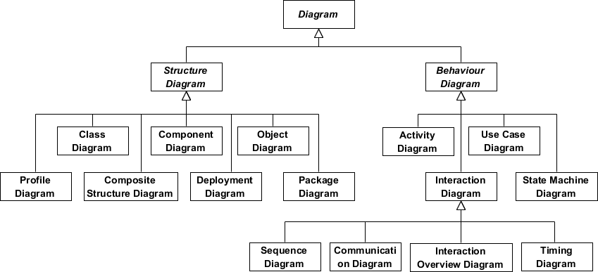

# UML简介

## 一、什么是UML

UML（Unified Modeling Language，统一建模语言）是一种由一整套图表组成的标准化建模语言。

UML用于帮助系统开发人员阐明、展示、构建和记录软件系统的产出。

UML代表了一系列在大型而复杂系统建模中被证明是成功的做法，是开发面向对象软件和软件开发过程中非常重要的一部分。

UML主要使用图形符号来表示软件项目的设计，使用UML可以帮助项目团队沟通、探索潜在的设计和验证软件的架构设计。

## 二、UML的起源

UML的目标是提供一个标准的符号，可以被所有面向对象的方法使用，并选择和整合前兆符号的最佳元素。

UML可用于广泛的应用程序，它为不同的系统和活动（如分布式系统、分析、系统设计和部署）提供了构造。

UML是由OMT统一而来的符号，时序如下：

1. 对象建模技术OMT（James Rumbaugh, 1991）：最适合分析数据密集型信息系统。
2. Booch（Grady Booch, 1994）：强项为设计和实作。尽管Booch方法很强大，但是并未广为接受。
3. OOSE（面向对象的软件工程，Ivar Jacobson, 1992）：有一个称为用例的模型。用例是理解整个系统行为的强大技术（OO传统上很弱的领域）。

1994年，OMT的创始人Jim Rumbaugh离开了通用电气公司（General Electric），转投了Rational，与Grady Booch并肩作战，为的是要把二人的想法合成一个统一的方法（项目名称也就是“统一方法”）。

到了1995年，OOSE的创建者Ivar Jacobson也加入了Rational，他的想法（特别是有关“用例”（Use Case）的概念）被整合于统一方法中，成为“统一建模语言”。Rumbaugh、Booch和Jacobson的团队则被称为“三友”。

UML也受到其他面向对象符号的影响：

- Mellor和Shlaer（1998）
- Coad和Yourdon（1995）
- Wirfs-Brock（1990）
- Martin和Odell（1992）

UML还包含其他主要方法中不存在的新概念，如扩展机制和约束语言。

## 三、为什么用UML，有什么好处

随着软件产品的价值提高，企业欲寻找技术以改善软件生产流程、提高质量、降低成本并缩短产品上市时间。

这些技术包括组件技术、可视化编程、模式和框架的应用。

企业也寻求能管理系统因范围和规模扩大而衍生的复杂性的技术。

他们也意识到需要解决周期性的体系结构问题，如物理分布、并发性、复制、安全性、负载平衡和容错性。

另外，万维网的开发虽然让不少事物简化，却加剧了这些架构问题。

统一建模语言（UML）旨在回应这些需求。

Page-Jones在《Fundamental Object-Oriented Design in UML》一书中总结了UML的主要目的：

1. 为用户提供现成的、有表现力的可视化建模语言，以便他们开发和交换有意义的模型。
2. 为核心概念提供可扩展性（Extensibility）和特殊化（Specialization）机制。
3. 独立于特定的编程语言和开发过程。
4. 为了解建模语言提供一个正式的基础。
5. 鼓励面向对象工具市场的发展。
6. 支持更高层次的开发概念，如协作、框架、模式和组件。
7. 整合最佳的工作方法（Best Practices）。

## 四、UML概述

要注意的是UML涉及很多不同的图表（模型），其目的是提供从许多不同的角度来审视系统。

软件开发流程往往有许多利益相关者参与其中，例如：

- 分析师
- 设计师
- 程序员
- 测试员
- 质量保证员
- 客户
- 技术文件撰稿员

这些人都对系统的不同方面各持不同兴趣，因此在建模时需要考虑不同的细节层次。

例如，程序员需要了解系统的设计，并将设计转换为代码；而技术文件撰稿员则对整个系统的行为感兴趣，借以了解产品的功能。

UML提供了极富表达能力的建模语言，好让各利益相关者至少可以从一个UML图表中得到感兴趣的信息。

UML图表可以大致分为**结构性图表**和**行为性图表**两种。

结构性图表显示了系统在不同抽象层次和实现层次上的静态结构以及它们之间的相互关系。

结构性图表中的元素表示系统中具有意义的概念，可能包括抽象的、现实的和实作的概念。

结构性图表有7种类型：

- 类图（Class Diagram）
- 组件图（Component Diagram）
- 部署图（Deployment Diagram）
- 对象图（Object Diagram）
- 包图（Package Diagram）
- 复合结构图（Composite Structure Diagram）
- 轮廓图（Profile Diagram）

行为性图表显示了系统中对象的动态行为，可用于表达系统随时间的变化。

行为性图表有7种类型：

- 用例图（Use Case Diagram）
- 活动图（Activity Diagram）
- 状态机图（State Machine Diagram）
- 序列图（Sequence Diagram）
- 通讯图（Communication Diagram）
- 交互概述图（Interaction Overview Diagram）
- 时序图（Timing Diagram）

