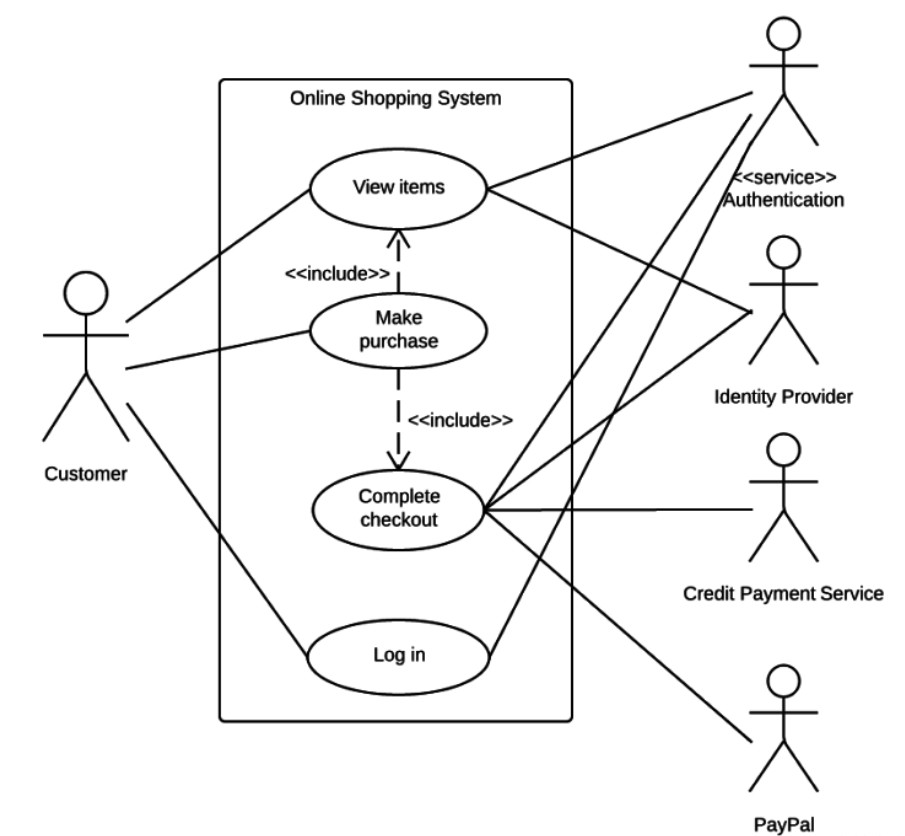

# 用例图

> PlantUML：通过代码自动生成UML图。`https://www.plantuml.com/`，不过感觉不太好用。
>
> 画UML图的软件：drawio，免费、开源、使用相对简单，`https://www.drawio.com/`
>
> 可以先让AI根据业务逻辑生成PlantUML代码（AI擅长代码编写，而且比直接画图更节省token），之后可以自己手画一遍。

## 一、用例图的本质定义

核心理念：

**用例图 = 从“系统外部”看系统能做什么**

记住关键词：

- 外部：站在系统外看
- 能做什么：功能视角
- 不关心怎么做：不涉及实现

> **重要原则：**
>
> 用例图不画流程、不画状态、不画代码

**用例图的本质作用：**

- 需求澄清：与客户/产品经理对齐功能边界
- 系统范围界定：明确哪些在系统内，哪些在系统外
- 功能清单：系统提供的所有对外服务
- 测试依据：每个用例都对应一组测试场景


## 二、用例图在整个UML体系中的位置

```
需求分析 -> 用例图 -> 行为图（活动图/状态图/时序图） -> 类图 -> 代码实现
```

**用例图是所有UML图的起点**，它回答：

- 系统要做什么？（What）
- 谁会使用系统？（Who）
- 系统边界在哪？（Boundary）

其他图回答：

- 活动图：流程怎么走？（Process）
- 状态图：状态如何变化？（State）
- 时序图：模块如何协作？（Interaction）
- 类图：结构如何设计？（Structure）


## 三、用例图的三个核心元素



### （一）参与者（Actor）

定义：与系统交互的外部角色，是系统功能的发起者或接收者。

**Actor可以是什么？**

| 类型     | 示例                       | 说明             |
| -------- | -------------------------- | ---------------- |
| 人       | 用户、管理员、操作员       | 最常见的Actor    |
| 设备     | 传感器、上位机、硬件控制器 | 嵌入式系统中常见 |
| 外部系统 | 数据库、云服务、第三方API  | 系统集成场景     |
| 时间     | 定时器、调度器             | 触发定时任务     |

**判断口诀：**

Actor一定在系统边界**外部**，不能是系统的组成部分。

举例：

```
正确的Actor：
- 用户
- 传感器
- 上位机软件
- 云端服务器

错误的Actor：
- UART模块（系统内部）
- DMA控制器（系统内部）
- FreeRTOS任务（系统内部）
- 数据处理函数（系统内部）
```

### （二）用例（Use Case）

定义：系统对Actor提供的一个**完整的、有价值的**功能。

**判断标准：**

一个合格的用例必须满足

1. Actor能主动发起吗？

- 用户登录系统【√】。
- 验证密码【×】。（这是登录的一部分，不是独立用例）

2. 功能是否对Actor有意义？

- 查询温度数据【√】。
- 读取ADC寄存器【×】。（这是实现细节）

3. 是否是完整的交互？

- 上传文件【√】。
- 打开文件对话框【×】。（只是步骤）

**用例命名规范**

```
好的命名（动宾结构）：
- 查询设备状态
- 配置通信参数
- 导出数据报表
- 接收传感器数据

不好的命名：
- 状态查询功能
- 参数配置
- 导出
- 数据接收处理模块
```

**命名原则：**

- 动词开头，体现动作
- 清晰表达用户意图
- 避免技术术语

### （三）系统边界（System Boundary）

定义：明确“系统管到哪为止”，划分系统的职责范围。

**为什么系统边界很重要？**

```
如果没有边界：
- 责任不清：出了问题不知道归谁
- 接口混乱：不知道哪些功能需要提供
- 测试困难：不知道测什么
```

**实际例子**

嵌入式数据采集系统

```
┌─────────────────────────────────────────────┐
│          数据采集系统（系统边界）               │
│                                             │
│  [启动采集]  [停止采集]  [查询数据]             │
│  [配置参数]  [导出数据]                        │
│                                             │
└─────────────────────────────────────────────┘
     ↑             ↑              ↑
    用户          传感器          上位机

边界内：系统负责的功能
边界外：外部实体（Actor）
```


## 四、用例图的标准图形元素

**基本元素表**

| 元素            | 图形表示              | 含义     | 画法说明               |
| --------------- | --------------------- | -------- | ---------------------- |
| Actor           | 小人图标              | 外部角色 | 位于系统边界外         |
| Use Case        | 椭圆                  | 功能     | 位于系统边界内         |
| System Boundary | 矩形框                | 系统范围 | 包含所有用例           |
| Association     | 实线                  | 使用关系 | 连接Actor和Use Case    |
| Include         | 虚线箭头`<<include>>` | 包含关系 | 从基用例指向被包含用例 |
| Extend          | 虚线箭头`<<extend>>`  | 扩展关系 | 从扩展用例指向基用例   |
| Generalization  | 空心三角箭头          | 泛化关系 | Actor或Use Case的继承  |


## 五、高级关系：Include和Exclude

### （一）`<<include>>`：必须发生

定义：一个用例**一定会包含**另一个用例，被包含的用例是基用例的必要组成部分。

**使用场景**

- 提取公共功能
- 避免重复
- 必选子功能

**示例**

```
          ┌──────────────┐
          │   用户登录    │
          └──────┬───────┘
                 │
            «include»
                 ↓
          ┌──────────────┐
          │   验证权限    │
          └──────────────┘

解释：登录时必须验证权限，没有例外
```

**实际案例**

```
[发送数据包]
    │
    ├──«include»──→ [数据校验]
    ├──«include»──→ [添加协议头]
    └──«include»──→ [发送到串口]

每次发送数据都必须执行这三个步骤
```

### （二）`<<extend>>`：条件发生

定义：在**特定条件下**才发生的扩展功能，基用例可以独立完成，扩展用例是可选的。

**使用场景**

- 可选功能
- 异常处理
- 特殊情况

**示例**

```
          ┌──────────────┐
    ┌────→│   查询数据    │
    │     └──────────────┘
    │ 
«extend» (条件：查询结果为空)
    │
    │    ┌──────────────┐
    └────│  显示无数据   │
         └──────────────┘

解释：只有在查询结果为空时，才会触发"显示无数据"
```

**实际案例**

```
[购买商品]
    ↑
    │ «extend» (条件：使用优惠券)
    │
[使用优惠券]

购买商品可以独立完成，使用优惠券是可选的
```

**Include vs Extend**

| 特性     | Include                | Extend               |
| -------- | ---------------------- | -------------------- |
| 发生时机 | 必然发生               | 条件发生             |
| 箭头方向 | 基用例 -> 被包含用例   | 扩展用例 -> 基用例   |
| 独立性   | 被包含用例不能单独存在 | 扩展用例可以单独存在 |
| 典型场景 | 公共功能提取           | 可选功能、异常处理   |

**记忆口诀**

- Include：“**我包含你**”，你是我的一部分
- Extend：“**我扩展你**”，我是可选的附加功能


## 六、用例图的常见错误

### （一）把内部模块当Actor

```
❌ 错误示例：
┌─────────────┐
│   UART      │       ← 这是系统内部模块，不是 Actor
└─────────────┘
        ↓
   [发送数据]

✅ 正确做法：
┌─────────────┐
│  上位机软件   │      ← 这才是外部实体
└─────────────┘
        ↓
   [发送数据]
```

**判断方法：**问自己，“这是系统的一部分吗？”


### （二）把函数名直接当用例

```
❌ 错误示例：
- HAL_UART_Receive_IT()  ← 这是函数名
- GPIO_WritePin()        ← 这是实现细节
- memcpy()              ← 这是底层操作

✅ 正确做法：
- 接收传感器数据        ← 从用户视角描述功能
- 控制设备开关
- 备份数据
```

**原则：**用例描述“做什么”，不是“怎么做”。


### （三）用例粒度太细

```
❌ 粒度太细：
- 发送一个字节
- 读取寄存器
- 切换 LED 状态

✅ 合适粒度：
- 通过串口发送数据包
- 读取设备配置
- 指示系统运行状态
```

**判断标准：**

- 用例对Actor是否有独立价值？
- 用户会单独发起这个操作吗？


### （四）不画系统边界

```
❌ 没有边界：
职责不清，不知道哪些是系统功能

✅ 画出边界：
┌───────────────────────────┐
│     智能温控系统          │ ← 明确系统范围
│  [监测温度]  [调节温度]   │
└───────────────────────────┘
```

**重要性：**

- 明确系统职责
- 便于需求评审
- 清晰的测试范围


### （五）用例图里出现流程箭头

```
❌ 错误示例（像流程图）：
[登录] ──→ [验证] ──→ [进入系统]
   ↓
[失败] ──→ [提示错误]

✅ 正确示例（用例图）：
┌──────────────────────┐
│    [用户登录]         │
│    [查看个人信息]     │
│    [修改密码]         │
└──────────────────────┘
```

**记住：**

- 用例图只表达“有哪些功能”
- 不表达“先做什么后做什么”
- 流程用活动图或时序图


## 七、用例图的工程化实践建议

### （一）什么时候画用例图？

```
✅ 适合画用例图的场景：
- 项目启动，需求分析阶段
- 与客户/产品经理评审需求
- 系统功能清单不明确时
- 多方协作，需要统一认知

❌ 不适合画用例图的场景：
- 单纯的算法实现
- 内部模块设计（用类图）
- 详细流程设计（用活动图）
```


### （二）用例图的详细程度

**原则：**不用追求完整，但一定要准确。

```
初期（需求讨论）：
- 粗粒度用例
- 关注主要功能
- 5-10 个核心用例

中期（设计评审）：
- 细化重点用例
- 补充 include/extend
- 15-20 个用例

后期（测试依据）：
- 每个用例对应测试用例
- 补充异常场景
```


### （三）用例描述模版

除了用例图，每个用例还应有文字描述。

> ### 用例：查询设备数据
>
> **ID**：UC-001
>
> **Actor**：用户、上位机
>
> **前置条件**：设备已连接，采集已启动
>
> **主流程**：
>
> 1. Actor 发起查询请求
> 2. 系统验证权限
> 3. 系统返回最新数据
> 4. 系统记录查询日志
>
> **后置条件**：数据已返回，日志已记录
>
> **异常流程**：
>
> - E1：权限不足 → 返回错误码
> - E2：数据不存在 → 提示无数据


### （四）与其他图的配合

```
用例图（What）
    ↓
活动图（How - 流程）
    ↓
时序图（How - 交互）
    ↓
类图（Structure）
    ↓
代码（Implementation）
```

