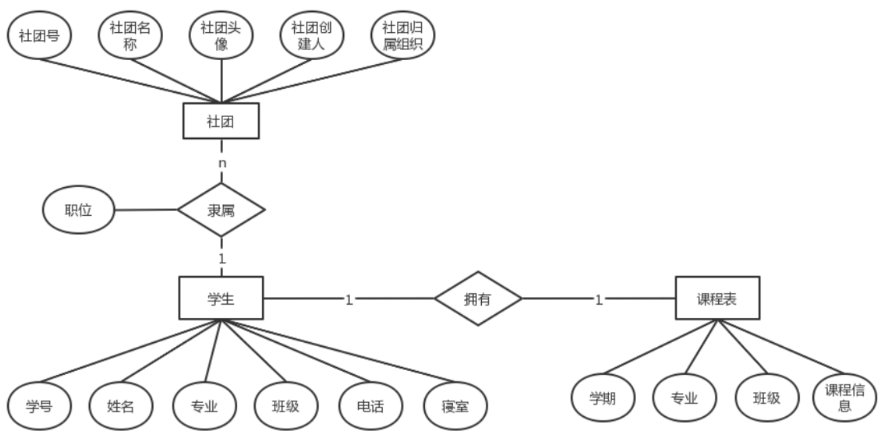

# E-R图

## 一、介绍

E-R图，也称为实体关系图，用于显示实体集之间的关系。它提供了一种表示实体类型、属性和连接的方法；用来描述现实世界的概念模型。

ER模型是数据库的设计或蓝图，将来可以作为数据库来实现。在E-R图中，实体集是一组相似的实体（数据模型中的数据对象），它们可以有属性。

在数据库系统中，实体是数据库中的表或属性，因此E-R图通过显示表和它们属性之间的关系来显示数据库的完整逻辑结构。

## 二、E-R图中的基本元素

### （一）实体

实际问题中客观存在的、并且可以相互区别的事物，称为实体。

实体是现实世界中的对象，可以具体到人、事、物。

比如上图中的：社团、学生、课程表。

### （二）属性

实体所具有的某一个特性称为属性，在E-R图中属性用来描述实体。

比如上图中的学生，可以用：学号、姓名、专业、班级、电话、寝室来进行属性描述。

### （三）实体集

具有相同属性的实体的集合称为实体集。

例如：“全体学生”就是一个实体集，而`(983573, 李刚, 男, 2000/12/12)`是学生实体集中的一个实体。

### （四）键

在描述实体集的所有属性中，可以唯一标识每个实体的属性称为键。键也是属于实体的属性。

作为键的属性，取值必须唯一，且不能为空。

比如：唯一、且不为空的学号，就可以作为学生的键。

> 注意：
>
> - 主键（PK）是唯一标识实体的属性集合。在ER图中，主键可以通过在属性标注的下方添加下划线来表示。如果主键是由多个属性组成，则这些属性都应该加下划线。
> - 外键（FK）是实体用来引用另一个实体主键的属性。在ER图中，外键可以通过在属性名后面加上“FK”来标注，或者用箭头从外键指向被引用的主键实体。
>   - 在Chen图里，外键通常用菱形的联系关系来表示
>   - 在Chen图里，外键是不画成实体的属性的，但在建表时应建为实体的一个字段。

#### 主键

是唯一的。一张表中只能有一个主键，也就是唯一标识符。

和身份证一样，可以准确地直接查到对应的数据。

#### 外键

主要是用来关联，产生两个表的关系。

如上图，“隶属”这个联系连接了“社团”和“学生”。同时，通过“学号”和“社团号”使得两个表产生联系。

#### 主键和外键的区别

1. 数据库中设置为主键后，不能为空（null），不能重复。外键是另一个表的主键，可以重复。
2. 主键是为了更加安全地保护数据，外键是为了产生关系。
3. 主键是唯一的（一个表只能设置一个主键），而外键可以设置很多个。

### （五）联系

世界上任何事物都不是孤立存在的，事物内部和事物之间都是有联系的。

实体之间的联系通常有3种类型：一对一、一对多、多对多。

**一对一（1:1）**

一对一关系是指对于实体集A和实体集B，A中的每一个实体至多与B中一个实体有关系；反之，在实体集B中的每个实体至多与实体集A中的一个实体有关系。

例如：一个用户只能拥有一张身份证，而一张身份证只属于一个用户。

**一对多（1:n）**

一对多关系是指实体集A与实体集B中至少有n（n>0）个实体有关系；并且实体集B中每一个实体至多与实体集A中一个实体有关系。

例如：一个用户拥有多张银行卡，但是一张银行卡只属于一个用户。这就是一对多。

反过来说就是多对一，一对多和多对一是一样的。

> 在`1:N`的联系中，通常“N端”保存指向“1端”的外键。
>
> 例如：店铺（1）销售商品（N）。则应该理解为“商品表”的“shop_id”是外键，引用店铺表的主键“id”。
>
> `1:1`和`M:N`联系则需要另外讨论。

**多对多（m:n）**

多对多关系是指实体集A中的每一个实体与实体集B中至少有m（m>0）个实体有关系，并且实体集B中的每一个实体与实体集A中的至少n（n>0）个实体有关系。

例如：用户和商品的关系，一个用户可拥有多件商品；同样，一件商品可被多个用户所拥有。

## 三、E-R图的作图规范

| 元素 | 画法                                                         |
| ---- | ------------------------------------------------------------ |
| 实体 | 矩形框，在框中记入实体名                                     |
| 联系 | 菱形框，在框中记入联系名                                     |
| 属性 | 椭圆形框，在框中记入属性名。对于主属性名，在其名称下画一条下划线 |
| 连线 | 实体与属性之间、实体与联系之间、联系与属性之间，用直线相连，并在直线上标注联系的类型（1、n/N、m/M） |

## 四、E-R图的具体绘制过程

大致可以分为以下5步：

1. 确定所有的实体集合
2. 选择实体集应包含的属性
3. 确定实体集之间的联系
4. 确定实体集的关键字，用下划线在属性上表明关键字的属性组合
5. 确定联系的类型，在用线将表示联系的菱形框联系到实体集时，在线旁注明是1或n或m来表示联系的类型